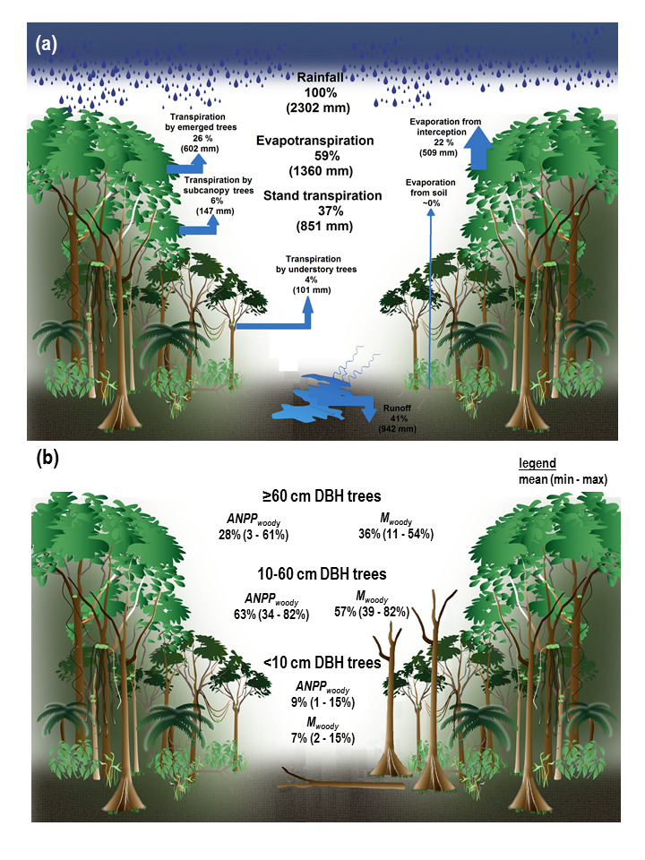

```{r setup, include=FALSE}
knitr::opts_chunk$set(echo = TRUE)
```

```{r eval = TRUE, echo=FALSE, warning=FALSE, results='hide'}


# DISPLAY ITEMS  (limit 8) # This chunk is for auto numbering of tables/figures
#figures
fig_schematic = 1
fig_NEON_vertical =  2
fig_leaf_T = 3
fig_treerings= 4 #not sure if we want to include one
fig_model=5

#tables
table_leaf_traits=1
table_leaf_metabolism=2


# SUPPLEMENTARY INFO (this chunk must be repeated in MEE_manuscript_SI.Rmd)

#Appendices
appendix_NEON_methods <- "S1"
appendix_tealeaves_methods <- "S2"
appendix_lit_review_methods <- "S3"


appendix_NEON_methods_title<- "Methods for NEON vertical profiles"
appendix_tealeaves_methods_title <- "Methods for leaf energy balance modeling"
appendix_lit_review_methods_title<- "Methods for literature review"


#SI table numbers
SItable_example = "S1"

#SI table captions
SItable_example_legend <- "Table S1. ...."

#SI figure numbers
SIfig_NEON_all = "S1"

#SI figure captions
SIfig_example_legend <- "Figure S1. Vertical gradients in micrometeorological conditions for all forested sites in the National Ecological Observatory Network (NEON)"

```


**Title:** Thermal sensitivity across forest vertical profiles: patterns, mechanisms, and ecological implications

**Authors:** 
Nidhi Vinod^1^,
Martijn Slot^2^,
Ian McGregor^3^,
Elsa M. Ordway^4,5^,
Marielle N. Smith^6^,
Tyeen Taylor^7^,
Lawren Sack^5^,
Kristina J. Anderson-Teixeira^1,2^* 


**Author Affiliations:**

1. Conservation Ecology Center; Smithsonian Conservation Biology Institute; Front Royal, VA 22630, USA

2. Smithsonian Tropical Research Institute; Panama, Republic of Panama

3. Center for Geospatial Analytics; North Carolina State University; Raleigh, NC 27607, USA

4. Department of Organismic and Evolutionary Biology, Harvard University, Cambridge, MA 02138, USA

5. Department of Ecology and Evolutionary Biology, UCLA, Los Angeles, CA 90039, USA

6. Department of Forestry, Michigan State University, East Lansing, MI 48824, USA

7. Department of Civil & Environmental Engineering, University of Michigan, Ann Arbor, MI 48109, USA

*corresponding author: teixeirak@si.edu; +1 540 635 6546

\newpage


## Summary

```{r eval=FALSE, echo=FALSE}
#  I think the limit for New Phyt is 200 words. 
```

(200 word limit, no bullet points )

Clean version implementing the changes below (198 words):

Rising temperatures are profoundly influencing forests on many scales with potentially strong variation vertically across forest strata. Using published research and new analyses, we evaluate how environmental conditions, leaf temperatures, and foliar traits and metabolism vary across vertical gradients, shaping whole-tree ecology and ecosystem function. In forests with dense canopies, canopy leaves are exposed to higher solar radiation and evaporative demand than understory leaves, and can experience elevated leaf temperature ($T_{leaf}$), particularly when transpirational cooling is curtailed by limited stomatal conductance.  However, foliar traits that also vary strongly across height or light gradients can partially mitigate the elevation of $T_{leaf}$ in the upper canopy. Leaf metabolism generally increases with height across the vertical gradient, and tall trees have higher absolute metabolic capacity and growth at both individual and ecosystem levels. Yet, differences in thermal sensitivity and damage thresholds across the gradient are modest. Under climate warming and increased drought, larger trees can face disproportionate stress, yet understory trees have fewer cooling mechanisms and thus may be impacted the most under hot, humid conditions, or when the buffering provided by large trees is lost.

\newpage

# Introduction

**Forest responses and feedbacks to climate change will have a critical influence on the future of Earth's climate.**
Globally, temperatures have risen $1.2^\circ$C since 1900 [@rohdeBerkeleyEarthLand2020] and are expected to reach or even exceed an average of $1.5^\circ$C in the next 20 years [@ipccClimateChangeWidespread2021], accompanied by increasing severity and frequency of heat waves [@meehlMoreIntenseMore2004; @ipccClimateChangeWidespread2021] and hotter droughts [@trenberthGlobalWarmingChanges2014b].
These changes are expected to have profound effects on tree metabolism and forest ecosystem function [@breshearsUnderappreciatedPlantVulnerabilities2021; IPBES report], by altering rates of photosynthesis and respiration [@breshearsUnderappreciatedPlantVulnerabilities2021; @corlettImpactsWarmingTropical2011; @scafaroResponsesLeafRespiration2021], causing foliar damage during heat waves [@osullivanThermalLimitsLeaf2017; @corlettImpactsWarmingTropical2011], and reducing growth and elevating mortality during drought [@rollinsonClimateSensitivityUnderstory2020; @breshearsUnderappreciatedPlantVulnerabilities2021; @mcdowellPervasiveShiftsForest2020]. Collectively, these impacts may lead to reduction of forest carbon sequestration, as has already occurred in some forests [@oishiWarmerTemperaturesReduce2018; @sullivanLongtermThermalSensitivity2020]. The resulting feedbacks to the climate system, carbon storage, and changes in albedo and hydrology will in turn impact the the future trajectory of climate change [@bonan_ecological_2016], yet the degree of the impact remains uncertain [@krauseLargeUncertaintyCarbon2018; @friedlingsteinClimateCarbonCycle2006].
 
**A great measure of uncertainity arises due to the differential impacts of rising temperatures on trees of differential size and canopy position, especially as because small understory trees exist in microenvironments that are substantially buffered by more exposed canopy trees [@zellweger_seasonal_2019; @davisMicroclimaticBufferingForests2019].**
Forests are vertically and horizontally stratified, containg trees of different sizes along various successional stages. 
Overstory canopies that play a crucial role in moderating forest climatic conditions [@ozanneBiodiversityMeetsAtmosphere2003; @nakamuraForestsTheirCanopies2017], including buffering understory microclimates from extreme meteorological conditions [@zellweger_seasonal_2019]. This creates a vertical stratification of the biophysical environment such as temperature, light, wind, humidity and CO~2~ concentrations that influences leaf traits, thermoregulation and metabolism along the gradient, with implications for whole plant performance [@fauset_differences_2018; @michaletzEnergeticCarbonEconomic2016].
Despite the fact that this vertical gradient inevitably shapes nearly every aspect of plant metabolism, demography, and ecology, we lack comprehensive understanding of these gradients [but see @niinemetsPhotosyntheticAcclimationSimultaneous2004b].
Importantly, this limits our ability to understand how warming temperatures will affect leaf-level metabolism, whole-plant performance, and, in turn, forest ecosystem dynamics, biodiversity, energy balance, ecosystem function, and biosphere-atmosphere interactions.


**Here, we review how the biophysical environment and plant form and function vary across the vertical canopy gradient in forests.** 
We focus on five key themes (Fig. `r fig_schematic`):
(1) the biophysical environment;
(2) leaf temperature ($T_{leaf}$);
(3) the leaf traits that most strongly influence $T_{leaf}$;
(4) leaf metabolism and gas exchange, including stomatal conductance, photosynthesis, respiration, and volatile organic compound (VOC) production; and 
(5) whole-tree and ecosystem ecology.
*We then consider the implications for understanding forest responses to global change, including how these responses scale across space and time.* 

![**Figure `r fig_schematic`. Schematic summarizing vertical gradients in forests according to (1) biophysical environment, (2) leaf temperature, (3) leaf traits, (4) leaf metabolism, and (5) whole-tree and ecosystem ecology. Abbreviations are as follows: VPD: vapor pressure deficit;  Tleaf - Tair: leaf-to-air temperature difference; LMA: leaf mass per area, VAZ: violaxanthin, antheraxanthin and zeaxanthin concentrations, VOC: volatile organic compounds; temp sensitivity: temperature sensitivity; ET: evapotranspiration, GPP: gross primary productivity.** Here, we summarize conditions in dense canopies during growing season and daytime conditions; patterns tend to be weaker, or sometimes reversed, in more open canopies, when canopy trees are seasonally deciduous, or at nighttime. Arrows indicate direction of increase, with double-pointed arrows indicating that observations have shown increases both higher and lower in the canopy [Issue #27](https://github.com/EcoClimLab/vertical-thermal-review/issues/27). ](schematics/Schematic figure 1.png)


# Review of vertical gradients

## The biophysical environment

**The biophysical environment, defined here to include the physical structure of the vegetation and associated physical conditions, varies across the vertical gradient from the forest floor to the top of the canopy (Figs. `r fig_schematic`, `r fig_NEON_vertical`), with physical conditions in large part determined by the structure of the forest.** 
In this section, we supplement a review of the existing literature with a new analysis of data on vegetation structure and vertical microclimate profiles from focal sites within the U.S. National Ecological Observatory Network [NEON; Figs. `r fig_NEON_vertical`-`r SIfig_NEON_all`; Supporting Information Methods `r appendix_NEON_methods`, @schimelNEONHierarchicallyDesigned2007].
While the focus here is on vertical gradients, it is important to note that in heterogeneous canopies with high gap fractions and large variation in tree height, or at forest edges, the biophysical environment can be more closely linked to the distance from the outer canopy than to height [@lowmanForestCanopies1995]. 

![**Figure `r fig_NEON_vertical`. Vertical gradients in the biophysical environment for six sites six US forest sites with contrasting forest structures in the National Ecological Observatory Network (NEON)**. Height profiles from the growing season are shown for: (a) leaf area density, (b) proportion of sun leaves, (c) proportion light incident at the top of the canopy, and July mean ± 1 standard deviation for (d) maximum photosynthetically active radiation (PAR), (e) maximum wind speed, (f) minimum humidity, (g) maximum $T_{air}$, and (h) maximum biological temperature, $T_{bio}$. Sites include a tropical montane broadleaf evergreen forest (Pu‘u Maka‘ala Natural Area Reserve, Hawai'i; PUUM), a subtropical longleaf pine savanna (Ordway-Swisher Biological Station, FL; OSBS), two temperate broadleaf forests (Smithsonian Conservation Biology Institute, VA, SCBI; Smithsonian Environmental Research Center, MD, SERC), and a mixed northern hardwood and coniferous forest (Harvard Forest, MA; HARV). Vertical profiles in micrometeorological variables (d-h) at all six NEON sites are shown in Fig. S1.](NEON_height_profiles/figures/profile_all.png)

**Canopy foliage acts as the primary physical barrier between the atmosphere and the forest floor, buffering multiple aspects of the understory conditions. It is critical in influencing -- and is influenced by -- the vertical biophysical gradient (Fig. `r fig_NEON_vertical`).**
Foliage distribution is determined by the distribution of tree sizes and tree architecture within a forest, and leaf area density (LAD; *i.e.*, leaf area per unit volume) patterns along the vertical gradient are heterogeneous across forests (Figs. `r fig_NEON_vertical`a-b, `r SIfig_NEON_all`). 
Dense canopy forests composed of broadleaf trees can have high LAD in the upper canopy layers, as well as in the understory (e.g., SCBI, SERC and HARV, Fig. `r fig_NEON_vertical`a) -- a pattern also common in tropical forests [@ashtonComparisonsStructureMixed1992; @koikeCanopyStructureTropical1993].
In temperate forests, although LAD is generally more concentrated in the upper-canopy, undualting patterns are formed by conifers and top- vs. bottom-heavy foliage trees, and sometimes by dense understories [e.g., SCBI, Fig. `r fig_NEON_vertical`a, @parkerVerticalProfileCanopy1989; @terborghVerticalComponentPlant1985; @ishiiExploringRelationshipsCanopy2004a; @parkerCanopyLightTransmittance2002]. 
In open-canopied forests, including many needle-leaf forests, LAD can be predominantly accumulated in the lower canopy layers [e.g., PUUM and WREF, Fig. `r fig_NEON_vertical`a, @hanberryOpenForestEcosystems2020a; @lawLeafAreaDistribution2001; @baldocchiSeasonalVariationEnergy1997; @bonan_ecological_2016; @ishiiExploringRelationshipsCanopy2004a]. 
Soil moisture conditions, topography, and gap formations following disturbances all alter foliage patterns and further influence the formation of closed vs. open canopy forests [e.g., @almeidaContrastingFireDamage2016; @starkReframingTropicalSavannization2020; @bonan_ecological_2016; @hanberryOpenForestEcosystems2020a]. 
In addition, seasonally dry and wet conditions, deciduousness, and phenology contribute to temporally shifting LAD patterns [@parkerStructuralPhenologyLeaf2004; @parkerConsequencesEnvironmentalHeterogeneity2019]. 
In this review, we focus on growing season conditions (peak leaf area index, LAI) unless otherwise noted.

**Light, specifically the proportion of incident light and photosynthetically active radiation (PAR), decreases from the canopy top to the forest floor, with the profile shape modified by LAD, canopy height, canopy structure, and across species and forest types [Figs. `r fig_NEON_vertical`a-d, `r SIfig_NEON_all`, @koike_leaf_2001].** 
This gradient is more pronounced in dense canopies, including broad-leaf and mixed forests (e.g., SCBI, SERC and HARV, Fig. `r fig_NEON_vertical`d), than in open canopy forests, including many conifer forests [e.g., OSBS, PUUM, and WREF, Figs. `r fig_NEON_vertical`d, `r SIfig_NEON_all`, @aussenacInteractionsForestStands2000a; @smithSeasonalDroughtrelatedChanges2019; @tymenQuantifyingMicroenvironmentalVariation2017; @chazdonPhotosyntheticLightEnvironments1984; @parkerConsequencesEnvironmentalHeterogeneity2019; @bartemucciOverstoryInfluencesLight2006; @baldocchiSeasonalVariationEnergy1997]. 
Variability in the light environment decreases with height, with the shaded understory being highly influenced by sunflecks, or brief increases in solar radiation caused by small canopy gaps and wind-induced canopy movements [@waySunflecksTreesForests2012]. 

**Wind speeds are also higher at the top of the canopy, owing to the buffering effect of the canopy [@juckerCanopyStructureTopography2018].**
Wind speeds increase with height across forest types from closed-canopy forests [@barnardSeasonalVariationCanopy2016a; @mcgregorTreeHeightLeaf2021; @juckerCanopyStructureTopography2018] to savannas [@curtis_intracanopy_2019; @mullerEvidenceEfficientNonevaporative2021; @hanberryOpenForestEcosystems2020a; @hanberryReconceptualizationOpenOak2018], including all 22 forested NEON sites (Figs. `r fig_NEON_vertical`e, `r SIfig_NEON_all`). Specifically, averaged across the NEON sites, maximum daily wind speeds were 4.1 m s^-1^ at the top of the vertical profile, compared to  $\le$ 1.1 m s^-1^ at the bottom (Figs. `r fig_NEON_vertical`, `r SIfig_NEON_all`).
The implication is that upper canopy leaves have substantially higher boundary layer conductance ($g_a$) and therefore greater potential for both water and heat loss (see section "Leaf temperature").

**Atmospheric concentrations of carbon dioxide (CO~2~) and water vapor can also vary across the vertical gradient.**
Atmospheric CO~2~ concentrations tend to be higher near the ground at night, associated with plant and soil respiration, although the elevated CO~2~ quickly dissipates during the day [@koike_leaf_2001; @yang_spatial_1999]. Elevated CO~2~ may benefit understory seedlings operating close to their carbon compensation point, but given that differences are negligible for most of the day when photosynthesis is occurring, gradients in CO~2~ concentrations are unlikely to significantly affect the energy balance and metabolism of leaves across the forest vertical gradient.

Relative humidity (RH) tends to be higher in the understory and decreases with height, although this trend is absent in open forests [Figs. `r fig_NEON_vertical`f, `r SIfig_NEON_all`, e.g., @mcgregorTreeHeightLeaf2021; @juckerCanopyStructureTopography2018].
Dense-canopy forests maintain higher daily maximum RH in the understory than open forests and nearby open areas, an effect that is greater in wetter conditions, and warmer months [@vonarxSpatiotemporalEffectsForest2012a; @hanberryOpenForestEcosystems2020a]. 
In combination with $T_{air}$, RH determines vapor pressure deficit (VPD) -- the driving force of water loss from leaves, which tends to be greater in the upper canopy and canopy gaps than in the understory [@fauset_differences_2018; @tymenQuantifyingMicroenvironmentalVariation2017; @niinemetsPhotosyntheticAcclimationSimultaneous2004b]. Especially when canopy height and LAI are large, maximum $T_{air}$ and VPD are reduced in the understory [@juckerCanopyStructureTopography2018].

**Air temperature ($T_{air}$) often shows little variation across the vertical gradient, but under certain circumstances it can be significantly buffered by forest canopies (Figs. `r fig_NEON_vertical`, `r SIfig_NEON_all`).**
The $T_{air}$ gradient from the upper canopy to the understory varies with factors such as radiation fluxes, local topography, vertical air mixing, cloud cover and vegetation type [@defrenneForestMicroclimatesClimate2021]. 
Typically, dense canopies buffer understories from high maximum $T_{air}$ more than open canopies -- *i.e.*, dense canopy understories can have cooler maximum daytime $T_{air}$ and warmer nighttime minimum $T_{air}$ than open canopy understories or nearby clearings [@missonPartitioningForestCarbon2007; @defrenneForestMicroclimatesClimate2021; @vonarxSpatiotemporalEffectsForest2012a; @defrenneGlobalBufferingTemperatures2019; @davisMicroclimaticBufferingForests2019; @zellweger_seasonal_2019; @ramboCanopyMicroclimateResponse2009]. 
Notably, this pattern can be reversed in open forests, where below-canopy maximum $T_{air}$ can be warmer than canopy $T_{air}$ due to turbulent air mixing and the thermal radiative flux from the soil and the canopy that is intercepted by lower-canopy layers, analogous to a 'canopy greenhouse effect' [e.g., OSBS, Figs. `r fig_NEON_vertical`g, `r SIfig_NEON_all`b, @banerjeeExplainingConvectorEffect2017; @curtis_intracanopy_2019;@zweifelMiddayStomatalClosure2002; @hadleyInfluenceKrummholzMat1987; @ramboCanopyMicroclimateResponse2009; @hardwickRelationshipLeafArea2015].    

## Leaf temperature 

Leaf temperature ($T_{leaf}$) is strongly tied to $T_{air}$, and is further influenced by other biophysical drivers (reviewed above) and by leaf traits and stomatal conductance (see following sections) with leaves adjusting to their environment to approach, when possible, an optimal $T_{leaf}$ for carbon assimilation and metabolic processes [@michaletzPlantThermoregulationEnergetics2015; @perezPhotosyntheticHeatTolerances2020; @drakeNoEvidenceHomeostatic2020]. 
Leaves are typically cooler than the air at night, and during the day especially under cloudy skies, at high windspeeds and high $T_{air}$. Leaves are typically warmer than air when under full sunlight, especially under slow windspeeds and low $T_{air}$ [@doughtyAreTropicalForests2008].
While $T_{leaf}$ is rarely exactly equal to $T_{air}$, it is most commonly within a few degrees [@cavaleriColdbloodedForestsWarming2020]. 


### Biophysical drivers

**Fundamentally, $T_{leaf}$ is determined by the energy balance of a leaf and can be estimated based on biophysical principles, where $T_{leaf}-T_{air}$ is a function of energy input from net radiation ($R_n$, including shortwave and longwave) minus heat lost to the environment [Fig. `r fig_leaf_T`, @campbell_introduction_1998; @muir_tealeaves_2019].**
High $R_n$ loads can elevate $T_{leaf}$ dramatically above $T_{air}$ (Fig. `r fig_leaf_T`a). Sensible heat flux between leaf and air is regulated by leaf boundary layer conductance, which is greater in smaller leaves (Fig. `r fig_leaf_T`d) and higher wind speeds (Fig. `r fig_leaf_T`b). Latent heat flux ($\lambda E$) through transpiration has a strong cooling effect, and is determined by stomatal and boundary layer conductances ($g_s$ and $g_b$) and VPD; notably, $g_b$ is influenced by windspeed and $g_s$ respond due to stomatal closure under high VPD.
Therefore, under full sunlight, $T_{leaf}-T_{air}$ decreases with $g_b$, which increases with wind speed [Fig. `r fig_leaf_T`b, @daudetWindSpeedLeaf1999a] and $g_s$ (Fig. `r fig_leaf_T`e); increases with leaf size (Fig. `r fig_leaf_T`d);
decreases with and increases with VPD, or increases with RH (Fig. `r fig_leaf_T`c).

![**Figure `r fig_leaf_T`. Theoretical expectations for variation in $T_{leaf}-T_{air}$ in response to (a) shortwave radiation, (b) wind speed, (c) relative humidity, (d) leaf width, and (e) stomatal conductance.** Leaf temperatures were modeled using the tealeaves R package of @muir_tealeaves_2019 parameterized to represent typical conditions for a broadleaf species (*Quercus rubra*) in a mesic temperate forest (Harvard Forest, Massachusetts, USA), as detailed in Appendix `r appendix_tealeaves_methods`. [ISSUE #6](https://github.com/EcoClimLab/vertical-thermal-review/issues/6).](leaf_energy_balance/fig3_leafenergy.png)

**Leaf energy balance is a tradeoff between water-use strategy and optimum $T_{leaf}$ [@fauset_differences_2018; @kochDiurnalPatternsLeaf1994].** 
When $g_s$ is high, high $\lambda E$ facilitates heat dissipation. 
However, when leaf water demand (influenced by VPD and stomatal opening) exceeds the rate of supply, conservation of water ($g_s$-limitation) occurs at the cost of increasing $T_{leaf}$ [Fig. `r fig_leaf_T`e, @fauset_differences_2018].
Therefore, while under maximum $g_s$, leaves can maintain $T_{leaf}$ closer to $T_{air}$ at high solar radiation loads, but during $g_s$-limitation solar radiation can drastically elevate $T_{leaf}$ above $T_{air}$, especially for larger leaves [@fauset_differences_2018; @songTreeSurfaceTemperature2020; @konradLeafTemperatureIts2021].
With adequate water, species with smaller leaves (higher $g_b$) and larger $g_s$ will be most effective at cooling under high temperatures [@songTreeSurfaceTemperature2020; @dongBiophysicalHomoeostasisLeaf2017; @konradLeafTemperatureIts2021; @leighInfluenceLeafSize2017; @leuzingerTreeSpeciesDiversity2007].

**Vertical gradients**

**These basic biophysical principles shape the propensity for $T_{leaf}$ to be elevated above $T_{air}$ across vertical gradients in closed-canopy forests.**
High radiation at the top of the vertical profile (Fig. `r fig_NEON_vertical`) implies that canopy leaves have much greater propensity for high $T_{leaf}-T_{air}$, such that they would be expected to be warmer than understory leaves under most conditions (Fig. `r fig_leaf_T`).
However, higher wind speeds (e.g., up to ~ 4 $ms^{-1}$ at NEON sites; Fig. `r fig_NEON_vertical`) are capable of lowering $T_{leaf}-T_{air}$ upto ~ $4^\circ$C [Fig. `r fig_leaf_T`b, @bonan_ecological_2016; @niinemetsPhotosyntheticAcclimationSimultaneous2004b]. Collectively, higher wind speed (Fig. `r fig_NEON_vertical`), and with adaptive leaf traits increase $g_b$ and $g_s$ (reviewed below) mediate the direct effects of solar radiation on upper canopy leaves (Fig. `r fig_leaf_T`a) and result in higher rates of heat loss (Fig. `r fig_leaf_T`b-e). In contrast, greater RH and lower wind speeds in the understory may stifle $\lambda E$ (through reduced $g_s$ and $g_b$), thereby increasing $T_{leaf}$ [Fig. `r fig_leaf_T`, @perezIncreasingHumidityThreatens2018; @tibbittsHumidityPlants1979b].

**Vertical $T_{leaf}$ gradients are also expected to vary with canopy structure (Fig. `r fig_leaf_T`).**
Closed canopies with high LAI act as an umbrella, absorbing most of the incoming radiation and preventing vertical air mixing in the understory. The intensity of incoming radiation and VPD in the upper canopy, combined with hydraulic challenges of water transport to the tops of tall trees [**REFS**] can cause $g_s$-limitation and an increase in $T_{leaf}$. Therefore, we would expect a strong $T_{leaf}$ gradient  in closed canopies [@millerOnlySunlitLeaves2021]. In contrast, open canopies with lower LAI allow more vertical air mixing and sunlight into the understory. This mixing and light penetration can either neutralize a $T_{leaf}$ gradient or elevate $T_{leaf}-T_{air}$ in the lower canopy relative to the upper canopy. The latter can result from the 'canopy greenhouse effect' or sunflecks, as mentioned above [@hardwickRelationshipLeafArea2015; @schymanskiStomatalControlLeaf2013b], and because shade leaves tend to have lower $g_s$ and greater thermal capacitance [capacity to hold heat, @schymanskiStomatalControlLeaf2013b]. 

**Within closed-canopy forests vertical gradients, the propensity for $T_{leaf}$ to be elevated above $T_{air}$ varies with micrometeorological conditions (Fig. `r fig_leaf_T`).**
Under drought conditions (hot and dry, with higher-than-average solar radiation), when $g_s$ is limiting, there will be a propensity for $T_{leaf} - T_{air}$ to be elevated in the canopy compared to the understory (Fig.`r fig_leaf_T`).
Because sun leaves are exposed to higher irradiance and VPD, their $g_s$-limitation is steeper than shade leaves, resulting in greater increases in $T_{leaf}$ when $g_s$ is reduced [Fig. `r fig_leaf_T`e, @leighInfluenceLeafSize2017; @fauset_differences_2018]. 
In contrast, under hot and wet conditions, higher wind speeds and $g_a$ enable cooling. Under lower wind conditions, the thickness of the air layer at the leaf surface curbs rapid leaf-to-air heat transfer, limiting $g_b$ and increasing $T_{leaf} - T_{air}$ [Fig. `r fig_leaf_T`b, @martin_boundary_1999; @leighInfluenceLeafSize2017; @robertsStomatalBoundaryLayerConductances1990a; @songTreeSurfaceTemperature2020]. 
Thus, while understory and within-canopy shade leaves can remain cooler under lower radiation, their environment is not conducive to shedding excess heat, which in combination with their physiological propensities can result in greater $T_{leaf}$ under slight heat stress [@leighInfluenceLeafSize2017; @songTreeSurfaceTemperature2020; @schymanskiStomatalControlLeaf2013b; @zweifelMiddayStomatalClosure2002].
 In addition to lower wind speeds (Fig. `r fig_NEON_vertical`), higher RH in the understory (Fig. `r fig_NEON_vertical`) would also inhibit cooling, as $\lambda E$ is stifled under high RH, resulting in  greater $T_{leaf}$-$T_{air}$ [Fig. `r fig_leaf_T`c, @songTreeSurfaceTemperature2020; @tibbittsHumidityPlants1979b; @perezIncreasingHumidityThreatens2018; @konradLeafTemperatureIts2021].

### In situ observations

**Following the principles outlined above, vertical microclimate profiles, leaf traits, and $g_s$ together explain *in situ* $T_{leaf}$ observations.** 
Often, $T_{leaf}$ tracks $T_{air}$, *in large part due to vertical gradients in leaf traits and $g_s$,* and therefore differs little between understory and canopy.
In forests with dense canopies, including tropical and temperate broadleaf forests, leaves experience greater $T_{leaf} - T_{air}$ and higher maximum $T_{leaf}$ in the upper canopy than buffered lower-canopies. In some cases canopy leaves exceed the optima for photosynthesis ($T_{opt}$) and $T_{air}$ because of $g_s$-limitation and high solar radiation loads [@carterExperimentalWarmingTropical2021; @niinemetsShapeLeafPhotosynthetic1999; @doughtyAreTropicalForests2008; @fauset_differences_2018; @mauTemperateTropicalForest2018a; @millerOnlySunlitLeaves2021; @rey-sanchez_spatial_2016; @rey-sanchez_spatial_2016; @pauTropicalForestTemperature2018]. 
In contrast, in open forests with lower LAI, lower-canopy $T_{leaf}$ can equal or even exceed upper canopy $T_{leaf}$, due to greater light transmission, vertical air mixing, and still air in the lower canopy and heating from the ground [Figs. `r fig_NEON_vertical`h, `r SIfig_NEON_all`b,e, @mullerEvidenceEfficientNonevaporative2021; @martin_boundary_1999; @zweifelMiddayStomatalClosure2002; @hadleyInfluenceKrummholzMat1987]. 
Similarly, in very open forests or savannas, trees growing close to the ground can experience greater heat stress in their lower than upper canopies [@hadleyInfluenceKrummholzMat1987; @curtis_intracanopy_2019; @johnstonWhatLiesVertical2020 (in review)]. 
Greater $RH$ in the inner canopy can also increase $T_{leaf}$ relative to upper canopy $T_{leaf}$ [@dietzVerticalPatternsDuration2007]. 

It is noteworthy that leaf and branch temperatures often differ substantially. For instance, exposed tropical tree bark can be much warmer than leaves [@pauTropicalForestTemperature2018; @stillImagingCanopyTemperature2021; @johnstonWhatLiesVertical2020]. 
Thus, vegetation temperature ($T_{veg}$) measured using sensors that integrate across both leaves and woody vegetation (e.g., infrared sensors for $T_{veg}$ at NEON sites, Fig. `r fig_NEON_vertical`h) does not always equal $T_{leaf}$, particularly in settings where leaf area is low relative to woody vegetation (*i.e.*, low-LAI ecosystems and understories). 
Recent advances in $T_{leaf}$ modeling (see "Scaling across Space and Time") will enhance our understanding of large scale $T_{leaf}$ vertical patterns [@stillImagingCanopyTemperature2021; @macleanMicroclimcMechanisticModel2021].

## Leaf traits 

**Leaf traits determine the capacity of leaves to thermoregulate [@michaletzEnergeticCarbonEconomic2016], and as such are critical to optimizing leaf metabolism across forest vertical strata [@michaletzPlantThermoregulationEnergetics2015; @zwienieckiHydraulicLimitationsImposed2004].**
Leaf morphology adjusts to the previously experienced microenvironment during leaf formation in buds, and also during ongoing leaf expansion [@zwienieckiHydraulicLimitationsImposed2004], and the ratio of far red to red light and associated water demands determines the differentiation of traits of sun and shade leaves [@casasSunShadeLeaves2011; @zwienieckiHydraulicLimitationsImposed2004; @keenanGlobalLeafTrait2016]. 
This dichotomy in leaves is observed along the vertical gradient where canopy-leaves vary dramatically from canopy-interior and understory due to the differences in biophysical conditions (Figs. `r fig_NEON_vertical`, `r SIfig_NEON_all`). 

Across the vertical gradient, traits vary (1) across sun and shade leaves within individuals, (2) across canopy and understory individuals of the same species, and (3) across canopy and understory species. 
The majority of studies characterizing variation in leaf traits or metabolism examine intraspecific patterns (categories 1 and 2), which are therefore the main focus of this review (Table 1).
However, when it comes to understanding and modeling forest ecosystem function, given that species traits strongly shape the propensity for trees to inhabit understory vs. canopy positions, ecosystem function is also shaped by interspecific trait variation [e.g., *Lamour, Serbin in prep*; @cavaleri_height_2010].


### Intraspecific variation

Within-canopy, leaf traits vary along the vertical light gradient [*i.e.,* sun and shade leaves, @casasSunShadeLeaves2011] at a biochemical, anatomical and structural level [Table `r table_leaf_traits`, @sackHowStrongIntracanopy2006; @niinemetsWorldwideAnalysisWithincanopy2015; @chenLeafEconomicsSpectrum2020]. 
As much of our understanding of trait coordination is based on the leaf economics spectrum concept developed across diverse species [@wrightWorldwideLeafEconomics2004] which was developed using sun leaves [@chenLeafEconomicsSpectrum2020; @keenanGlobalLeafTrait2016], further research is needed to characterize trait relationships and responses vertically through the full range of canopy microenvironments. 
It has been established that independently of the light environment, traits also vary within species along the ontogenetic trajectory from the understory to the canopy. For example, leaf mass per area (LMA), photosynthetic capacity ($A_A$) and $g_s$ have been observed to increase with height, independently of light [@thomasPhotosyntheticDifferencesSaplings2002; @houterOntogeneticChangesLeaf2012; @cavender-baresChangesDroughtResponse2000]. Therefore, ontogeny is bound to play a role in thermal sensitivity [@carterExperimentalWarmingTropical2021; @niinemetsResponsesForestTrees2010a]. 


```{r eval=FALSE, echo=FALSE}
# refs in this table need to go in the nocite field below (easiest in alphabetical order)
```
---
nocite: |
@mau_temperate_2018; @cobleLightDrivesVertical2014; @sackHowStrongIntracanopy2006; @chinLeafAcclimationLight2017; @wykaResponsesLeafStructure2012; @athertonSpatialVariationLeaf2017; @kenzoHeightrelatedChangesLeaf2015; @kusiPlasticLeafMorphology2020; @dangProfilesPhotosyntheticallyActive1997;@gebauerEffectsProlongedDrought2015; @marencoLeafTraitPlasticity2017; @kafutiFoliarWoodTraits2020; @vanwittenbergheVariabilityStomatalConductance2012; @zhang_photosynthetic_2012; @weerasingheCanopyPositionAffects2014; @oldhamHydrostaticGradientNot2010; @ichieEcologicalDistributionLeaf2016; @gregoriouEffectsReducedIrradiance2007; @levizouNondestructiveAssessmentLeaf2005; @liakouraTrichomeDensityIts1997; @fauset_differences_2018; @niinemetsAcclimationHighIrradiance1998; @millenLeafAngleAdaptive1979; @smithShootStructuralEffects1988; @hadleyInfluenceKrummholzMat1987; @panditharathnaChangeLeafStructure2008; @baltzerLeafOpticalResponses2005; @dietzVerticalPatternsDuration2007; @cobleHowVerticalPatterns2016a; @scartazzaInvestigatingEuropeanBeech2016; @duursmaVerticalCanopyGradients2006; @harleyEffectsLightTemperature1996; @hernandezSimilarTemperatureDependence2020; @turnbullScalingFoliarRespiration2003; @chenLeafEconomicsSpectrum2020; @vandewegPhotosyntheticParametersDark2012; @cavaleri_foliar_2008; @konigerXanthophyllCyclePigmentsPhotosynthetic1995;@matsubaraSunshadePatternsLeaf2009; @harrisChangesLeafProperties2013; @hansenVariationPigmentComposition2002a; @poorterLeafOpticalProperties1995; @cobleHowVerticalPatterns2016; @niinemetsCanopyGradientsLeaf2004; @poorterLeafOpticalProperties2000; @taylorNewFieldInstrument2021; @harleyEnvironmentalControlsIsoprene1997; @niinemetsHowLightTemperature2015; @sharkeyFutureIsopreneEmission2014b; @sharkeyFutureIsopreneEmission2014; @simpragaVerticalCanopyGradient2013; @zwienieckiHydraulicLimitationsImposed2004; @sackLeafVenationStructure2013; @ballMaintenanceLeafTemperature1988
---


#### (Anatomical, Morphological and Physiological traits)

Sun leaves have traits that reduce heat and water stress -- for instance, by being smaller, more pubescent, having higher vein density [Table 1, @leighInfluenceLeafSize2017; @vogelSunLeavesShade1968a; @sackHowStrongIntracanopy2006; @zwienieckiHydraulicLimitationsImposed2004;@mathurPhotosyntheticEfficiencySun2018a], and a steeper leaf-angle [@niinemetsAdjustmentFoliageStructure1998; @ballMaintenanceLeafTemperature1988]. These traits collectively aid heat dissipation and regulate $T_{leaf}$-photosynthetic balance. In contrast, shade leaves have traits that maximize light capture in the diffuse-light environment with sunflecks (e.g., lower LMA), but they are more likely to overheat than sun leaves due to greater thermal capacitance [@leighInfluenceLeafSize2017; @casasSunShadeLeaves2011; @schymanskiStomatalControlLeaf2013b]. In open canopies, where light is comparatively homogeneous, exposed leaves are shaped more by $T_{air_{max}}$ and VPD stress than by light [@mediavillaFoliarPlasticityRelated2019a].

#### (Biochemical and elemental traits, and isoprene)

Elemental concentrations such as $N_{area}$ and $P_{area}$, contribute to high rates of leaf metabolism, including respiration [@meirLeafRespirationTwo2001;@weerasingheCanopyPositionAffects2014] and photosynthetic processes in sun leaves [Table 1, @scartazzaInvestigatingEuropeanBeech2016; @niinemetsWithincanopyVariationRate2004a; @weerasingheCanopyPositionAffects2014], and may be optimized throughout the vertical canopy gradient [@buckleyOptimalCarbonPartitioning2021]. Within-canopy leaf nitrogen distribution can be regulated to prevent photoinhibition in shade leaves during sunflecks, and direct light for sun leaves [@kitaoCanopyNitrogenDistribution2018]. However, @zhuPlasticityPhotosyntheticHeat2018 and @osullivanThermalLimitsLeaf2017 observed no relation between total foliar concentrations of N and P and foliar thermal tolerance.

Biochemical protection against foliage light and heat damage also increases with irradiance, and thus tends to be higher in the upper canopy than in the understory (Table 1). 
Carotenoids and xanthophyll cycle pigments -- violaxanthin, antheraxanthin and zeaxanthin (VAZ) -- can play a role in antioxidant scavenging and converting excess excitation energy into heat to reduce photoinhibition [@niinemetsPhotosynthesisResourceDistribution2007a; @mathurPhotosyntheticEfficiencySun2018a; @niinemetsAcclimationHighIrradiance1998]. The dissipation of excess light energy is also important for leaf acclimation to higher temperatures if high $T_{leaf}$ impairs the photochemical energy dissipation pathway [@havauxTemperaturedependentAdjustmentThermal1996]. Heat-sensitive emissions of isoprene gas from tree leaves enhance photosynthetic thermal tolerance by regulating antioxidant defences and other metabolic processes [@sharkeyIsopreneEmissionPlants2008; @taylorCapacityEmitIsoprene2019a; @monsonLeafIsopreneEmission2021].

#### (Leaf lifecycles)

The vertical structure of microenvironments likely influences forest photosynthetic capacity [@rey-sanchez_spatial_2016] via leaf phenology. For example, deciduousness is an adaptation to conserve water during cold or dry periods [@meakemRoleTreeSize2018], but is also structured across the vertical profile. Within tropical deciduous species, the fraction of seasonally deciduous individuals increases toward larger tree size classes in hotter, brighter environments, with understory individuals typically remaining evergreen [@conditQuantifyingDeciduousnessTropical2000c]. Even in evergreen forests, environmental variation alters leaf age distributions [@albertCrypticPhenologyPlants2019], which affects forest photosynthetic capacity [@wuLeafDevelopmentDemography2016; @niinemetsLeafAgeDependent2016] and heat stress via age-specific leaf function [@albertCrypticPhenologyPlants2019]. For instance, in tropical evergreen forests, because leaf turnover rates of sun leaves in the upper canopy is faster than in the subcanopy, less damage accumulates [@millerOnlySunlitLeaves2021]. Leaf age affects vulnerability to heat stress and has a strong effect on metabolism  [@mariasImpactsLeafAge2017; @zhouLeafageEffectsTemperature2015; @kikuzawaSynthesisRelationshipsLeaf2006], and can be expected to similarly scale through vertically structured phenology to affect forest responses to heat anomalies.

### Interspecific variation 

Vertical gradients in the biophysical environment shape which plant strategies, or sets of traits, are competitive in canopy versus understory conditions, thereby shaping community composition across size classes. 
Generally, the pattern of fundamental trait adaptations to light gradients across forest species is similar to within-canopy traits [@rozendaalPlasticityLeafTraits2006; @thomasPhotosyntheticDifferencesSaplings2002; @houterOntogeneticChangesLeaf2012]. 
For instance, across increasing tree size classes, there is an increase in the fractions of species that are deciduous [@conditQuantifyingDeciduousnessTropical2000c; @meakemRoleTreeSize2018].However, exceptions exist: at least among evergreen species, shade tolerant species tend to have higher LMA than light demanding species, by contrast with the generally higher LMA for sun than shade leaves within canopies [@luskWhyAreEvergreen2008].
Further, the range in trait values can be several times greater in multi-species canopy than in understory species, based on their inherent species-specific traits and responses to environmental conditions. 
Therefore, vertical gradients in $T_{leaf}$ and metabolism within forest ecosystems are underpinned by both intra- and inter-specific variation in traits. 

## Leaf metabolism and thermal responses

Leaf metabolism is strongly shaped by $T_{leaf}$, and by the traits and environmental drivers reviewed above, all of which vary across vertical forest gradients (Fig. `r fig_schematic`). 
However, as we detail below, few studies have evaluated temperature responses of leaf metabolic rates along a vertical canopy gradient, or compared sun and shade leaves (Table `r table_leaf_metabolism`).


```{r eval=FALSE, echo=FALSE}
# refs in this table need to go in the nocite field below (easiest in alphabetical order)
```
---
nocite: | @kafutiFoliarWoodTraits2020; @vanwittenbergheVariabilityStomatalConductance2012a; @roberts_stomatal_1990; @dangProfilesPhotosyntheticallyActive1997; @marencoLeafTraitPlasticity2017; @ambroseEffectsHeightTreetop2010; @zweifelMiddayStomatalClosure2002; @slot_photosynthetic_2019; @hernandezSimilarTemperatureDependence2020; @urbanInductionPhotosynthesisImportance2007; @carterWithinCanopyExperimentalLeaf2018a; @martin_boundary_1999; @mau_temperate_2018; @kosugiSeasonalFluctuationsTemperature2006; @niinemetsVariabilityLeafMorphology2015; @bachofenLightVPDGradients2020; @hamerlynckPhotosyntheticStomatalResponses1996a; @cobleHowVerticalPatterns2016; @wykaResponsesLeafStructure2012; @rijkersEffectTreeHeight2000a; @weerasingheCanopyPositionAffects2014; @scartazzaInvestigatingEuropeanBeech2016; @millerOnlySunlitLeaves2021; @harrisChangesLeafProperties2013; @legnerWithincanopyVariationPhotosynthetic2014; @kitaoCanopyNitrogenDistribution2018; @fauset_differences_2018; @rey-sanchez_spatial_2016; @mullerEvidenceEfficientNonevaporative2021; @curtis_intracanopy_2019; @meirLeafRespirationTwo2001; @turnbullScalingFoliarRespiration2003; @arakiVerticalSeasonalVariations2017; @bolstad_foliar_1999; @kenzoHeightrelatedChangesLeaf2015; @harleyEffectsLightTemperature1996;@xuSeasonalVariationTemperature2006; @athertonSpatialVariationLeaf2017; @sackHydrologyLeavesCoordination2003
---


### Stomatal conductance

Maximum $g_s$ increases with light, and is thus higher in the sun-exposed upper canopy than in sub-canopy or understory leaves (Table 2). However, because of the high VPD and irradiance experienced by sun leaves,  midday stomatal depression is more prevalent in sun leaves than shade leaves in closed-canopy forests.  In sun leaves, $T_{leaf}$ thus further increases due to the lack of transpirational cooling [@sanchesDifferentialLeafTraits2010; @zwienieckiHydraulicLimitationsImposed2004; @kochDiurnalPatternsLeaf1994; @kosugiSeasonalFluctuationsTemperature2006]. In open forests, midday stomatal closure can occur in both upper canopy and lower canopy leaves, with stomata of lower canopy leaves remaining closed for a longer duration than upper canopy leaves, resulting in elevated $T_{leaf}$ [OSBS, Fig. `r fig_leaf_T`,@zweifelMiddayStomatalClosure2002]. The temperature at which $g_s$ is maximized, $T_{opt}$ of $g_s$, did not differ significantly between sun and shade leaves in three tropical tree species [@slotPhotosyntheticHeatTolerance2019a], sun leaves in the upper canopy show a stronger decrease in $g_s$ in response to rising $T_{air}$ than do shade leaves in the lower canopy [@hernandezSimilarTemperatureDependence2020; @carterExperimentalWarmingTropical2021]. A study of tropical oaks found decreasing stomatal conductive capacity (based on morphology) with increasing site mean $T_{air}$ (Lin et al., 2021), a response likely linked to water conservation under increasing VPD. The extent to which maximum conductance (and its leaf cooling potential) increases with light may therefore depend on the specific thermal microenvironments arrayed across the profile

### Photosynthesis

**Photosynthetic capacity is generally higher in exposed canopy positions-- a fact that is both theoretically expected and observed in numerous field studies (Table 2; Niinemets 2007 ; Kenzo et al. 2015 ; Slot et al. 2019; Chen et al. 2020).**
This is primarily driven by the greater light available to sun leaves, which also have traits enabling higher photosynthetic rates under high light and sufficient nutrient and water conditions (Table 1, Table 2). 

Temperature can affect photosynthesis via direct and indirect pathways: directly, by altering photosynthetic enzyme activity and the electron transport chain, and indirectly through increased VPD causing stomatal closure [@lloydEffectsRisingTemperatures2008]. Photosynthesis has a peaked response to $T_{air}$, with the peak commonly corresponding to the prevalent ambient growing season conditions [@tanOptimumAirTemperature2017; @slotSituTemperatureResponse2017; @doughtyAreTropicalForests2008]. Beyond the optimum, photosynthesis decreases as a result of stomatal closure [e.g. @slotSituTemperatureResponse2017; @smithEmpiricalEvidenceResilience2020; @grossiordPlantResponsesRising2020; @fredeenTemperatureHumidityEffects1999], and eventually due to biochemical constraints [@kumarathungeAcclimationAdaptationComponents2019a; @sageTemperatureResponseC32007; @varhammarPhotosyntheticTemperatureResponses2015; @sharkeyEffectsModerateHeat2005].

**We have very little evidence as to how the temperature sensitivity of photosynthesis compares between sun and shade leaves.**
Based on consistent positive relationships between growth temperature and optimum temperature of photosynthesis ($T_{opt}$) across sites and seasons [e.g. @tanOptimumAirTemperature2017; @kumarathungeAcclimationAdaptationComponents2019a], one might expect sun leaves to have a stronger temperature-dependence and higher temperature optima than shade leaves [Campbell and Norman 1998; @niinemetsShapeLeafPhotosynthetic1999; @niinemetsPhotosyntheticAcclimationSimultaneous2004b]. However, such a trend is not apparent among recent studies, where for three species in Panama, the $T_{opt}$ for sun leaves tended to be moderately, but not significantly, higher than that of shade leaves [@slotPhotosyntheticHeatTolerance2019a; @hernandezSimilarTemperatureDependence2020]. Similarly, $T_{opt}$ of RuBP carboxylation  ($V_{max}$) and regeneration rates ($J_{max}$) did not differ systematically between tropical sun and shade leaves [@hernandezSimilarTemperatureDependence2020], and along vertical gradients of tropical and temperate trees [@mau_temperate_2018; @millerOnlySunlitLeaves2021;@mau_temperate_2018]. In contrast, tropical experimental warming observations showed that $T_{opt}$, and $T_{opt}$ of $J_{max}$ decrease from the understory to the canopy, potentially linked to greater thermal sensitivity of $g_s$ in upper canopy leaves [@carterExperimentalWarmingTropical2021]. 

@hernandezSimilarTemperatureDependence2020 also speculated that the observed lack of sun-shade differences in $T_{opt}$ may reflect acclimation to similar temperatures of peak photosynthesis. Sun leaves experience higher temperatures, but maximum temperatures are associated with conditions of midday stomatal depression, and acclimation to optimize photosynthesis at these temperatures would not be advantageous. Shade leaves that do not experience midday depression continue to fix carbon even when afternoon air temperatures peak [@millerOnlySunlitLeaves2021]. Evaluating this requires diurnal monitoring of net photosynthesis through the canopy.
 
**Leaf photosynthetic thermal tolerance**
Irreversible damage to photosystem II, leading to leaf necrosis and eventually leaf death, occurs at $T_{leaf}$ of $40-60^{\circ}C$ [@bakerChlorophyllFluorescenceProbe2008; @feeley_thermal_2020].Thermal tolerance is described in terms of the temperature at which efficiency of photosystem II starts to decrease, $T_{crit}$, and the $T_{leaf}$ at which efficiency of photosystem II had decreased by 50%, $T_{50}$ [@slotLeafHeatTolerance2020]. Thermal tolerance varies globally across latitude and climate, where $T_{50}$ and $T_{crit}$ decrease across latitudes, and with elevation among tropical forests [@feeley_thermal_2020;  @slotLeafHeatTolerance2021; @osullivanThermalLimitsLeaf2017].

Leaf thermal tolerances are more closely adapted to microclimate than macroclimate [@feeley_thermal_2020; @slotPhotosyntheticPlasticityTropical2021]. Chinquapin oak (*Quercus muehlenbergii*) growing in xeric, sunnier conditions showed higher $T_{50}$ by $2{^\circ}C$ than bur oak (*Quercus macrocarpa*) growing in shaded mesic conditions [@hamerlynckPhotosyntheticStomatalResponses1996a]. Along a vertical gradient within the canopy, *Acacia papyrocarpa* (Benth.) showed greater $T_{50}$ and higher composite climate stress in the lower, north-facing canopy than other canopy positions, correlating with low wind-speed, greater radiation and $T_{air}$, and lower rates of heat dissapation, as indicated by longer leaf thermal time constants [@curtis_intracanopy_2019]. Additionally, thermal tolerances are explained more by leaf traits than phylogeny [@feeley_thermal_2020; @slotPhotosyntheticPlasticityTropical2021]. $T_{crit}$ was found to be greater among tropical species with large leaves that had slow heating and cooling time, whereas $T_{50}$ was greater among species with greater LMA [@slotPhotosyntheticPlasticityTropical2021]. Across species sun leaves that experienced higher maximum temperatures show higher photosynthetic heat tolerance [@perezPhotosyntheticHeatTolerances2020]. However, considering sun and shade leaf differences within canopy (Table 1), $T_{50}$ varies modestly, being slightly lower for shade than sun leaves for two of three tree species in Panama [@slotPhotosyntheticHeatTolerance2019a]. The small difference in $T_{50}$ coupled with large differences in $T_{leaf}$ across thermal microenvironments implies that more thermally tolerant leaves tend to operate closer to their thermal limits and could therefore be more vulnerable to heat anomalies [@perezPhotosyntheticHeatTolerances2020].


### Respiration

**Similar to photosynthesis, respiration tends to be higher in canopy sun-leaves [Table 2, @chenLeafEconomicsSpectrum2020], but its temperature sensitivity ($Q_{10}$) shows no definite trend along the vertical gradient [@bolstad_foliar_1999; @weerasingheCanopyPositionAffects2014].** Specifically, the $Q_{10}$ of respiration can be constant within vertical profiles and in seedling sun vs. shade leaves [@carterExperimentalWarmingTropical; @weerasingheCanopyPositionAffects2014; @bolstad_foliar_1999; @zaragoza-castellsDoesGrowthIrradiance2007; @zaragoza-castellsClimatedependentVariationsLeaf2008; @xuSeasonalVariationTemperature2006], greater in upper-canopy leaves [@turnbullScalingFoliarRespiration2003; @harleyEffectsLightTemperature1996], or greater in the lower canopy [@griffinCanopyPositionAffects2002]. This may vary based on forest type [**REF**], leaf traits and leaf age, as in evergreen species, $Q_{10}$ has shown to be greater in younger than older leaves [@zhouLeafageEffectsTemperature2015]. Recent observations suggest that tropical understory leaves down-regulate $Q_{10}$ with rising $T_{air}$ [@carterExperimentalWarmingTropical2021]. 

### VOC production

**The vertical structuring of leaf isoprene emissions may indicate the importance of temporal variability in thermal conditions as distinct from the long-term average.** Isoprene gas emission from tree leaves is associated with photosynthetic thermal tolerance [@taylorCapacityEmitIsoprene2019; @sharkeyIsopreneEmissionPlants2008], and within species, emission rates tend to increase toward brighter and hotter microenvironments [@niinemetsEmissionFactorVolatile2010]. Across landscapes, emitting species increase in relative abundance toward hotter climates, exceeding half of trees in warm tropical forests [@taylorIsopreneEmissionStructures2018a]. In contrast, a recent inventory in an Amazon forest showed that both the abundance of emitting species and average emission rates were highest in the mid-canopy region instead of the hotter and brighter upper canopy [@taylorNewFieldInstrument2021]. This observation is consistent with the hypothesis that temperature sensitive isoprene emissions enable real-time acclimation to rapidly changing leaf thermal environments typical of the mid-canopy region [@sharkeyIsopreneEmissionPlants2008], due to the sun's passage across a dynamically structured canopy surface. This review focuses primarily on variation in mean conditions across the vertical profile, but future work should seek to understand how temporal dynamics of leaf heating [see @leighInfluenceLeafSize2017] vary through the canopy and influence leaf function.

## Whole-tree and ecosystem ecology

**Differences across forest vertical gradients in biophysical conditions, plant traits, and metabolism scale up to affect whole-tree ecology, ecosystem ecology, and their temperature responses (Fig. `r fig_schematic`).** 


### Tree metabolism and growth, and survival

**Vertical gradients affect tree metabolism and growth.**
Whole-tree transpiration and gross primary production (GPP) increase in tandem with increasing tree size, where size is most commonly measured as diameter at breast height (DBH), but functionally linked to metrics such as foliage biomass, crown volume, and height, all of which scale with DBH [**REFS**, @anderson-teixeiraSizerelatedScalingTree2015].
Specifically, increases are linked to increased leaf area and in part to an increasing probability that the crown is in the canopy [@muller-landauTestingMetabolicEcology2006], where higher light availability and associated elevation of $g_s$ and $A_A$ result in higher leaf area-specific transpiration and photosynthesis (Table 2).
The net foliar photosynthate production is allocated among functions including respiration, woody growth, foliar turnover, belowground allocation, reproduction, defense, and storage of non-structural carbohydrates (NSCs). 
The proportion of GPP allocated to many of these increases with tree size, including ... foliar respiration (Table 2), reproduction [**REFS**; @westIncreasingRespiratoryCosts2020]. As a result of increasing carbon allocation to these other functions, mass-specific - and sometimes even absolute - woody growth rates decrease with tree size [**REFS**; @anderson-teixeiraCarbonCyclingMature2021].
However, NSC reserves increase with tree size, such that larger trees have relatively more buffer against biological and biophysical stressors [@niinemetsResponsesForestTrees2010a].


**Vertical gradients also affect the climate sensitivity of metabolism and growth.** 
Stomatal conductance tends to be more strongly limited by high atmospheric demand (high $T_{air}$ and VPD, low RH) than by low soil moisture in forests not experiencing soil drought [@novickIncreasingImportanceAtmospheric2016; @corlettImpactsWarmingTropical2011; @ruehrWaterAvailabilityDominant2016]. Therefore, periods of high atmospheric demand--be these on time scales of hours, days, or seasons--tend to cause greater reductions in whole-tree transpiration and photosynthesis in tall trees that occupy canopy positions in relatively dense-canopy forests [@christoffersenLinkingHydraulicTraits2016; @garciaImportanceHydraulicStrategy2021]. This is consistent with the observation that $g_s$-limitation with $T_{air}$ increases with height in the canopy (Table 2). More active stomatal regulation of tall canopy trees [e.g., @mediavillaStomatalResponsesDrought2004]-- often combined with greater effective rooting depth--may offset greater xylem embolism risk [@olsonPlantHeightHydraulic2018; @garciaImportanceHydraulicStrategy2021; @chitra-tarakHydraulicallyvulnerableTreesSurvive2021] and lower capacity to adjust traits related to carbon metabolism to drought [@bartholomewSmallTropicalForest2020]. This results in decreasing carbon isotope discrimination, indicative of an increasingly conservative hydraulic strategy, with increasing tree height [Table 1, @mcdowellRelationshipTreeHeight2011].

The interannual climate sensitivity of annual woody growth can be determined through analysis of tree-ring increments.
While it is generally accepted that large, exposed trees display the greatest climate sensitivity and are therefore best for climate reconstructions [@frittsTreeRingsClimate1976], only a relatively limited number of studies have directly examined drought- or temperature-sensitivities as a function of tree size.
These have generally found greater sensitivity to low precipitation or seasonally high temperatures among larger, more exposed trees [**Fig. `r fig_treerings`**, @trouillierSizeMattersComparison2018; @gillerotTreeNeighbourhoodDiversity2020; @mcgregorTreeHeightLeaf2021], corroborating evidence from globally disurbed forest censuses that larger trees tend to undergo larger growth declines during drought [@bennettLargerTreesSuffer2015]. In addition to lower drought resistance of growth, larger trees frequently exhibit lower ability to recover from stress, ie. resilience [@mcgregorTreeHeightLeaf2021; @gillerotTreeNeighbourhoodDiversity2020], and greater increases in mortality [@bennettLargerTreesSuffer2015; @stovallTreeHeightExplains2019].
Despite the potential for shorter trees in open forests to experience greater environmental stress [@curtis_intracanopy_2019], this pattern has been observed in open as well as closed-canopy forests [@bennettLargerTreesSuffer2015; @anderson-teixeiraCarbonCyclingMature2021].

There are, however, exceptions to the pattern of greater growth reductions under high $T_{air}$ among larger trees.
In eight mesic forests across the northeast United States, tree-ring records showed steep growth declines of understory trees at higher $T_{air}$, contrasting with the responses of canopy trees [Fig `r fig_treerings`, @rollinsonClimateSensitivityUnderstory2021].
Potential mechanisms for these patterns include stifling of understory $\lambda E$ under low wind, humid conditions, resulting in above-optimal $T_{leaf}$ (Fig. 3) and lower photosynthesis. Furthermore, warming-induced increases in nighttime respiratory carbon loss may be particularly disadvantageous for understory trees that are operating closer to their light-compensation point than canopy trees. Additional research is required to understand these mechanisms and to disentangle tree growth responses to hot-wet versus hot-dry conditions. 

![**Figure `r fig_treerings`. Examples of tree-ring analyses showing differential interannual temperature sensitivity of annual growth between large canopy versus smaller understory trees.** In column (a), across three sites and species, trees with large diameter breast height (DBH) had more negative growth responses to high temperatures during the current or previous growing season (denoted by c or p, respectively, on the x axes) than did small trees of the same species. Shown are tree ring width responses to the most influential temperature variable at the site ($T_{max}$ or PET) for the maximum and minimum tails of the DBH distribution included in the analysis.  Colored lines represent responses to the temperature variable in a model including a DBH - temperature interaction. Other model terms are held constant at their mean. Transparent ribbons indicate 95% confidence intervals. Vertical grey lines and shading indicate the long-term mean $\pm$ 1 standard deviation of the temperature variable. From Anderson-Teixeira et al. (in revision). In column (b), understory trees of four species had more negative growth responses to high growing season temperatures across eight New England forests. Growth is expressed as relativized basal area increment (BAI), where values > and < 100% indicate higher- or lower- than-average growth, respectively. Again, colored lines indicate modeled mean temperature responses and transparent ribbons indicate 95% confidence intervals. From @rollinsonClimateSensitivityUnderstory2020. ](tree_rings/Figure_4_tree_rings.png)


### C and water flux

**Canopy trees account for the majority of forest ecosystem water and carbon cycling.**
While studies partitioning transpiration across forest vertical gradients are rare, both ET and transpiration have been shown to increase with height in a *Picea abies* forest in Germany, such that the upper half of the canopy contributed an estimated 80% of daytime ET [@staudtVerticalStructureEvapotranspiration2011]. Similarly, in a tropical forest in the Brazilian Amazon, canopy and subcanopy trees jointly contributed approximately 93% of ET, or 88% of transpiration (Fig 5a; Kunert et al. 2017), and trees >33 cm DBH contributed >80% of transpiration in a forest in Costa Rica [@mooreUpscalingTranspirationDiverse2018]. In terms of C cycling, it has been estimated that canopy strata contribute $\geq$ 64% of net daytime ~CO~2~ uptake [i.e., GPP - ecosystem respiration, including from soil; @missonPartitioningForestCarbon2007]. Large trees also dominate in terms of woody aboveground net primary productivity ($ANPP_{woody}$) and mortality ($M_{woody}$), with trees $\geq$ 10cm DBH usually contributing > 85% of ANPPwoody and Mwoody across 25 globally distributed forests (Fig. 5b, Piponiot et al., accepted). 



**It is less clear how thermal sensitivity of water and carbon fluxes vary across strata, but likely responses can be inferred based on the patterns and mechanisms reviewed above.** We expect that transpiration, GPP, and $ANPP_{woody}$ should all be sensitive to high temperatures-- at least under conditions of moderate to high VPD. Increases in canopy $T_{leaf}$ are shown to reduce forest GPP in the tropics [@pauTropicalForestTemperature2018]. A rare example of a study comparing the climate sensitivity of C fluxes across size classes [@meakemRoleTreeSize2018] showed that $M_{woody}$ was more strongly elevated among large than small trees during an El Nino drought in Panama, while the smallest size classes had higher productivity during the drought, likely because of increased light in the understory. It remains far less clear how thermal sensitivity varies across forest strata under wet conditions, but both physiological mechanisms (Fig. 3) and tree ring evidence (Fig. 4) suggests that understory trees may respond more negatively to hot, wet conditions. Further research is required to better understand the thermal sensitivity of forest ecosystem function across strata.

## Implications [ & future research directions?]

Having established how physical conditions and biological form and function vary across vertical gradients, we now turn attention to the implications of these patterns for our understanding of how forest ecosystems may be impacted by global change, and our ability to project this across space and time.


## Global change responses

The complex interwoven relations between the biophysical environment and biological factors--leaf traits, metabolic processes and distribution of trees-- are likely to produce amplifications and feedback loops in a warming world, with implications for forests on many levels.  

### warming

Warming impacts forests, from leaf metabolism to whole forest structure. Leaf level $T_{opt}$ is closely related ecosystem $T_{opt}$. Temperature limitations to leaf processes, such as VPD and gs-limitation, can modify ecosystem $T_{opt}$ if species do not acclimate, resulting in reduced carbon sequestration [@huangAirTemperatureOptima2019; @wayJustRightTemperature2019; @tanOptimumAirTemperature2017; @bennettThermalOptimaGross2021]. At a metabolism level, leaf photosynthesis and respiration are coupled to photosynthetic thermal optima. Beyond this inflection point, photosynthesis declines whereas respiration continues to increase exponentially, eventually shifting the carbon balance from sink to source, independent of water and irradiance [@duffyHowCloseAre2021]. Exposed canopies are likely most vulnerable, as current growing season temperatures are equal to, or higher than photosynthetic optima of temperature and tropical forests [@slotSituTemperatureResponse2017; @mauTemperateTropicalForest2018a; @huangAirTemperatureOptima2019; @kumarathungeAcclimationAdaptationComponents2019], and leaf temperatures may  approach lethal temperatures [e.g., @osullivanThermalLimitsLeaf2017; @tiwariPhotosyntheticQuantumEfficiency2021]. A buffering effect from the canopies might allow shaded layers to photosynthesize longer in the day [@millerOnlySunlitLeaves2021], especially if RH in the understory does not inhibit transpirational cooling.  Thermal limits are especially narrow in tropical and mid-latitudes forests [@osullivanThermalLimitsLeaf2017]. A daytime temperature threshold of 32 degrees C has been suggested for long term climate sensitivity of global tropical forests, where reduced growth, and increased drought and tree mortality will lead to increased carbon source than sink [@sullivanLongtermThermalSensitivity2020].
In the understory, warming is disproportionately affecting the less thermally-adapted plant species, resulting in associated plant community thermophilization [@zellwegerForestMicroclimateDynamics2020; @duqueThermophilizationAdultJuvenile2015; @greiserHidingClimateCharacterizing2019]. Canopy disturbance (see next section) along with a trend towards younger forests and again reduced tree growth associated with warming [McDowell et al. 2018; REFS] poses an increasing threat to the biodiversity of microrefugia that are otherwise buffered from extremes [@scheffersMicrohabitatsReduceAnimal2013; @greiserHidingClimateCharacterizing2019]. 

### canopy disturbance

Canopies are crucial to microclimatic stratification, as they buffer several aspects of forest microenvironments [Figs 1-2, @zellweger_seasonal_2019]. This buffering is influenced by hydrology, as wetter sites and seasons allow for denser, and more buffered canopies  [@davisMicroclimaticBufferingForests2019]. Severe droughts and rising temperatures place canopies at risk, as larger trees tend to suffer more during droughts [@bennettLargerTreesSuffer2015]. The disproportionate impact of disturbance on large trees holds for other types of disturbance, including forest fragmentation and logging (Laurance et al. 2006; Miller et al. 2004), although fire tends to predominantly affect smaller trees (Brando et al. 2019). Canopy structure affects understory species composition, which has been shown to shift under warming and canopy disturbance [@majasalmiImpactTreeCanopy2020; @bertrandCommentForestMicroclimate2020; @maesPlantFunctionalTrait2020]

In general, disturbances (e.g., drought, fire, fragmentation, and logging) reduce canopy cover, which in turn increases incident radiation levels and temperatures within the canopy [@starkReframingTropicalSavannization2020]. This shift to hotter and drier microclimates often makes forests more susceptible to further disturbances, for example, increasing fire risk (Brando et al. 2014; Aragao et al. 2018). Severe degradation impacts can cause dramatic ecological state changes (e.g., the transition from forest to more open, savanna-like vegetation in tropical forest regions through 'savannization'; Silverio et al. 2013) and non-linear threshold responses in energy balance and associated microclimates, with implications for forest-atmosphere interactions [@starkReframingTropicalSavannization2020].

Variation in resistance and resilience among forests may drive different trajectories in the face of global climate change. For example, African rainforests, with canopy trees that are more resilient to warming and drought than other forests [@bennettResistanceAfricanTropical2021]. Species with smaller leaves and larger gs will be less vulnerable to temperature increase than species with larger leaves [@fauset_differences_2018; @songTreeSurfaceTemperature2020] and isoprene emitting species will have a selective advantage in a warming world [@taylorCapacityEmitIsoprene2019]. Temperature acclimation [@slotGeneralPatternsAcclimation2015; @slotPhotosyntheticPlasticityTropical2021; @wayJustRightTemperature2019;  @cunninghamTemperateRainforestTrees2003] and recovery from canopy heat stress [@smithEmpiricalEvidenceResilience2020] will also help forests cope with warming.

These shifts in forest structure at large may be detectable by lidar and thermal remote sensing. If we know how metabolism maps to the thermal profile, then the observed forest structural changes can inform prediction of forest function.
 
## Scaling across space and time 

### Representing Vertical Gradients in Models

Models are needed to predict future ecosystem dynamics, which remain one of the largest sources of uncertainty in Earth System Model (ESM) projections of the future of global carbon cycling and climate change [@friedlingsteinClimateCarbonCycle2006]. Dynamic global vegetation models (DGVMs), which comprise the land surface models in ESMs, are used to predict the global distribution of vegetation types and biosphere-atmosphere feedbacks [@foleyIntegratedBiosphereModel1996; @sitchEvaluationEcosystemDynamics2003; @woodwardVegetationDynamicsSimulating2004]. DGVMs operate at a range of scales and vary in complexity, from detailed individual-based models (i.e., forest gap models), which represent vegetation at the level of individual plants, capturing spatial variability in the light environment and microclimates at high vertical and horizontal spatial resolution [@shugartGapModelsTheir2018], to big-leaf models that reduce 3D vegetation structure across the entire biosphere into a single vegetation layer [@bonanDynamicGlobalVegetation2003; @krinnerDynamicGlobalVegetation2005]. This simplification is computationally more efficient, although it comes at a cost of a lack of representation of important demographic processes and vertical light competition [@hurttTerrestrialModelsGlobal1998; @krinnerDynamicGlobalVegetation2005; @smithRepresentationVegetationDynamics2001]. The computational middle-ground to representing vertical structure in DVGMs lies in cohort-based models (CBMs), which sit between the oversimplified vegetation dynamics in big-leaf models and the computational expense of individual-based models. CBMs represent vegetation as cohorts of individual plants, grouped together based on properties including size, age, and functional type [@fisherVegetationDemographicsEarth2018].

**The findings of this review reinforce the notion that representing vertical structuring is essential to capturing forest dynamics under global change.** Improved representation of vertical variation in forest canopy architecture and ecosystem function is critical for representing thermal sensitivity and has repeatedly been identified as an important step toward reduced uncertainty and more accurate characterization of biologically mediated feedbacks [@moorcroftMethodScalingVegetation2001; @banerjeeEffectVerticalCanopy2018; @bonanMovingIncorrectUseful2021]. In addition, this review finds that, although larger trees face disproportionate stress during drought, understory trees have fewer cooling mechanisms and may also be stifled under hot, humid conditions. **A key question is whether existing models adequately represent the processes that underpin understory tree responses to thermal stress as well as large tree responses.** Most models have been developed to capture dynamics in the canopy, or overstory, given the disproportionate role of these large trees in ecosystem dynamics. Less attention has focused on developing and validating understory tree dynamics and responses to perturbations in models. This is likely due in large part to the fact that observations are only beginning to shed light on the vulnerability of understory trees to changes in temperature and other abiotic conditions [e.g., @rollinsonClimateSensitivityUnderstory2020]. 

Though an improvement over big-leaf models, DGVMs that separate the canopy into only two layers (e.g., sunlit and shaded portions) may not be able to capture important within-canopy variation in terms of leaf dynamics [e.g., seasonal shifts in vertical leaf area distributions, @smithSeasonalDroughtrelatedChanges2019a] and functions (e.g., thermal responses, as we present in this paper). At the very least, multi-layered ecosystem models will likely be necessary for accurately predicting future forest function [e.g., @depurySimpleScalingPhotosynthesis1997; @bonanMovingIncorrectUseful2021]. In addition, capturing the vertical gradients in NPP, GPP, and respiration, and subsequently the net ecosystem effects, requires improved characterization of the functional response of leaf-level processes to vertically varying abiotic conditions, and the role of traits and abiotic conditions in mediating responses to thermal sensitivity. 

![**Figure `r fig_model`.** Lidar and thermal remote sensing data can be used to measure vertical canopy structure and plant thermal signatures at increasingly large scales. (a-b) Integrating in situ and remote sensing measurements will support our ability to scale understanding of vertical gradients within and across ecosystems. (c) In turn, these efforts can be used to directly inform ecosystem model development and parameterization. Vertically resolved in situ data could include any variable listed in Table 1 or 2. [Issue #42](https://github.com/EcoClimLab/vertical-thermal-review/issues/42). ](schematics/fig_remote_sensing.png)

**Scaling in situ data with remote sensing**

Remote sensing data provide a valuable means to scale between in situ observations and DGVMs. Specifically, the increasing availability of airborne and spaceborne LiDAR and thermal remote sensing data offer a promising opportunity for mapping vertical thermal gradients in combination with vegetation structure at locations with in situ data and across larger landscapes (Fig. 6). Airborne and spaceborne lidar, as well as terrestrial laser scanning data yield detailed 3D reconstructions of whole tree and forest structure. These data can be leveraged in combination with thermal remote sensing data from the spaceborne ECOSTRESS sensor [@hulleyNewECOSTRESSMODIS2019; @fisherECOSTRESSNASANext2020] or drone- and tower-based FLIR cameras. 

Detailed structural information from lidar data has been used to measure tree height, DBH, and crown dimensions [@fisherECOSTRESSNASANext2020], evaluate spatial variation in vertical leaf area density profiles [@dettoSpatialVariabilityTropical2015], and resolve complex seasonal and diurnal variation in shortwave radiation forcing in ecosystems [@musselmanEstimationSolarDirect2013]. In addition, shading by the overstory can be better represented to predict understory temperatures by modeling the time-varying interaction of the forest canopy with solar radiation, as has been done in other LIDAR-based analyses [e.g., @davisLiDARderivedTopographyForest2019]. Satellite and airborne thermal infrared remote sensing analyses are now being conducted at regional and continental scales, although very few applications exist at finer-scales necessary for understanding of vertical variation in plant canopy temperatures [@johnstonWhatLiesVertical2020 in review]. [@pauTropicalForestTemperature2018] used data from a tower-based FLIR camera in combination with eddy-covariance data and found that tropical forest canopy temperatures were more strongly associated with GPP than air temperatures or VPD. In a savanna system in the western U.S., [@johnstonWhatLiesVertical2020 in review] found significant vertical variation in plant temperature, with warmer temperatures in the understory compared to the top of the blue oak canopies. This finding was the opposite of what was expected and occurred in association with very high grass temperatures. The growing availability of these data makes this an opportune time to link fine-scale and landscape-scale measurements with the type of in situ measurements reviewed above to further explore ecosystem-scale patterns in vertical temperature gradients seasonally and across biomes. 


## Conclusions


- across vertical gradients, directional trends in biophysical environment and leaf traits are the rule, suggesting that the physiology and ecology that have these as their underpinnings should also vary
- a number of studies confirm that this is the case.
- However, when we ask the critical question of how the temperature sensitivities  of metabolism and woody growth varies across these different environments, we can't say much-- there are only a small number of studies, often showing insignificant differences or mixed results.
- The preponderance of available data suggest that while large canopy trees are the most vulnerable to warming when water is limited, understory trees may be more vulnerable under more mesic conditions, but more research is needed. 
- Critically, change to the vertical gradient--e.g., through increased mortality of canopy trees--will change processses across forest strata, with potentially dramatic consequences. (some of the literature on forest degredation or fragmentation could inform what happens when those gradients change)


## SI files

Appendix `r appendix_NEON_methods`. `r appendix_NEON_methods_title`

Appendix `r appendix_tealeaves_methods`. `r appendix_tealeaves_methods_title`

Appendix `r appendix_lit_review_methods`. `r appendix_lit_review_methods_title`

SIfig_example_legend

\newpage
## References


