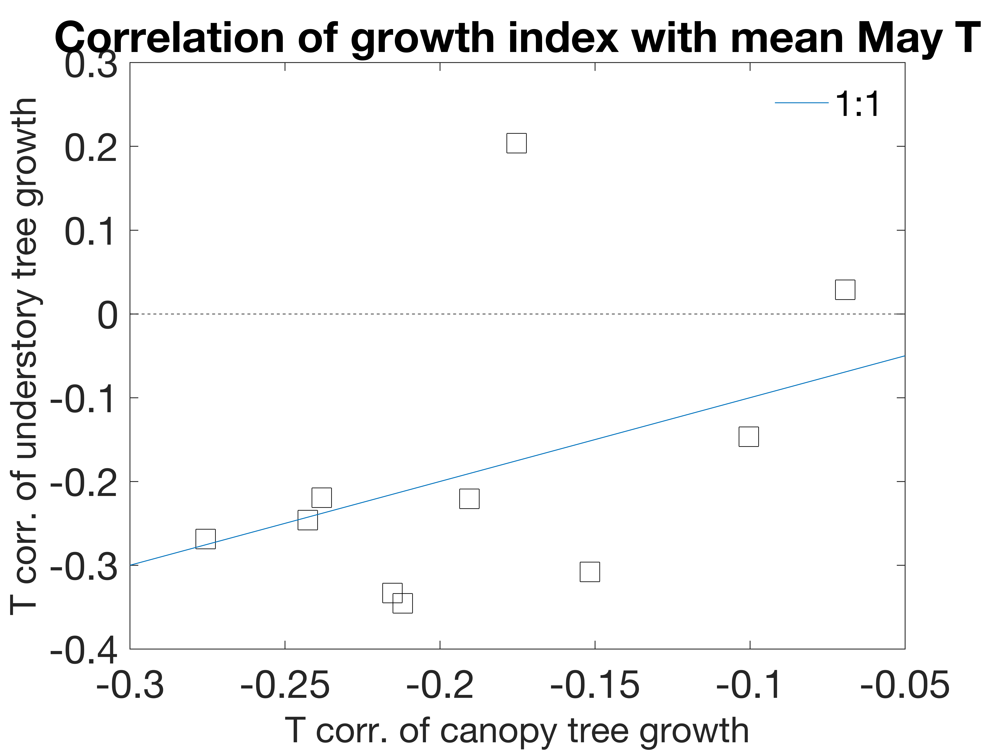

```{r setup, include=FALSE}
knitr::opts_chunk$set(echo = TRUE)
```

**Title:** Thermal sensitivity across forest vertical profiles: patterns, mechanisms, and ecological implications

**Authors (so far, not necessarily in final order):** 
Nidhi Vinod^1^,
Martijn Slot^2^,
Ian McGregor^3^,
Elsa Ordway,
Marielle N. Smith^3^,
Tyeen Taylor,
Kristina J. Anderson-Teixeira^1,2^* 


**Author Affiliations:**

1. Conservation Ecology Center; Smithsonian Conservation Biology Institute; Front Royal, VA 22630, USA

2. Smithsonian Tropical Research Institute; Panama, Republic of Panama

3. Center for Geospatial Analytics; North Carolina State University; Raleigh, NC 27607, USA

4. Department of Forestry, Michigan State University, East Lansing, MI 48824, USA

*corresponding author: teixeirak@si.edu; +1 540 635 6546

\newpage

```{r eval=FALSE, echo=FALSE}
# based on Helene's Tansley review, and regular NewPhyt guidelines, I think the limit for New Phyt is 200 words. 
```

## Summary

*(currently too long for NewPhyt)*

Rising temperatures are expected to have profound effects on forests; however, it is not well understood how responses will vary across forest strata.
Here, we synthesize evidence as to how environmental conditions and foliar traits vary across vertical gradients, shaping leaf temperatures, metabolism, and ultimately whole-tree growth and mortality.
Strong vertical microclimatic gradients imply that canopy leaves are exposed to more solar radiation and higher evaporative demand than understory leaves.
However, foliar traits relevant to shaping leaf temperature ($T_{leaf}$) and metabolism also vary strongly across height or light gradients.
Resulting $T_{leaf}$'s generally track air temperature ($T_{air}$) and do not vary dramatically across the vertical gradient, except when hydraulic limitations impede evaporative cooling such that $T_{leaf}$'s of sun-exposed canopy leaves become significantly elevated above both $T_{air}$ and understory $T_{leaf}$.
Correspondingly, while leaf metabolism generally increases with height across the vertical gradient, differences in thermal sensitivity, optimal temperatures, and thermal damage thresholds are modest.
The implications for tree performance are mixed: whereas thermal buffering may contribute to the disproportionate stress of larger trees during drought, emerging tree-ring evidence suggests that understory trees experience relatively greater stress from high $T_{air}$.
Additional research will be important for improving our spotty understanding of the thermal sensitivity of metabolism and tree growth across vertical forest gradients.
In the meantime, our findings imply that while large canopy trees are the most vulnerable to warming when combined with drought, understory trees may be more vulnerable under more mesic conditions.


\newpage

## Introduction

Globally, temperatures have risen # $^\circ$C since YEAR and are expected to rise an additional #-#$^\circ$C by YEAR (IPCC REF). 
There is also increasing severity and frequency of heat waves (@perkinsIncreasingFrequencyIntensity2012).
This is expected to have profound effects on forest biodiversity and ecosystem function (REFS), and the resulting feedbacks to the climate system (e.g., decreased C storage, altered albedo and hydrology) will have a critical influence on the future of trajectory of climate change [@bonan_ecological_2016, Bonan 2008].
These changes, alongside climate change-driven disturbances such as drought, deforestation and fire, may contribute to increasing tree mortality in forests around the world [@mcdowellMechanismsPlantSurvival2008, @allenUnderestimationGlobalVulnerability2015, Brienen et al. 2015].

**Rising temperatures are likely to have differential impacts on trees of different size and canopy position, in large part because small understory trees exist in a microenvironment that is substantially buffered by the more exposed canopy trees [@zellweger_seasonal_2019; @davis_microclimatic_2019].**
Larger trees form canopies that maintain vertically-stratified forest ecosystems, and play a crucial role in regulating macro-microclimate. (Nakamura et al. 2017, Ozanne et al. 2003)  
With increase in temperatures globally, we're seeing that larger trees suffer more during drought [@bennettLargerTreesSuffer2015, @stovallTreeHeightExplains2019] 
Increasing mortality of large trees, sometimes coupled with reduced tree growth rates, is driving a global trend towards more disturbed forests with younger trees (McDowell et al.2020). 


**The structure and microclimates of global forests are changing due to unprecedented disturbance rates.**
Temperate and tropical forest canopies are already or will be soon functioning beyond their optimal photosynthetic threshold [@mau_temperate_2018, @huangAirTemperatureOptima2019].Additionally, loss of canopy cover as a result of increasing temperature and related forest disturbances [@senfCanopyMortalityHas2018a] is associated with reductions in canopy structural complexity, and altered microclimates and surface energy balance components (Zellweger et al. 2020; Stark et al. 2020 ), this has shown to increase understory temperatures which raises concern for understory species and forest biodiversity [@zellweger_seasonal_2019, @defrenneMicroclimateModeratesPlant2013]

(Marielle--"Reductions in canopy cover can lead to non-linear threshold responses, causing dramatic shifts from one forest state to another (e.g., transition from forest to savanna-like vegetation in tropical forest regions through "savannization"), with energy balance impacts and implications for forest-atmosphere interactions (Stark et al. 2020)".)  

We're seeing increasing evidence that this impacts the ecology, with potential feedbacks to climate change, especially in protecting cool-acclimated species [@zellweger_forest_2020, @suggittExtinctionRiskClimate2018, @scheffersMicrohabitatsReduceAnimal2013,@defrenneMicroclimateModeratesPlant2013]  

With shifting forest dynamics, it is becoming more important than ever to understand thermal sensitivity along the vertical canopy profile, from the understory to the top of the canopy, this will provide crucial insights for how rising temperature affects forest ecology and biodiversity, energy balance, ecosystem function, and biosphere-atmosphere interactions [with additional feedbacks to forest structure and microclimates].

**However, we lack a systematic understanding of biophysical and biological patterns across this gradient, how these affect leaf-level processes, and in turn how it affects ecology (Fig. 1).** 

**This review addresses the following questions:**

i.	How does the biophysical environment vary with height in forests?

ii.	How do leaf traits vary with height (or between sun and shade leaves) in forests?

iii.	How do biophysical environment and traits combine to affect leaf temperature?

iv.	How does leaf metabolism respond to temperature in canopy and understory settings?

v.	What are the implications of these patterns for the ecology and climate change responses of canopy versus understory trees? 

vi. What are the implications for modeling/ scaling? 

*Our primary interest is the gradient in height and exposure from the top of the canopy to the understory in forests. However, because a lot of the relevant research has focused on exposure gradients near ground level (e.g., comparisons of sun and shade leaves), and the implications [or utility] for ecosystem models we also review studies focused on exposure gradients.*


## The biophysical environment

Maybe we should start this section with a brief definition of what we mean by "biophysical"? E.g. the physical structure of the forest canopy (from understory to the canopy top) and associated microclimates, which are in large part determined by the structure of the forest itself. ] 

**Forest canopies have a buffering effect on multiple aspects of the understory climate (Fig. **2**).**

Most notably, light conditions vary  with canopy height due to cumulative layers of vegetation that limits light to lower canopy layers [@fauset_differences_2018, @niinemetsPackingPhotosyntheticMachinery2009, Parker 1995, @poorterMetaanalysisPlantResponses2019b]
(Fig. **2x**)such that the forest floor of understory regions receive 1-2%  of the light incident to the top of the canopy [@robertsStomatalBoundaryLayerConductances1990a, Chazdon & Fetcher 1984; Parker et al. 2019]
In heterogeneous canopies [with high gap fractions], distance from the outer canopy is a better proxy for light environment than height (Parker 1995) and lower canopy light environments are highly variable, ranging from high light gap to deeply shaded understory regions (Chazdon & Fetcher 1984; Tymen et al. 2017 ; Smith et al. 2019). 
This difference in light regime is an important variable in determining leaf traits along the gradient and consequently their responses to temperature.[@fausetDifferencesLeafThermoregulation2018, @niinemetsResponsesForestTrees2010, @sackHowStrongIntracanopy2006, Doughty and Gouden 2008]

In addition, the vertical structure and hence, microenvironments of forest canopies vary seasonally (Parker & Tibbs 2004; Smith et al. 2019 ; Parker et al. 2019) and following disturbance (e.g., Parker et al. 2002 ; Almeida et al. 2016 ; Stark et al. 2020 in press).
- (*@bonan_ecological_2016 reviews this and points to appropriate references*)
-	Sunflecks: Leaky et al. 2003--from Marielle, "This is another, higher resolution axis of the variability of microenvironments that is probably quite important to address. (Also see the papers by Robin Chazdon on temporal variability of light environments). Maybe we will want to add these sentences (above) and something about sunflecks to a separate section that specifically addresses sources of variation in forest structure & microenvironments (e.g., vertical, horizontal, seasonal, diurnal, and with disturbance)?"

**Wind speeds are also higher at the top of the canopy (Fig. **2x**).**
*(fill in some specifics from the NEON analysis)*
Consistent with the results from NEON sites, higher wind speed at greater heights within a forest have previously been observed in both closed canopy forests [e.g., REFS; @mcgregor_tree_nodate] and open savannas (Curtis et al. 2018).
This results in higher boundary layer conductance, *DEFINE*, for canopy leaves [@martin_boundary_1999; @roberts_stomatal_1990].

**Air temperature, $T_{air}$, is sometimes significantly buffered by forest canopies (Fig. **2x**).**
Studies comparing $T_{air}$ under forest canopies with nearby clearings have found lower maximum temperatures under forest canopies across Europe [@zellweger_seasonal_2019] and in the northwestern United States [@davis_microclimatic_2019]. 
Similarly, maximum air temperatures were higher above than below tropical forest canopies during wet seasons in Panama [@rey-sanchez_spatial_2016] and coastal Brazil [@fauset_differences_2018, Tymen et al. 2017] 
"max temps were higher and humidity lower in gaps vs understory regions (both at 1.5 m above the ground), see Fig. 4 - again illustrating buffering effect of the canopy"
However, similar maximum temperatures have been observed during the dry season in Panama [@rey-sanchez_spatial_2016] and in a temperate deciduous forest in the eastern United States [@mcgregor_tree_nodate].
Minimum $T_{air}$ is also buffered by forest canopies under some conditions. 
Higher minimum temperatures under forest canopies relative to nearby clearings have been observed across Europe [@zellweger_seasonal_2019] and in the northwestern United States [@davis_microclimatic_2019].
However, similar minimum temperatures under forest canopies have been observed in tropical forests in Panama [@rey-sanchez_spatial_2016] and coastal Brazil [@fauset_differences_2018], as well as in a temperate deciduous forest in the eastern United States [@mcgregor_tree_nodate].
*(Add something about risk of freeze.)*

**Humidity also varies across the forest vertical profile, being generally higher in the understory (Fig. **2x**).**
- DETAILS - REFS
- @mcgregor_tree_nodate
RH, in combination with temperature, determines vapor pressure deficit, $VPD$
- $VPD$ is lower in understory of Atlantic forest during wet season [@fauset_differences_2018, Tymen et al. 2017]
This means that canopy leaves tend to be exposed to higher *evaporative demand*.

**Finally, carbon dioxide (CO~2~) concentrations tend to be higher in the understory.** 
-	Higher in understory, particularly at dusk (Koike et al. 2001).
-	Higher in the understory overnight; difference persists during the day but is very small [@yang_spatial_1999].
Differences in concentration are by far most pronounced near ground level. 
Given that differences are small during the day when photosynthesis is active, and that even nighttime differences are modest at the height of understory tree crowns, CO~2~ concentration is unlikely to have much effect on the energy balance and metabolism of leaves across the forest vertical gradient. 


**The strength of this buffering varies across forests, being influenced by both forest characteristics and the biophysical environment.**
First, buffering increases with canopy cover.
* greater cover --> lower max T and VPD, higher minT  [@davis_microclimatic_2019]
* greater cover -->  lower max T and light availability [@zellweger_seasonal_2019]
* [@thom_effects_2020; Tymen et al. 2017 ; Jucker et al. 2018 ; Hardwick et al. 2015]
*Presumably, buffering would also be affected by canopy roughness, which affects turbulent air flow and the canopy boundary layer.*
Taller trees don’t necessarily increase buffering [@zellweger_seasonal_2019]. 
Species that have higher shade casting ability increase T buffering (Zelllweger et al. 2019) [@zellweger_seasonal_2019]
The strength of buffering also varies with respect to geographic and climatic factors.
* Distance to coast, topographic position, elevation [@zellweger_seasonal_2019]
* [@davis_microclimatic_2019]

## Trait variation 

[Add something about how leaf traits along the vertical canopy profile are different than the expectation from leaf economic spectrum (LES)? Chen et al. 2020 is a good paper to help frame this . They make an important point in that paper that we may also want to make here: that the LES was 'built' using mainly sun (upper canopy) leaves; given the vastly different light environments at the bottom of the canopy (and that most leaves in the canopy are likely to be shade leaves) there is a strong research need to better characterise trait relationships and leaf responses through the whole vertical canopy - hence the importance of this review. Keenan & Niinemets 2016  will also be helpful in making this point.]--M N. Smith

**Many traits vary with height and/or between sun and shade leaves on the same species (Table 1).**
Here, we focus on traits that are important for shaping leaf temperature ($T_{leaf}$) and thermal sensitivity.


```{r eval=FALSE, echo=FALSE}
# refs in this table need to go in the nocite field below (easiest in alphabetical order)
```
---
nocite: | 
  @mau_temperate_2018
---

Are traits shaped more by height or light?
-	 “Height is more important than light in determining leaf morphology in a tropical forest” (Cavaleri et al. 2010)
- 	(Cavaleri et al. 2008) 
- from Martijn: "If I remember correctly, height and light exposure are closely correlated and things like LMA scale with both, but above a certain level of light exposure, the effect of additional light disappears, while the relationship of the morphological traits with height continues. I have often been a bit skeptical about assuming height drives morphology, as most of the work that convincingly shows that (and relates it to turgor pressure for example) is from 100 m tall redwoods."

*Leaf area / characteristic dimension*:
- Recent paper on influence on leaf size/shape in PCE – certain aspects of leaf shape were not as relevant as expected. 
- Max stomatal conductance - increases with canopy height (Kenzo et al. 2015).
Max transpiration rate - increases with canopy height (Kenzo et al. 2015).


*Thermal time constant (probably not a lot out there)*
-	Curtis et. al, 2018 – higher in more exposed leaves (heat up slower, cool slower)
-	Michaeletz has used this in theoretical calculations (Michaeletz et al. 2016 and 2015?

*Carotinoids* 
-	photoprotective- disseminate heat, acclimate to high T. THese are proportional to irradiance 
-	antioxidant scavenging function- protect against cellular damage
- Königer et. al. 1995, and  Matsubara et al. 2009?

*Isoprene production*
-  Isoprene production *capability* as a trait (actual isoprene production is in section 4. I'm not sure whether Ty's content belongs here or in that section) 


## Leaf temperature

**Many of the biophysical and trait variable reviewed above affect leaf temperature, $T_{leaf}$, which in turn has a strong influence on leaf metabolism (see following section).**
$T_{leaf}$ is determined by the energy balance of a leaf and can be estimated based on basic biophysical principles [@campbell_introduction_1998; @muir_tealeaves_2019] (Fig. 3).
While small leaves remain within a few degrees of $T_{air}$, regardless of stomatal conductance, wider leaves can have temperatures deviating more from air temperature.
Large leaves can be significantly cooler than $T_{air}$ under low radiation with stomata open, and significantly hotter under high radiation with stomata closed.  
Leaves with open stomata and high radiation loads maintain $T_{leaf}$ similar to $T_{air}$, with coolest leaves at intermediate sizes (~10mm).
Shaded understory leaves should tend to maintain cooler daytime leaf temperatures for any given level of stomatal conductance.
However, counteracting this, lower wind speed in understory would reduce latent heat loss.
Thus, under hot conditions, canopy leaves exposed to higher wind speeds would be most effective at cooling when sufficient water is available to maintain high stomatal conductance; however, their $T_{leaf}$ can be highly elevated above $T_{air}$ when stomatal conductance is limiting.


**Aligning with biophysical expectations, field observations have show that leaf temperatures are influenced by the biophysical environment and leaf traits.**
1.	Air T
2.	Solar radiation
3.	Leaf traits 
-  Michaletz et al have done some interesting work on leaf thermoregulation in relation to various leaf traits. I don’t think there is sun vs shade tests, but we could look at how this might translate, or how some of the traits he has calculated might differ between sun and shade leaves. For example, he has this thermal time constant parameter that is calculated from leaf mass per area, leaf dry matter content, and some environmental parameters. E.g.: DOI: 10.1038/nplants.2016.129, http://dx.doi.org/10.1016/j.tree.2015.09.006

**When vertical gradients in the biophysical environment and leaf traits combine to shape leaf energy budgets, $T_{leaf}$ often differs little from $T_{air}$ and between understory and canopy (Fig. **2?**).**
For instance... 	(Bolstad et al. 1999).
Similarly, during the dry season in a tropical moist forest in Panama... (Rey-Sánchez et al. 2016).
**However, canopy leaves can reach much higher maximum $T_{leaf}$, and higher $T_{leaf} - T_{air}$, than understory leaves.**
-	(Slot et al. 2019) and refs therein
-	(Fauset et al. 2018)
Sun leaves can also be  cooled relative to $T_{air}$ more than shade leaves (Rey-Sánchez et al. 2016).

## Leaf metabolism and thermal responses

Leaf metabolism is strongly shaped by leaf temperature, and by the traits and environmental drivers reviewed above, all of which vary across vertical forest gradients (Fig. 1). 
However, as we detail below, there are limited studies comparing thermal responses of sun and shade leaves (Table 2).


```{r eval=FALSE, echo=FALSE}
# refs in this table need to go in the nocite field below (easiest in alphabetical order)
```
---
nocite: | 
  @bolstad_foliar_1999; @roberts_stomatal_1990; @slot_photosynthetic_2019 
---


*Stomatal conductance*


*Photosynthesis*

**Photosynthesis is generally higher in sun leaves-- a fact that is well-established (Niinemets 2007 ; Kenzo et al. 2015 ; Slot et al. 2019; Chen et al. 2020) and observed in numerous field studies.**
This is primarily driven by the greater light available to sun leaves.
In response to the greater light availability, sun leaves have traits allowing greater photosynthetic rates at high light,  including ....
The vertical gradient in photosythetic rates is also influenced by...
.[thoughts: plasticity vs change in tree species composition through the canopy; differences in variability of microenvironments through the profile - highest lower down in canopy?; life history / investment strategies and hence, leaf life spans at leaves at the top vs bottom of the canopy]-- M N. Smith


**While sun and shade leaves differ dramatically in $A_{max}$, the temperature sensitivity of photosynthesis does not appear to differ substantially between sun and shade leaves**
Biophysically, we might expect that sun leaves should tend to have a stronger temperature-dependence and higher temperature optima than shade leaves (Fig. 14.5; *revisit this!*) (Campbell and Norman 1998).
However, this does not appear to be the case based on the limited number of field studies that have compared temperature sensitivity of photoshythesis in sun and shade leaves.
For 3 species in Panama, (Slot et al. 2019) found that the optimum temperature for sun leaves tended to be slightly higher than that of shade leaves, but differences were not significant.
Mau et al. found no trend along a height gradient in Puerto Rico, and no significant trend in temperate trees (Mau et al. 2018).

**Leaf thermal tolerance (Tcrit/ T50)**
- define.
Typical values ~45-50$^\circ$C, varying somewhat 
across latitude/climate (O’sullivan et al. 2017),
with elevation [@feeley_thermal_2020;  Slot unpublished data],
with leaf traits [Sastry et al. 2018, @zhang_photosynthetic_2012].

**Thermal tolerance (e.g., $T_{50}$) varies with exposure, but there are no studies isolating effect of height.**
For two of three species studied in a tropical moist forest in Panama, $T_{50}$ was slightly lower for shade than sun-exposed leaves, both measured near ground level (Slot et al. 2019). 
Similarly, for *Acacia Papyrocarpa* (Benth.) trees in an arid region of southern Australia, higher $T_{50}$ was observed in more exposed (North-facing) canopy positions (Curtis et al. 2019). 
We're not aware of any other studies on this.

*Respiration*

**Similar to photosynthesis, respiration tends to be higher in sun leaves (Chen et al. 2020), but its temperature sensitivity appears to be similar between between sun and shade leaves.**
(Bolstad et al. 1999) did a study at Coweeta, including elev gradient. 
Found higher respiration (at reference T) in canopy leaves (@bolstad_foliar_1999). (*Martijn has some unpublished data on this that we might include: https://github.com/EcoClimLab/vertical-thermal-review/issues/8.*)
At Coweeta, Q10 showed a variable pattern, with a slight tendency to increase down the canopy [@bolstad_foliar_1999]. (*Martijn has some unpublished data on this that we might include.unpublished data showing higher Q10 in shade than in sun leaves for 10 species or so. May make sense to include here: https://github.com/EcoClimLab/vertical-thermal-review/issues/8.*)
Combining reference respiration and $Q_{10}$, @bolstad_foliar_1999 found  a modest net decrease in R for understory leaves relative to canopy leaves as T increases (*see their Fig. 1*).
Thus, @bolstad_foliar_1999 found evidence of acclimation, but there remained a declining trend of respiration with elevation.


*VOC production*

**Isoprene production**
- high emission rates occur in the mid-canopy, and even from very small statured trees and shrubs, at a site in the Brazilian Amazon (Taylor et al., in prep).
- The high temperature carbon compensation point of sun leaves is higher in isoprene emitting species than in non-emitting species, so it is to be expected that other aspects of heat tolerance will be similarly affected by isoprenes (https://doi.org/10.1111/pce.13564).
-  Within species, isporene production scales with light/ T


## Ecology

**Differences across forest vertical gradients in biophysical conditions, plant traits, and metabolism and its thermal responses scale up to affect whole-tree ecology in several ways.** First, vertical gradients in the biophysical environment shape which plant strategies, or sets of traits, are competitive in understory versus canopy conditions. 
-	*Spring and fall leaf phenology in temperate deciduous forests (Augsburger). 	Mechanism: more moderate conditions (T, wind) in understory (REF).*
*Among species that can be deciduous, greater proportion of deciduous individuals in larger size classes (Condit et al. 2000). One potential mechanism is lower temperature/hydraulic stress in understory*
- something on isoprene production?

**Vertical gradients also affect tree growth and survival, and how these respond to climatic variation.**
There are numerous demographic differences between understory and canopy trees, which have been linked to both the physical environment and plant traits (e.g., REFS), and we will not attempt to review those here.
More interesting in this context is how these shape differences in the climatic sensitivity of growth and mortality.
Many observations of larger trees suffering more during drought (Bennett et al. 2015).
One likely mechanism behind this pattern is that the crowns of larger trees exist higher in the vertical profile and therefore are exposed to higher evaporative demand and solar radiation [@mcgregor_tree_nodate].
Although drought is primarily a hydraulic problem, lack of water --> lower gs --> higher leaf T, so leaves face tradeoffs of water loss vs potentially damaging leafT.

**There is also recently emerging evidence that understory trees tend to exhibit greater growth declines with $T_{air}$ under mesic conditions.** 
In eight forests across the northeast United States, growth rates of understory trees declined sharply at higher $T_{air}$ (Rollinson et al., in review).
Similarly, our previously unpublished analysis shows that in a broadleaf deciduous forest in Virginia, understory trees in a Mid-Atlantic forest responded more negatively to warmer $T_{air}$ than did canopy trees (Fig. **4**; Appendix **S3**). 
This pattern is initially counter-intuitive in that sun-exposed leaves can experience greater elevation of $T_{leaf}$ over $T_{air}$ than shade leaves (Fig. **3?**). 
However, given adequate moisture to sustain high $g_s$, canopy leaves exposed to more wind and lower humidity should be more effective at cooling when $T_{air}$ exceeds physiological optima (Fig. **3**).
It is also possible that competition is accelerated under warmer temperatures.

**Appears to affect community change under warming (Zellweger et al. 2020).**




## Implications for Modeling / Scaling

E.g. see de Pury & Farquhar, 1997 : though likely an improvement over 'big-leaf' models, models that separate the canopy into sunlit and shaded portions (sun/shade models) may not be able to capture important within-canopy variation in terms of leaf dynamics (e.g. seasonal shifts in vertical leaf area distributions, Smith et al. 2019) and functions (e.g. thermal responses, as we present in this paper). Hence, multi-layered ecosystem models may be necessary for accurately projecting future forest function.

## Future Questions

- Are patterns (in traits, metabolism, ecology) driven by tree height or exposure?

- CO2 may lead to denser understory (Martijn)

- Influence of increasing temperatures on species compositions and feedbacks to future forest microclimates and function?

## Conclusions

## SI files

Appendix S1. Methods for NEON vertical profiles

Appendix S2. Methods for literature review

Appendix S3. Methods for SCBI tree-ring analysis

\newpage
## References


