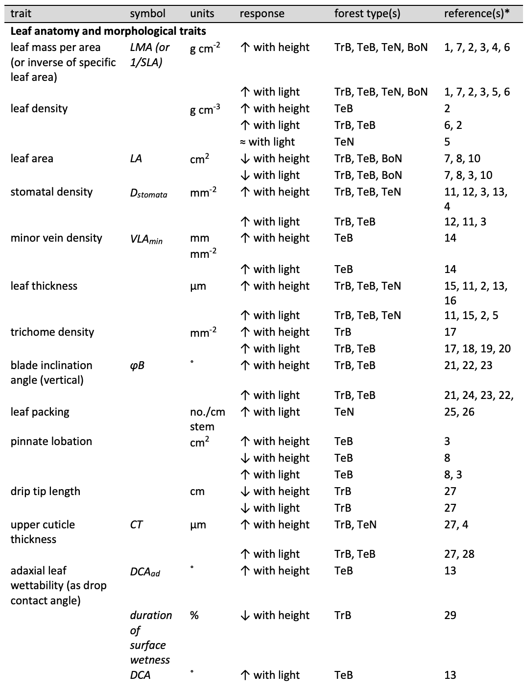
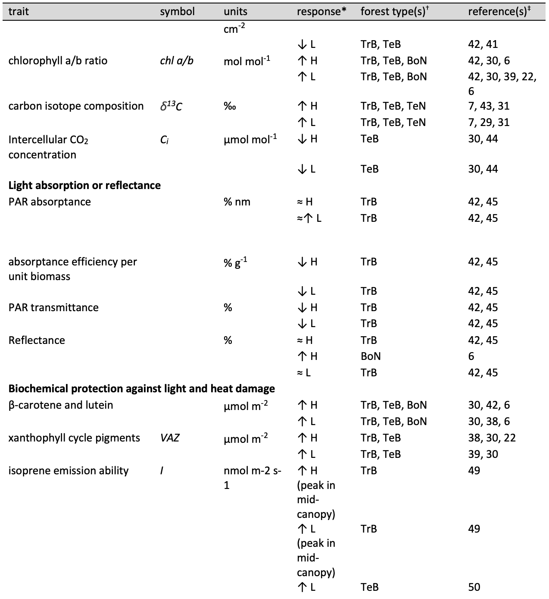
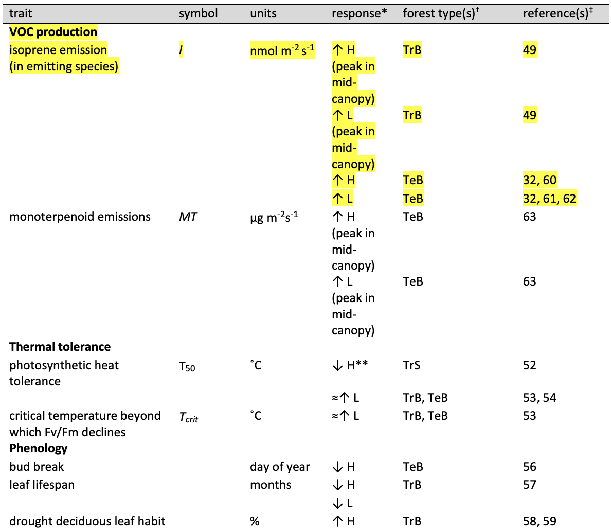
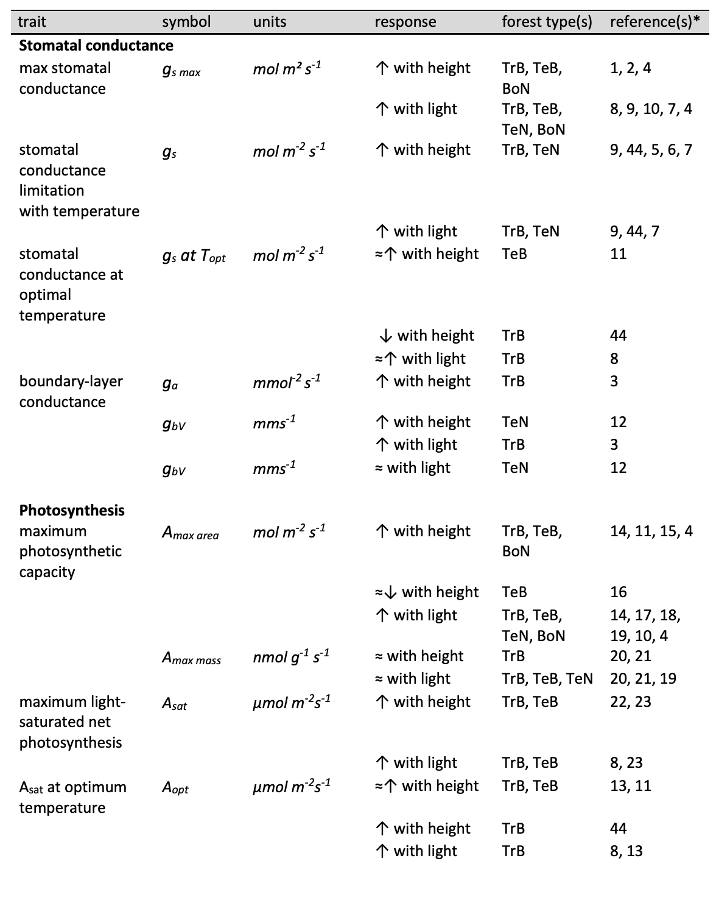
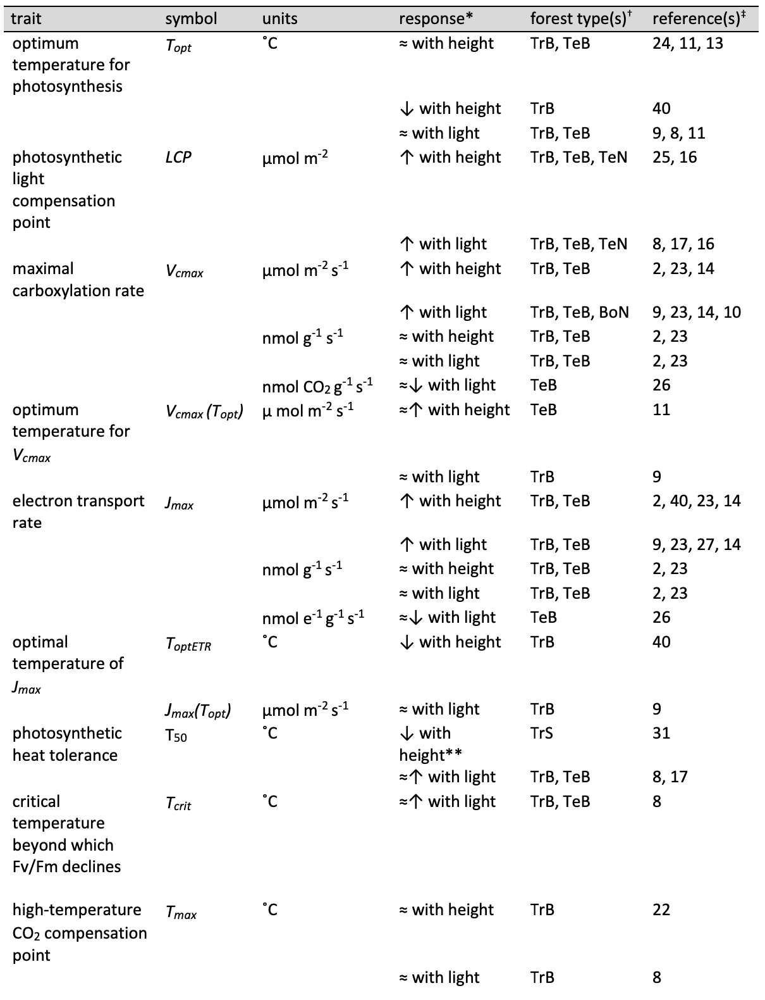
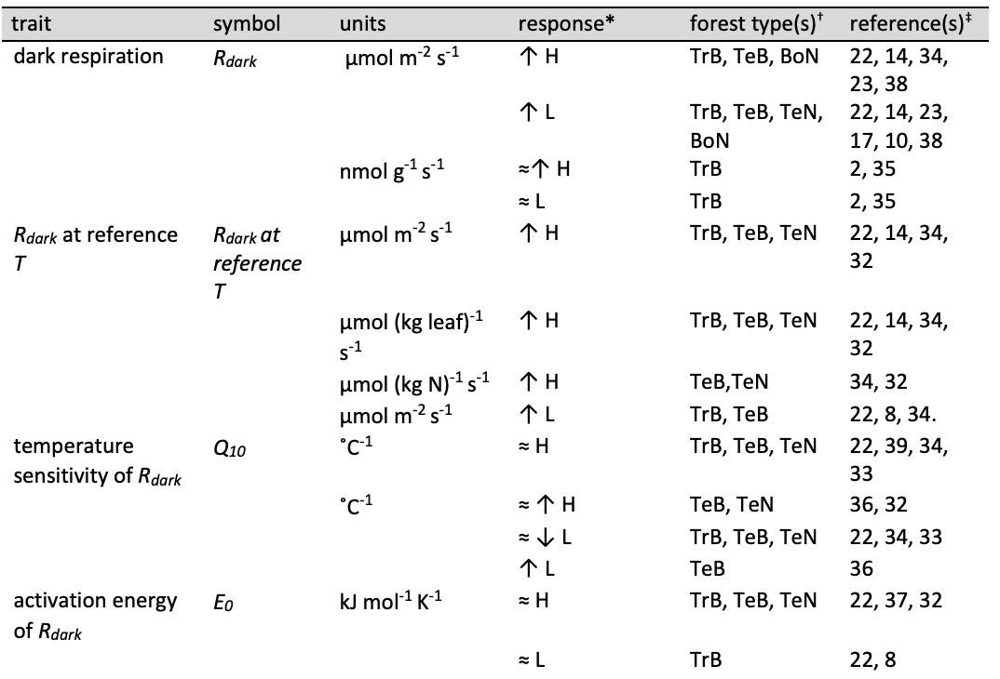

```{r setup, include=FALSE}
knitr::opts_chunk$set(echo = TRUE)
```

```{r eval = TRUE, echo=FALSE, warning=FALSE, results='hide'}


# DISPLAY ITEMS  (limit 8) # This chunk is for auto numbering of tables/figures
#figures
fig_schematic = 1
fig_NEON_vertical =  2
fig_leaf_T = 3
fig_treerings= 4 #not sure if we want to include one
fig_ecosystem=5
fig_model=6

#tables
table_leaf_traits=1
table_leaf_metabolism=2


# SUPPLEMENTARY INFO (this chunk must be repeated in MEE_manuscript_SI.Rmd)

#Appendices

Notes_leafTbiophysics<- "S1"

appendix_NEON_methods <- "S1"
appendix_tealeaves_methods <- "S2"
appendix_lit_review_methods <- "S3"


appendix_NEON_methods_title<- "Methods S1. Methods for analyzing vertical gradients in the biophysical environment"
appendix_tealeaves_methods_title <- "Methods S2. Methods for leaf energy balance modeling"
appendix_lit_review_methods_title<- "Methods S3. Methods for literature review"


#SI table numbers
NEON_sites = "S1"

#SI table captions
NEON_sites_legend = "Table S1. National Ecological Observatory Network (NEON) sites included in the analysis of vertical gradients of key biophysical characteristics"

#SI figure numbers
SIfig_NEON_all = "S1"

#SI figure captions
SIfig_NEON_all_legend <- "Figure S1. Vertical gradients in micrometeorological conditions for all forested sites in the National Ecological Observatory Network (NEON)"

#Word count
w_intro=414
w_biophys=1580
w_tleaf=758
w_traits= 2477
w_met=1000
w_ecol=1352
w_vertgradients=w_biophys+w_tleaf+w_traits+w_met+w_ecol
w_implications=2399
w_conclusions=248
w_total=w_intro+w_vertgradients+w_implications+w_conclusions

```


**Title:** Thermal sensitivity across forest vertical profiles: patterns, mechanisms, and ecological implications

**Authors:** 
Nidhi Vinod^1,2^,
Martijn Slot^3^,
Ian R. McGregor^4^,
Elsa M. Ordway^2,5^,
Marielle N. Smith^6^,
Tyeen C. Taylor^7^,
Lawren Sack^2^,
Thomas N. Buckley^8^,
Kristina J. Anderson-Teixeira^1,3^* 


**Author Affiliations:**

1. Conservation Ecology Center; Smithsonian Conservation Biology Institute; Front Royal, VA 22630, USA

2. Department of Ecology and Evolutionary Biology, UCLA, Los Angeles, CA 90039, USA

3. Smithsonian Tropical Research Institute; Panama, Republic of Panama

4. Center for Geospatial Analytics; North Carolina State University; Raleigh, NC 27607, USA

5. Department of Organismic and Evolutionary Biology, Harvard University, Cambridge, MA 02138, USA

6. Department of Forestry, Michigan State University, East Lansing, MI 48824, USA

7. Department of Civil & Environmental Engineering, University of Michigan, Ann Arbor, MI 48109, USA

8. Department of Plant Sciences; University of California; Davis, CA, 95616, USA

*corresponding author: teixeirak@si.edu; +1 540 635 6546


Text | word count | other | n
---|---|-----|--------------------
Total word count (excluding summary, references and legends) | 	`r w_total` |	No. of figures | 	6 (all colour)
Summary|  	200 | 	No. of Tables | 	2  
Introduction|	`r w_intro` |	No of Supporting Information files | 	6
Review of vertical gradients |	`r w_vertgradients`	||	 
Implications |	`r w_implications`	 ||
Conclusions |	`r w_conclusions`	||
Acknowledgments | 44	||	

\newpage


## Summary

<!--  200 word limit, no bullet points-->

Rising temperatures are influencing forests on many scales, with potentially strong variation vertically across forest strata. 
Using published research and new analyses, we evaluate how microclimate and leaf temperatures, traits, and gas exchange vary vertically in forests, shaping tree ecology and ecosystem function. 
In closed-canopy forests, upper-canopy leaves are exposed to the highest solar radiation and evaporative demand, which can elevate leaf temperature ($T_{leaf}$), particularly when transpirational cooling is curtailed by limited stomatal conductance.
However, foliar traits also vary across height or light gradients, partially mitigating and protecting against the elevation of upper-canopy $T_{leaf}$.
Leaf metabolism generally increases with height across the vertical gradient, yet differences in thermal sensitivity across the gradient appear modest.
Scaling from leaves to trees, tall trees have higher absolute metabolic capacity and growth at both individual and ecosystem levels, yet are disproportionately vulnerable to drought and damaging $T_{leaf}$, particularly under climate change. 
In contrast, understory trees experience fewer extreme high $T_{leaf}$'s but have fewer cooling mechanisms and thus may be disproportionately impacted under hot, humid conditions, or when exposed to harsher conditions through canopy disturbance.
As the climate changes, integrating the patterns and mechanisms reviewed here into models will be critical to forecasting forest-climate feedbacks.

**Key words**: forest; vertical gradients; microclimate; leaf temperature; leaf traits; gas exchange; ecosystem; climate change 

\newpage

# I. Introduction

<!--This first paragraph is all good content, but mostly pretty basic background knowledge that could be cut if needed.-->
Forest responses and feedbacks to climate change will critically influence Earth's furture climate.
Global average temperatures have risen 1.2$^\circ$C since 1900 [@rohdeBerkeleyEarthLand2020] and are expected to reach +1.5$^\circ$C by 2040 [@ipccClimateChange20212021], accompanied by increasing severity and frequency of heat waves and hotter droughts [@meehlMoreIntenseMore2004; @ipccClimateChange20212021].
These changes are expected to affect tree metabolism and forest ecosystem function [@breshearsUnderappreciatedPlantVulnerabilities2021; @portnerScientificOutcomeIPBESIPCC2021] by altering rates of photosynthesis and respiration [@breshearsUnderappreciatedPlantVulnerabilities2021; <!--@corlettImpactsWarmingTropical2011-->; @scafaroResponsesLeafRespiration2021], causing foliar damage during heat waves [@osullivanThermalLimitsLeaf2017; @corlettImpactsWarmingTropical2011], and reducing growth and elevating mortality during drought [@breshearsUnderappreciatedPlantVulnerabilities2021; @mcdowellPervasiveShiftsForest2020]. 
Warming may increase or decreased tree growth and forest carbon sequestration on balance, with decreases being more common globally [@oishiWarmerTemperaturesReduce2018; @sullivanLongtermThermalSensitivity2020; @anderson-teixeiraCarbonCyclingMature2021]. 
The resulting feedbacks to climate and carbon storage, and changes in albedo and hydrology will in turn impact the future trajectory of climate change [@bonan_ecological_2016], yet the degree of the impact remains uncertain [@krauseLargeUncertaintyCarbon2018; @friedlingsteinClimateCarbonCycle2006].
 
Much uncertainty arises because effects of warming on trees depend on size and crown position. 
Forests are vertically and horizontally stratified, and canopies moderate climatic conditions [@ozanneBiodiversityMeetsAtmosphere2003; @nakamuraForestsTheirCanopies2017], including buffering understory microclimates from extreme meteorological conditions [@zellweger_seasonal_2019]. 
The resulting vertical stratification of the biophysical environment such as temperature, light, wind, humidity and carbon dioxide (CO~2~) concentrations that influences leaf traits, thermoregulation and metabolism, with implications for whole plant performance [@fauset_differences_2018; @michaletzEnergeticCarbonEconomic2016a].
Although these vertical gradients strongly influence plant metabolism, demography, and ecology, we lack comprehensive understanding of these gradients [but see @niinemetsPhotosyntheticAcclimationSimultaneous2004].
Importantly, this limits our ability to understand how warming temperatures will affect leaf-level metabolism, whole-plant performance, and, in turn, forest ecosystem dynamics, biodiversity, energy balance, ecosystem function, and biosphere-atmosphere interactions.

Here, we review vertical gradients in the biophysical environment and plant form and function in forests, focusing on five key themes (Fig. `r fig_schematic`):
(1) the biophysical environment;
(2) leaf temperature ($T_{leaf}$);
(3) the leaf traits that most strongly influence $T_{leaf}$ and thermal tolerance;
(4) leaf gas exchange (including stomatal and boundary layer conductance, photosynthesis, and respiration) and its thermal sensitivity; and 
(5) tree and ecosystem ecology.
We then consider the implications for understanding forest responses to global change and how they scale across space and time. 

![**Figure `r fig_schematic`. Schematic summarizing vertical gradients in forests according to (1) biophysical environment, (2) leaf temperature ($T_{leaf}$), (3) leaf traits, (4) leaf metabolism, and (5) tree and ecosystem ecology.** Abbreviations are as follows: $T_{air}$: air temperature, VPD: vapor pressure deficit;  $T_{leaf}$ - $T_{air}$: leaf-to-air temperature difference; LMA: leaf mass per area; T sensitivity: temperature sensitivity; ET: evapotranspiration. Here, we summarize conditions in closed-canopy forests during growing season and daytime conditions; patterns tend to be weaker, or sometimes reversed, in more open forests, when canopy trees are seasonally deciduous, or at nighttime. Arrows indicate direction of increase, with double-pointed arrows indicating that the direction of the trend is uncertain or inconsistent. *Isoprene emission has also been observed to peak in mid-canopy (Table `r table_leaf_traits`).](schematics/Schematic figure 1.png)


# II. Review of vertical gradients

## 1. The biophysical environment

The biophysical environment, defined here to include the physical structure of the vegetation and associated physical conditions, varies vertically from the forest floor to the top of the canopy (Figs. `r fig_schematic`, `r fig_NEON_vertical`), with physical conditions largely determined by forest structure.
In this section, we review of the existing literature and analyze data on vegetation structure and vertical microclimate profiles from focal sites within the U.S. National Ecological Observatory Network (NEON; Fig. `r fig_NEON_vertical`, Supporting Information Methods `r appendix_NEON_methods`, Supporting Information Figure `r SIfig_NEON_all`).
Although we focus on vertical gradients, it is important to note that in heterogeneous canopies with high gap fractions and large variation in tree height, or at forest edges, the biophysical environment can be more closely linked to the distance from the outer edge of vegetation than to height [@lowmanForestCanopies1995]. 

![**Figure `r fig_NEON_vertical`. Vertical gradients in the biophysical environment for six US forest sites in the National Ecological Observatory Network (NEON)**. Height profiles, normalized relative to the top of the canopy, are shown for: growing season (a) modelled leaf area density, (b) estimated proportion of sun leaves, and (c) proportion of light incident to the top of the canopy (as fraction relative to to top of canopy), and for July mean ± 1 standard deviation for (d) maximum photosynthetically active radiation (PAR), (e) maximum wind speed, (f) minimum humidity (min RH), (g) maximum air temperature ($T_{air}$), and (h) maximum biological temperature, ($T_{bio}$). Measurements extend from ground level (normalized height = 0 m) to the top of the canopy (horizontal dashed line at normalized height = 1) or above (d-g). Variables shown in panels a-c are derived from lidar, and those shown in panels d-h from micrometeorological tower data. Sites, which represent a variety of forest structures, include a mixed northern hardwood forest (Harvard Forest, MA; HARV), a subtropical longleaf pine savanna (Ordway-Swisher Biological Station, FL; OSBS), a tropical montane broadleaf evergreen forest (Pu'u Maka'ala Natural Area Reserve, Hawai'i; PUUM), two temperate broadleaf forests (Smithsonian Conservation Biology Institute, VA, SCBI; Smithsonian Environmental Research Center, MD, SERC), and a coniferous forest (Wind River Experimental Forests, WA; WREF). Further site information is given in Supporting Information Table `r NEON_sites`, and analysis details in Supporting Information Methods `r appendix_NEON_methods`. Vertical profiles in micrometeorological variables (d-h) at all forested NEON sites are shown in Supporting Information Figure `r SIfig_NEON_all`.](NEON_height_profiles/figures/Fig2_normalized.png)

### 1.1 Foliage 

Canopy foliage is the primary physical barrier between the atmosphere and the forest floor, buffering multiple aspects of the understory conditions from large fluctuations in conditions experienced above the canopy. It strongly influences -- and is influenced by -- the vertical biophysical gradient (Fig. `r fig_NEON_vertical`).
Vertical patterns in leaf area density (*i.e.*, leaf area per unit volume) differ across forests (Fig. `r fig_NEON_vertical`a-b, Supporting Information Figure `r SIfig_NEON_all`). 
In tropical and temperate forests with dense broadleaf canopies, leaf area density is generally highest in the canopy layer (i.e., that formed by the crowns of dominant trees), but understory leaf area density is often high as well, sometimes causing undulating patterns with height [e.g., SCBI, SERC and HARV, Fig. `r fig_NEON_vertical`a,<!--@terborghVerticalComponentPlant1985;--> @ashtonComparisonsStructureMixed1992; @koikeCanopyStructureTropical1993; @parkerVerticalProfileCanopy1989; @dominguesParameterizationCanopyStructure2005]. 
In forests with more open upper canopies, including many needle-leaf forests, leaf area density can be greatest in the lower canopy or understory [e.g., PUUM and WREF, Fig. `r fig_NEON_vertical`a, @baldocchiSeasonalVariationEnergy1997; @hanberryOpenForestEcosystems2020; @lawLeafAreaDistribution2001;@bonan_ecological_2016]. 
Soil moisture conditions, topography, and gap formations following disturbances all alter foliage patterns [e.g., @bonan_ecological_2016; @almeidaContrastingFireDamage2016; @starkAmazonForestCarbon2012; @hanberryOpenForestEcosystems2020]. 
In addition, seasonally dry and wet conditions, deciduousness, and phenology contribute to temporally shifting leaf area density patterns [<!--@parkerStructuralPhenologyLeaf2004;--> @parkerConsequencesEnvironmentalHeterogeneity2019; @smithSeasonalDroughtrelatedChanges2019; @tangLightdrivenGrowthAmazon2017; @nunesForestFragmentationImpacts2022]. 
In this review, we focus on growing season conditions (peak leaf area index, LAI) unless otherwise noted.

### 1.2 Light

The intensity of visible and photosynthetically active radiation (PAR, 400-700nm) decreases from the canopy top to the forest floor, with a profile whose shape is modified by leaf area density, leaf clumping, canopy height, and vertical structure across species and forest types [Fig. `r fig_NEON_vertical`d, Supporting Information Figure `r SIfig_NEON_all`, @belandVerticalStructureHeterogeneity2021; @koike_leaf_2001; @binLeafTraitExpression2022].
Canopy foliage absorbs a large portion of PAR (400-700nm), and selectively filters light, thereby altering the spectrum of PAR creceived in the lower canopy and understory layers. 
The ratio of red (~685-690 nm) to far red (~730-740 nm) light declines along qith total PAR with increasing depth in the canopy, and understories receive diffuse light enriched in near infrared radiation (700-1000 nm)  [@decastroLightSpectralComposition2000; @poorterLeafOpticalProperties2000].
Mid-canopies and understories experience a highly dynamic light environment due to sunflecks, or brief increases in direct solar radiation, caused by small canopy gaps, wind-induced canopy movements or the sun's passage across a dynamically structured canopy surface [@waySunflecksTreesForests2012].
This light gradient is more pronounced in dense canopies, including broad-leaf and mixed forests (e.g., SCBI, SERC and HARV, Fig. `r fig_NEON_vertical`d), than in forests with more open upper canopies, including many conifer forests [e.g., OSBS, PUUM, and WREF, Fig. `r fig_NEON_vertical`d, Supporting Information Figure `r SIfig_NEON_all`, @chazdonPhotosyntheticLightEnvironments1984; @aussenacInteractionsForestStands2000a; @tymenQuantifyingMicroenvironmentalVariation2017;  @parkerConsequencesEnvironmentalHeterogeneity2019; @bartemucciOverstoryInfluencesLight2006; @baldocchiSeasonalVariationEnergy1997]. 
This light gradient drives variation in leaf traits (Table 1), photosynthetic capacity (see section 4.2) and leaf temperature (see sections 2.2, 4.2).

### 1.3 Turbulent transport and wind
Vertical transport in forest canopies is dominated by turbulent transport, making vertical profiles of wind speed, water vapor, CO~2~, and temperature more difficult to predict and to generalize on the basis of theoretical first principles compared to radiation profiles. 
Above the canopy, turbulent transport typically mimics diffusion – that is, vertical fluxes of heat, mass and momentum are proportional to their respective vertical gradients, and to transfer coefficients [eddy diffusivities, @penmanWeatherWheatEssay1960]-- such that wind speed declines logarithmically with proximity to the canopy surface [@monteithPrinciplesEnvironmentalPhysics2013]. 
Interaction with a plant canopy also attenuates wind, causing wind speed to decline through the canopy; for example, small plant elements can rapidly dissipate momentum within dense canopies [e.g., @raupachAveragingProceduresFlow1982; @baldocchiSpectralLagcorrelationAnalysis1988].
Within canopies, however, transport often fails to mimic diffusion – e.g., transport of momentum [@shawSecondaryWindSpeed1977] or heat [@raupachLagrangianAnalysisScalar1987] may occur in the direction opposite to that predicted by gradients of wind speed or temperature, respectively – making vertical wind profiles difficult to generalize from first principles [e.g., @denmeadScalarTransportPlant1987; @RaupachM.R1989Ttip; @meyersModellingPlantCanopy1987; @katulModelingCO2Sources1999; @harmanSimpleUnifiedTheory2007].
Such counter-gradient transport may arise from the intermittent generation, at the canopy surface, of large wakes or coherent eddy structures that periodically dip down through the canopy, gathering packets of warmed, humidified and CO~2~-enriched or depleted air from beneath and within the canopy and flushing them to the atmosphere above [@finniganTurbulenceWavingWheat1979; @baldocchiTraceGasExchange1991]. 
These "sweep-eject" events can couple understory conditions more directly to conditions above the canopy than beneath. 

Despite these complexities of within-canopy transport, wind speeds are generally much higher at the top of the canopy than within or beneath [@juckerCanopyStructureTopography2018; @jiao-junWindProfilesTrees2004].
This holds true across the range of forest types [Fig. `r fig_NEON_vertical`e, Supporting Information Figure `r SIfig_NEON_all`, @barnardSeasonalVariationCanopy2016; @mcgregorTreeHeightLeaf2021; @juckerCanopyStructureTopography2018; @mullerEvidenceEfficientNonevaporative2021; @hanberryOpenForestEcosystems2020; @hanberryReconceptualizationOpenOak2018] and savannas [@curtis_intracanopy_2019;@johnstonWhatLiesVerticalinpress]. 
Thus, upper canopy leaves have substantially higher boundary layer conductance ($g_b$) and therefore greater potential for exchange of both mass and sensible heat exchange (see sections 2.2, 4.1).

### 1.4 Atmospheric concentrations of CO~2~ and water vapor
Atmospheric CO~2~ concentrations tend to be higher near the ground at night, associated with plant and soil respiration, although the elevated CO~2~ quickly dissipates during the day [@koike_leaf_2001; @yang_spatial_1999]. 
Vertical CO~2~ concentration gradients can drive gradients in the ratio of leaf intercellular CO~2~ to ambient CO~2~ ($c_{i}/c_{a}$) calculated from $\delta^{13}C$, and in rates of refixation of respired CO~2~ vertically, both of which tend to be higher at lower heights (Table 1). 
Particularly, understory seedlings benefit from elevated CO~2~ by having higher rates of CO~2~ refixation [@brooksVerticalGradientsPhotosynthetic1997]. 
However, given that differences are negligible for most of the day when photosynthesis is occurring, gradients in CO~2~ concentrations concentrations likely have little effect on energy balance and metabolism across the vertical gradient.
 
Relative humidity (RH) tends to be higher in the understory and decreases with height, although this trend is absent in open forests [Fig. `r fig_NEON_vertical`f, Supporting Information Figure `r SIfig_NEON_all`, e.g., @juckerCanopyStructureTopography2018; @mcgregorTreeHeightLeaf2021; @binLeafTraitExpression2022].
Dense-canopy forests maintain higher daily maximum RH in the understory than open forests and nearby open areas, an effect that is greater in wetter conditions, and warmer months [@vonarxSpatiotemporalEffectsForest2012a; @hanberryOpenForestEcosystems2020]. 
In combination with $T_{air}$ and $T_{leaf}$, RH determines leaf-to-air vapor pressure deficit (VPD) -- the driving force of water loss from leaves -- which tends to be greater in the upper canopy and canopy gaps than in the understory [@fauset_differences_2018; @tymenQuantifyingMicroenvironmentalVariation2017; @niinemetsPhotosyntheticAcclimationSimultaneous2004]. 
Especially when canopy height and LAI are large, maximum $T_{air}$ and VPD are reduced in the understory [@juckerCanopyStructureTopography2018].
The implication is that upper canopy leaves have higher $g_b$ and associated potential for water and heat loss (see sections 2.2, 4.1).

### 1.5 Air temperature 
Vertical gradients in air temperature ($T_{air}$) differ widely (Fig. `r fig_NEON_vertical`, Supporting Information Figure `r SIfig_NEON_all`) and depend on factors such as vegetation type, local topography, vertical air mixing, cloud cover, sensible heat emissions, and times of day and year [@defrenneForestMicroclimatesClimate2021; @zellweger_seasonal_2019]. 
Commonly, attenuation of radiation and vertical transport of sensible heat by the canopy buffers the lower canopy and understory from large diel and seasonal swings in air temperature [@defrenneForestMicroclimatesClimate2021; @haesenForestTempSubcanopyMicroclimate2021a; @zellweger_seasonal_2019].
Diel temperature range is typically smaller beneath dense canopies than above, resulting from lower maximum daytime $T_{air}$ and warmer nighttime minimum $T_{air}$ than beneath open canopies or in nearby clearings [<!-- @missonPartitioningForestCarbon2007--> @defrenneForestMicroclimatesClimate2021; @vonarxSpatiotemporalEffectsForest2012a; <!--@defrenneGlobalBufferingTemperatures2019; @davisMicroclimaticBufferingForests2019--> @zellweger_seasonal_2019 <!--@ramboCanopyMicroclimateResponse2009; @binLeafTraitExpression2022; @haesenForestTempSubcanopyMicroclimate2021a; @meeussenMicroclimaticEdgetointeriorGradients2021-->]. 
Notably, buffering against high maximum daytime $T_{air}$ becomes weaker and can be reversed as canopies become more open [Supporting Information Figure `r SIfig_NEON_all`,@curtis_intracanopy_2019; @meeussenMicroclimaticEdgetointeriorGradients2021]. 
Analogous to a 'canopy greenhouse effect', in open forests, below-canopy maximum $T_{air}$ can be warmer than canopy $T_{air}$, due to turbulent air mixing and interception of thermal radiative flux from the soil and the canopy by lower-canopy layers [e.g., OSBS, Fig. `r fig_NEON_vertical`g, Supporting Information Figure `r SIfig_NEON_all`b; <!--@hadleyInfluenceKrummholzMat1987--> @banerjeeExplainingConvectorEffect2017; @curtis_intracanopy_2019;<!--@zweifelMiddayStomatalClosure2002; @ramboCanopyMicroclimateResponse2009; @hardwickRelationshipLeafArea2015--> @mullerEvidenceEfficientNonevaporative2021].
These usually-modest gradients in $T_{air}$ combine with the above-described gradients in micrometeorological conditions to shape $T_{leaf}$ patterns within canopies.

## 2. Leaf temperature 

$T_{leaf}$ is strongly tied, and usually within a few degrees of, $T_{air}$ [@drakeNoEvidenceHomeostatic2020;@rey-sanchez_spatial_2016], but can be substantially warmer or cooler under certain conditions [@rey-sanchez_spatial_2016;@doughtyAreTropicalForests2008;@vogelLeavesLowestHighest2009]. 
Deviation of $T_{leaf}$ from $T_{air}$ is influenced by other micrometeorological drivers and by leaf traits and stomatal conductance (Fig. `r fig_leaf_T`; Note `r Notes_leafTbiophysics`), all of which vary across forest vertical gradients (Fig. `r fig_schematic`).
High radiation in the upper canopy (Fig. `r fig_NEON_vertical`) implies that upper canopy leaves often have higher $T_{leaf}-T_{air}$, and thus are often warmer than understory leaves (Fig. `r fig_leaf_T`a).
However, higher wind speeds (Fig. `r fig_NEON_vertical`) reduce $T_{leaf}-T_{air}$ [Fig. `r fig_leaf_T`b, @niinemetsPhotosyntheticAcclimationSimultaneous2004; @bonan_ecological_2016]. 
In addition, adaptive leaf traits that increase $g_b$ and $g_s$ (see sections 3, 4.1) mediate the direct effects of solar radiation on upper canopy leaves and result in higher rates of heat loss (Fig. `r fig_leaf_T`b-e). 
In contrast, in the lower canopy, greater RH and lower wind speeds may limit $\lambda E$ (through reduced VPD and $g_b$), increasing $T_{leaf}$ [Fig. `r fig_leaf_T`, @perezIncreasingHumidityThreatens2018; @tibbittsHumidityPlants1979].
Leaves in these normally-shaded locations experience rapid light and temperature surges during sunflecks (>10$^\circ$C)  [@waySunflecksTreesForests2012].


![**Figure `r fig_leaf_T`. Theoretical expectations for variation in the difference between leaf and air temperatures, $T_{Leaf}-T_{air}$, in response to (a) shortwave radiation, (b) wind speed, (c) relative humidity, (d) leaf characteristic dimension, and (e) stomatal conductance.** Leaf temperatures were modeled using the  *tealeaves* R package of @muir_tealeaves_2019 parameterized to represent a broadleaf species (*Quercus rubra* L.) in a mesic temperate forest (Harvard Forest, Massachusetts, USA) under hypothetical moist and drought conditions, as detailed in Supplementary Information Methods `r appendix_tealeaves_methods`. In each scenario, the independent variable was allowed to vary while other parameters were held constant at the values given in the table of biophysical constants. Dots along each line correspond to the biophysical constant assigned for the independent variable in the other scenarios, and therefore represent the modeled value for $T_{Leaf}-T_{air}$ with all parameters set to the biophysical constants given in the table. Biohphysical constants in the the table include: shortwave radiation (swr), wind speed (ws), relative humidity (rh), leaf characteristic dimension (lcd), stomatal conductance (gs), air temperature (tair). ](leaf_energy_balance/fig3_leafenergy.png)


Elevation of $T_{leaf}$ above $T_{air}$ varies with micrometeorological conditions. 
During drought (hot and dry, with higher-than-average solar radiation), when $g_s$ is limiting, $T_{leaf} - T_{air}$ will tend to be higher in the upper canopy compared to the understory (Fig. `r fig_leaf_T`).
This is because sun leaves are exposed to higher irradiance and VPD, and therefore have stronger $g_s$ limitation than shade leaves [Fig. `r fig_leaf_T`e, @leighInfluenceLeafSize2017; @fauset_differences_2018]. 
In contrast, under conditions conducive to stomatal opening, higher wind speeds and $g_b$ enable cooling in the upper canopy, whereas lower wind and $g_b$ in the understory limit evaporative cooling  [Fig. `r fig_leaf_T`b,d, @robertsStomatalBoundaryLayerConductances1990; @martin_boundary_1999; @leighInfluenceLeafSize2017 <!-- @songTreeSurfaceTemperature2020-->]. 
Thus, while understory and within-canopy shade leaves can remain cooler under lower radiation, their environment is less conducive to dissipating excess heat compared to upper-canopy leaves. 
Limitations in heat dissipation in shade leaves, together with physiological propensities, may cause above-optimal $T_{leaf}$ under slight heat or drought stress or during sunflecks [@leighInfluenceLeafSize2017; @songTreeSurfaceTemperature2020; @schymanskiStomatalControlLeaf2013].
In addition to lower wind speeds (Fig. `r fig_NEON_vertical`), higher RH (lower VPD) in the understory and inner canopy (Fig. `r fig_NEON_vertical`) also inhibits evaporative cooling, thus increasing $T_{leaf}-T_{air}$ [Fig. `r fig_leaf_T`c, @tibbittsHumidityPlants1979; @songTreeSurfaceTemperature2020;  @perezIncreasingHumidityThreatens2018; @konradLeafTemperatureIts2021a; @dietzVerticalPatternsDuration2007].

Vertical $T_{leaf}$ gradients are also expected to vary with canopy structure. 
Forests with closed canopies and high LAI, including tropical and temperate broadleaf forests, act as a parasol, absorbing most incoming radiation and preventing vertical air mixing in the understory. 
Therefore, in these forests, leaves in the upper canopy can experience greater $T_{leaf}-T_{air}$ and higher maximum $T_{leaf}$ than lower-canopy leaves, in some cases exceeding photosynthetic temperature optima ($T_{opt}$) because of $g_s$ limitation and high radiation [@carterExperimentalWarmingTropical2021; <!--@niinemetsShapeLeafPhotosynthetic1999-->; @doughtyAreTropicalForests2008; <!--@fauset_differences_2018-->; @mauTemperateTropicalForest2018; @millerOnlySunlitLeaves2021; <!--@rey-sanchez_spatial_2016; @pauTropicalForestTemperature2018-->]. 
In contrast, open canopies with lower LAI allow more vertical air mixing and sunlight into the understory, which can either neutralize a $T_{leaf}$ gradient or elevate $T_{leaf}-T_{air}$ at lower heights relative to the upper canopy [Fig. `r fig_NEON_vertical`h, Supporting Information Figure `r SIfig_NEON_all`; <!--@hadleyInfluenceKrummholzMat1987--> @mullerEvidenceEfficientNonevaporative2021; @martin_boundary_1999; @zweifelMiddayStomatalClosure2002]. 
The latter can result from a combination of still air at lower heights (Fig. `r fig_NEON_vertical`e), and sunflecks or the 'canopy greenhouse effect', as mentioned above [@hardwickRelationshipLeafArea2015; @schymanskiStomatalControlLeaf2013], and because shade leaves tend to have lower $g_s$  [@schymanskiStomatalControlLeaf2013]. Similarly, in very open forests or savannas, trees growing close to the ground can experience greater heat stress in their lower than upper canopies due to heat from the soil increasing $T_{leaf}$ of foliage near the ground [Fig. `r SIfig_NEON_all`, @hadleyInfluenceKrummholzMat1987; @curtis_intracanopy_2019; @johnstonWhatLiesVerticalinpress]. 
One of the few remote sensing studies combining drone lidar and thermal data found strong vertical gradients in midday plant temperature with ~5$^{\circ}$C cooler temperatures lower in the vertical profile of a dense subalpine stand in the alpine Eastern Swiss Alps [@websterThreedimensionalThermalCharacterization2018]. 
However, the opposite trend was observed for a lone tree surrounded by grass in a California open oak woodland, with cooler temperatures at the top of the crown, indicating a strong influence of closed-canopy shading on vertical temperature gradients [@johnstonWhatLiesVerticalinpress]. 

## 3. Leaf traits 

Anatomical, structural and biochemical leaf traits vary vertically across forest strata at anatomical, structural and biochemical levels [Table `r table_leaf_traits`, @sackHowStrongIntracanopy2006; @niinemetsWorldwideAnalysisWithincanopy2015; @chenLeafEconomicsSpectrum2020], shaping vertical profiles of leaf temperature, metabolism, and thermal sensitivity [@michaletzPlantThermoregulationEnergetics2015a;@michaletzEnergeticCarbonEconomic2016a; @zwienieckiHydraulicLimitationsImposed2004]. 
Vertical variation in leaf structure and composition has been long recognized, with sun and shade leaf traits distinguished for more than 100 years [@haberlandtPhysiologicalPlantAnatomy1914; @salisburyCausesEcologicalSignificance1928].
Early work attributed differences among leaves to sun versus shade [@wyliePrinciplesFoliarOrganization1951; @vogelSunLeavesShade1968], and this tendency grew given the parallel differences observed for plants grown in sun versus shade [@boardmanComparativePhotosynthesisSun1977; @abramsLeafStructuralCharacteristics1990].
More recent work has extended the focus from light alone to leaf height in the canopy, as important in determining differences in leaf structure and function that can partially mitigate the effects of gravity and hydraulic pathlength on leaves higher up in the canopy [@sackHowStrongIntracanopy2006; @kochLimitsTreeHeight2004; @burgessRegressionsLeafTraits2006].
For example, leaf mass per area (LMA), photosynthetic capacity ($A_{max}$ per area) and $g_s$ have been observed to increase with height, independently of light [@thomasPhotosyntheticDifferencesSaplings2002; @houterOntogeneticChangesLeaf2012; @cavender-baresChangesDroughtResponse2000; @binLeafTraitExpression2022].
Thus, leaves develop differently according to the irradiance and hydraulic stress associated with their canopy location, height and evaporative load, with additional potential influences of branch ontogenetic stage [Table `r table_leaf_traits`, @carterExperimentalWarmingTropical2021; @niinemetsResponsesForestTrees2010; @casasSunShadeLeaves2011;  @keenanGlobalLeafTrait2016; @binLeafTraitExpression2022; @sackHowStrongIntracanopy2006; @chenLeafEconomicsSpectrum2020; @niinemetsVariabilityLeafMorphology2015].
Plasticity throughout the canopy may emerge when development of new leaves is influenced by information from adjacent mature leaves or apical meristems, including  (e.g., for deciduous species expanding leaves) a “memory” of previous conditions in that location, and may also acclimate during and after expansion to the current microclimate [@zwienieckiHydraulicLimitationsImposed2004].
Overall, leaves may optimize their biochemistry, anatomy and structure for their local conditions [@lloydOptimisationPhotosyntheticCarbon2010; @buckleyOptimalCarbonPartitioning2021; @hikosakaOptimalNitrogenDistribution2014; @kitaoCanopyNitrogenDistribution2018; @niinemetsPhotosynthesisResourceDistribution2007]. 
Yet, while these studies have clarified many details of leaf differences throughout the canopy, no papers have integrated the many differences in leaf traits throughout the canopy in a cohesive framework.
Rather, much of our understanding of trait coordination is based on the leaf economics spectrum concept developed across diverse species using sun leaves [@wrightWorldwideLeafEconomics2004; @keenanGlobalLeafTrait2016; @chenLeafEconomicsSpectrum2020]. 
As canopy shade is known to alter these trait relationships [@osnasDivergentDriversLeaf2018], further research is needed to characterize trait relationships and responses vertically through the full range of canopy microenvironments.

Across the vertical gradient, traits vary (1) within individuals, across height and light gradients [e.g., @zwienieckiHydraulicLimitationsImposed2004; @sackHowStrongIntracanopy2006; @binLeafTraitExpression2022], (2) across individuals of the same species, often representing an ontogenetic trajectory from the understory to the canopy [e.g., @carterExperimentalWarmingTropical2021; @niinemetsResponsesForestTrees2010], and (3) among understory and canopy species [e.g., @lloydOptimisationPhotosyntheticCarbon2010]. 
Most studies characterizing variation in leaf traits or metabolism examine intraspecific patterns (categories 1 and 2), which are therefore the main focus of this review (Table `r table_leaf_traits`).
Generally, the pattern of fundamental trait adaptations to light gradients across forest species is similar to within-species trends [@rozendaalPlasticityLeafTraits2006; @thomasPhotosyntheticDifferencesSaplings2002; @houterOntogeneticChangesLeaf2012; @binLeafTraitExpression2022; @cavaleri_height_2010; @lloydOptimisationPhotosyntheticCarbon2010]; however, vertical trends vary across trees [@lloydOptimisationPhotosyntheticCarbon2010], and counter-gradient variation can exist [e.g., @luskWhyAreEvergreen2008].
Many leaf physiological parameters can be estimated based on foliage height profiles [e.g., @cavaleri_height_2010; @lloydOptimisationPhotosyntheticCarbon2010].

\newpage
**Table `r table_leaf_traits`.** Summary of typically observed variation in leaf traits and its thermal sensitivity across the vertical gradient and/or between sun and shade leaves. Studies listed here were compiled using a systematic review process, as described in Supplementary Information Methods `r appendix_lit_review_methods`.



\newpage
Table `r table_leaf_traits`, cont.



\newpage
Table `r table_leaf_traits`, cont.



*Responses across height and light gradients are summarized, with up and down arrows indicating significant increasing or decreasing trends, respectively, in response to height (H) or light (L). $\approx$ indicates lack of any notable directional variation, and $\approx \uparrow$ or $\approx \downarrow$ indicate non-significant or mixed trends (e.g., significant in some but not all species studied). 

$\dagger$ Forest types are coded as follows: TrB = tropical broadleaf; TeB = temperate broadleaf; TeN = temperate needleleaf (conifer); BoN= boreal needleleaf (conifer).

<!--refs in this table are in the nocite field at top of document-->
$\ddagger$ 1. Mau et al. 2018; 2. Coble and Cavaleri 2014; 3. Sack et al. 2006; 4. Chin and Sillett 2019; 5. Wyka et al. 2012; 6. Atherton et al. 2017; 7. Kenzo et al. 2015; 8. Kusi and Karasi 2020; 9. Dang et al. 1997; 10. Gebauer et al. 2015; 11. Marenco et al. 2017; 12. Kafuti et al. 2020; 13. Van Wittenberghe et al. 2012; 14. Zhang et al. 2019; 15. Weerasinghe et al. 2014; 16. Oldham et al. 2010; 17. Ichie et al. 2016; 18. Gregoriou et al. 2007; 19. Levizou et al. 2005; 20. Liakoura 1997; 21. Fauset et al. 2018; 22. Niinemets et al. 1998, 23. Ishida et al. 1998; 24. Millen and Clendon 1979; 25. Smith and Carter, 1988; 26. Hadley and Smith 1987; 28. Baltzer and Thomas 2005; 29. Coble et al. 2016; 30. Scartazza et al. 2016; 31. Duursma and Marshall, 2006; 32. Harley et al. 1996;  33. Hernandez et al. 2020; 34. Turnbull et al. 2003; 35. Chen et al. 2020; 36. van de Weg et al. 2012; 37. M.A Cavaleri et al. 2008;  38. Koniger et al. 1995; 39. Mastubara et al. 2009; 40. Harris and Medina 2013; 41. Hansen et al. 2001; 42. Poorter et al. 1995; 43. Coble et al. 2016; 44. Niinemets et al. 2004; 45. Poorter et al. 2000; 46. Zwieniecki et al. 2004; 47. Sack and Scoffoni, 2013; 48. Ball et al., 1988; 49. Taylor et al. 2021; 50. Niinemets et al. 2010; 51. Brooks et al. 1997; 52. Curtis et al. 2019; 53. Slot et al. 2019; 54. Hamerlynck and Knapp 1994; 55. Lloyd et al. 2010; 56. Augspurger and Bartlett, 2003; 57. Osada et al. 2001; 58. Meakem et al. 2018; 59. Condit et al. 2000; 60. Harley et al. 1997; 61. Niinemets and Sun, 2014; 62. Sharkey and Monson, 2014; 63. Simpraga et al. 2013; 64. Domingues et al. 2005

\newpage

## 3.1 Leaf anatomy and morphology

Sun leaves have anatomical, morphological, and physiological traits that reduce $T_{leaf}$ through higher conductance ($g_b$ or maximal $g_s$) and/or reflectance (Table `r table_leaf_traits`). 
Thus, sun leaves are generally smaller and thicker, with higher LMA, and are more deeply lobed [Fig. `r fig_leaf_T`, @vogelSunLeavesShade1968; @zwienieckiHydraulicLimitationsImposed2004; @sackHowStrongIntracanopy2006; @leighInfluenceLeafSize2017], but with greater leaf packing and clumping (which reduces $g_b$).
Steeper leaf angles reduce mid-day radiation loads and thereby decrease $T_{leaf}-T_{air}$ [@niinemetsAdjustmentFoliageStructure1998; @ballMaintenanceLeafTemperature1988], while higher trichome density increases reflectance, also decreasing radiation load.
Further, sun leaves tend to have higher stomatal and vein densities, which fascilitate evaporative cooling by enabling higher $g_s$ [see section 4.1, @zwienieckiHydraulicLimitationsImposed2004]. 
Yet sun leaves also have adaptations to limit water stress, particularly in drier climates, including greater cuticle thickness and higher trichome density [which may reduce or increase $g_b$; @schreuderModelledInfluencesNonexchanging2001; @ichieEcologicalDistributionLeaf2016a].
In contrast, shade leaves have traits that maximize light capture (e.g., lower LMA and greater light absorptance per unit biomass), but larger leaves and lower transpiration make them more prone to overheating than sun leaves [@leighInfluenceLeafSize2017; @casasSunShadeLeaves2011; @schymanskiStomatalControlLeaf2013]. 
In open canopies, where light is comparatively homogeneous, leaf traits may be shaped more by maximum $T_{air}$ and VPD stress than by light [@mediavillaFoliarPlasticityRelated2019a].

## 3.2. Leaf optical properties
Leaf optical properties are influenced by anatomical, morphological, and biochemical traits, that vary throughout the canopy, as outlined in sections 3.1 and 3.3.
High in the canopy, high light absorptance can lead to photoinhibition and would be in part be mitigated by $T_{leaf}$ regulation (see sections 3.4 and 3.5; Table `r table_leaf_traits`). 
For leaves in higher light environments, light absorptance and thus heat load can be reduced by leaf surface modifications that increase reflectance, such as trichome and cuticle, and heat may be dissipated biochemically  by carotenoids, including xanthophylls [Table `r table_leaf_traits`, @leeCorrelatesLeafOptical1990; @knappVariabilityLeafOptical1998].
Further, sun leaves tend to be thicker, with more palisade layers, which act as “light pipes”, and channel abundant light into deeper cell layers, enhancing photosynthetic capacity  [@poorterLeafOpticalProperties1995; @leeCorrelatesLeafOptical1990]. 
In contrast, shade leaves have lower LMA and absorb more light per unit mass investment, as well as denser chloroplasts layers and a greater proportion of spongy mesophyll, more effective for capturing diffuse light (Table `r table_leaf_traits`) [@poorterLeafOpticalProperties1995; @poorterLeafOpticalProperties2000; @leeCorrelatesLeafOptical1990]. 

## 3.3. Metabolic capacity and efficiency

Most leaf biochemical traits also vary across light and height gradients (Table `r table_leaf_traits`), both shaping and resulting from gradients in metabolism (see section 4, Table `r table_leaf_metabolism`).
Sun leaves have higher concentrations area-based concentrations of elements like nitrogen ($N_{area}$) and phosphorus ($P_{area}$) that are critical for respiration [@meirLeafRespirationTwo2001;@weerasingheCanopyPositionAffects2014] and photosynthesis [@scartazzaInvestigatingEuropeanBeech2016a; @niinemetsPhotosyntheticAcclimationSimultaneous2004; @weerasingheCanopyPositionAffects2014].
Increases in chlorophyll a/b ratios with height reflect greater light availability in the upper canopy, while greater chlorophyll concentrations at lower heights within the forest vertical profile increase PAR absorptance efficiency of shade leaves (Table `r table_leaf_traits`).
Higher photosynthetic rates (per unit leaf area) and more frequent stomatal closure in sun exposed canopies (see section 4, Table `r table_leaf_metabolism`) compared to shaded lower canopies, reduce intercellular CO~2~ concentrations and increase leaf $\delta^{13}$C (Table `r table_leaf_traits`).


## 3.4. Biochemical protection against foliage light and heat damage

Biochemical protection against light and heat damage increases with peak radiation loads, and thus tends to be higher in the upper canopy than in the understory (Table `r table_leaf_traits`). 
Further, by reducing photosynthesis, VPD-associated stomatal closure can reduce the capacity to use light energy for photochemistry, thereby increasing the potential for photoinhibition [@niinemetsPhotosynthesisResourceDistribution2007] <!--Nidhi, I feel like this sentence needs a reference. {maybe this would be better as a topic sentence without a ref? but there is one Ty suggested-->.
Accumulation of excess light energy causes overreduction of the electron transport chain and the formation of harmful reactive oxygen species [@niyogiSafetyValvesPhotosynthesis2000; @suzukiReactiveOxygenSpecies2006a].
A ubiquitous defense is a rapidly inducible non-photochemical quenching (NPQ) mechanism that responds to the increased thylakoid pH gradient caused by excess light [@niyogiSafetyValvesPhotosynthesis2000; @gossBiodiversityNPQ2015].
This form of NPQ entails interconversion of xanthophyll cycle pigments—violaxanthin, antheraxanthin, and zeaxanthin (VAZ)—which regulates the capacity for de-excitation of chlorophyll through thermal dissipation instead of photochemistry.
Due to higher leaf temperatures and hydraulic limitations, upper canopy leaves spend more time with stomata closed (Table 2), and therefore require a high capacity to dissipate excess light energy [@niinemetsPhotosynthesisResourceDistribution2007].
Correspondingly, leaves in higher light environments show a greater capacity for NPQ and higher concentrations of VAZ as well as other carotenoids (e.g., beta carotene and lutein) employed as antioxidant defenses [Table `r table_leaf_traits`, @niinemetsAcclimationHighIrradiance1998; @garcia-plazaolaAcclimationAntioxidantPools2004a; @scartazzaInvestigatingEuropeanBeech2016a].
In contrast, to maximize photosynthesis and minimize damage during $T_{leaf}$ surges caused by sunflecks (see section 2.2), shade-acclimated leaves tend to induce photochemical processes more quickly [@urbanInductionPhotosynthesisImportance2007], and also show a steeper response of NPQ to light than sun-acclimated upper canopy leaves [@scartazzaInvestigatingEuropeanBeech2016a].

<!--VOCs-->
Heat-sensitive, light-dependent (photosynthetically linked) emissions of volatile organic compounds (VOCs), including isoprene and monoterpenes, enhances photosynthetic thermal tolerance by regulating antioxidant defenses and other metabolic processes [@sharkeyIsopreneEmissionPlants2008; @taylorCapacityEmitIsoprene2019; @monsonLeafIsopreneEmission2021; @vickersUnifiedMechanismAction2009; @copoloviciCapacityThermalProtection2005; @riedlmeierMonoterpenesSupportSystemic2017]. 
In contrast to VOCs stored in oils that are released passively by heat and wounding, such as the monoterpenes responsible for pine scent, light-dependent emissions are linked to photosynthetic substrate supply and are dynamically tuned to environmental and metabolic conditions as a component of metabolic regulatory processes [@monsonLeafIsopreneEmission2021; @laothawornkitkulBiogenicVolatileOrganic2009; @lantzIsopreneNewInsights2019; @riedlmeierMonoterpenesSupportSystemic2017]. 
Due to its much higher emission rate and relative ease of detectability, isoprene has received far more study in the field, though both isoprene and monoterpenes are expressed by many angiosperms and gymnosperms across all biomes [see @taylorNewFieldInstrument2021 and references therein].

Fewer than half of tree species express significant light-dependent isoprene emissions [@kesselmeierBiogenicVolatileOrganic; @taylorIsopreneEmissionStructures2018], such that vertical variation in emissions is influenced by both vertical variation in species compositions and plasticity in emission rate capacities [@taylorNewFieldInstrument2021].
Within species, isoprene emission tends to increase toward brighter and hotter microenvironments [@niinemetsPhotosynthesisResourceDistribution2007], and across landscapes, emitting species are more abundant in hotter climates, exceeding half of trees in warm tropical forests [@taylorIsopreneEmissionStructures2018]. 
However, a recent study found a contrasting interspecific vertical structuring of emission capacities, with more emitting species and higher species-maximum emission rates in the mid-canopy of an Amazonian forest [Table `r table_leaf_traits`, @taylorNewFieldInstrument2021]. 
Similarly, within European beech crowns, monoterpene emissions were highest in semi-shaded leaves beneath the canopy surface [Table `r table_leaf_traits`, @simpragaVerticalCanopyGradient2013]. 
This pattern may indicate the importance of temporal variability in thermal conditions as distinct from the long-term average. 
Temperature-sensitive VOC emissions have been hypothesized to enable real-time acclimation to rapidly changing leaf thermal environments typical of the mid-canopy region [see section 1, @sharkeyIsopreneEmissionPlants2008]. 
Future work to understand how temporal dynamics of $T_{leaf}$ [see @leighInfluenceLeafSize2017] vary with height and influence leaf function will be important for resolving the role of VOCs in forest thermal sensitivity across the vertical gradient. 
Given current understanding, we may hypothesize that light-dependent VOC emissions are important for mid-canopy thermal responses, while other traits play similar roles in upper-canopy leaves.


## 3.5. Thermal tolerance

<!--short par giving background on thermal tolerance-->
Upper thermal thresholds for leaf survival can be approximated by assessing the photosystem II functioning via using chlorophyll fluorescence techniques [@krauseHightemperatureToleranceTropical2010]. 
Very high $T_{leaf}$ (~40-60$^{\circ}$C) irreversibly damages photosystem II, leading to leaf necrosis and death [@bakerChlorophyllFluorescenceProbe2008; @feeley_thermal_2020; @kunertSummerTemperaturesReachinpress]. 
Thermal tolerance is described in terms of the $T_{leaf}s$ at which photosystem II efficiency starts to decrease ($T_{crit}$) is reduced by 50%, $T_{50}$ [e.g., @slotLeafHeatTolerance2021]. 
Thermal tolerances vary across species, being more closely linked to leaf traits than phylogeny [@feeley_thermal_2020; @slotLeafHeatTolerance2021]<!--; for example, among tropical species, $T_{crit}$ and $T_{50}$ were found to be high in species with large leaves with high thermal capacitance and those with high LMA, respectively [@slotLeafHeatTolerance2021]-->, and being greater in leaves that experience higher maximum temperatures [@perezPhotosyntheticHeatTolerances2020].
$T_{50}$ and $T_{crit}$ decrease across increasing latitudes, and with elevation among tropical forests [@feeley_thermal_2020;  @slotLeafHeatTolerance2021; @osullivanThermalLimitsLeaf2017].
However, they appear more closely adapted to microclimate than macroclimate [@feeley_thermal_2020; @slotLeafHeatTolerance2021]. 
<!--For example, *Quercus muehlenbergii* Engelm. growing in xeric, sunnier conditions showed higher $T_{50}$ by $2{^\circ}C$ than *Quercus macrocarpa* Michx. growing in shaded mesic conditions [@hamerlynckPhotosyntheticStomatalResponses1996a]. (removed because I had trouble finding this in the paper, plus it's not really needed, but feel free to reinstate) -->

<!--par on thermal tolerance across vertical gradients-->
Thermal tolerance metrics are hypothesized to be greatest for the leaves with the greatest radiation loads and highest temperatures along the vertical gradient. 
Indeed, considering sun and shade leaf differences across the vertical profile of a closed-canopy forest in Panama, $T_{50}$ was 0.7 - 1.4$^\circ$C lower for shade than sun leaves for two of three tree species [Table `r table_leaf_traits`, @slotPhotosyntheticHeatTolerance2019]. 
Similarly, within a very open canopy in *Acacia papyrocarpa* Benth. canopy, $T_{50}$ was highest (*albiet* by <1$^\circ$C) in the lower, north-facing leaves, which faced the greatest composite climate stress (low wind speed, greater radiation and $T_{air}$, and lower rates of heat dissipation) [Table `r table_leaf_traits`, @curtis_intracanopy_2019]. 
These modest differences in $T_{50}$ coupled with larger differences in $T_{leaf}$ across thermal microenvironments imply that more thermally tolerant sun leaves tend to operate closer to their thermal limits and could therefore be more vulnerable to heat anomalies [@perezPhotosyntheticHeatTolerances2020].
However, not enough studies have evaluated thermal tolerances across vertical gradients to make robust inferences.

## 3.6. Leaf phenology

Leaf phenology likely influences the vertical structure of microenvironments, $T_{leaf}$, and forest photosynthetic capacity [@rey-sanchez_spatial_2016]. 
In deciduous forests, the timing and extent of seasonal leaf gain and loss is structured across the vertical profile. 
In temperate deciduous forests, seasonal warming occurs earlier in the sheltered understory, facilitating earlier spring bud-break compared to the cooler upper canopy [@augspurgerDifferencesLeafPhenology2003]. 
Early leaf-out gives saplings and seedlings a window for disproportionately high photosynthesis -- contributing the majority of annual carbon fixation for some seedlings -- before canopy foliage and reduces light availability [@augspurgerDifferencesLeafPhenology2003; @leeSpringPhenologicalEscape2021]. 
Within tropical dry-season-deciduous species, the fraction of seasonally deciduous individuals is greater in larger trees in hotter, brighter environments, with understory individuals typically remaining evergreen [@conditQuantifyingDeciduousnessTropical2000c].
Similarly, fractions of deciduous species increase with tree size class [@conditQuantifyingDeciduousnessTropical2000c; @meakemRoleTreeSize2018].
Even in evergreen tropical forests, seasonal variation in leaf quantities follows distinct vertical patterns throughout the vertical profile depending on height and light environments [@smithSeasonalDroughtrelatedChanges2019;@tangLightdrivenGrowthAmazon2017;@nunesForestFragmentationImpacts2022]. 
For instance, in a central Amazonian forest, the upper canopies of both interior and edge forests shed leaves when maximum daily $T_{air}$ exceeded ~35$^\circ$C [@nunesForestFragmentationImpacts2022].
Beacsue leaf turnover is faster in the upper canopy than the understory [@osadaLeafDynamicsMaintenance2001], and as a result upper canopy leaves are, on average, younger than shade leaves.
Leaf age distributions affect forest photosynthetic capacity [@wuLeafDevelopmentDemography2016; @niinemetsLeafAgeDependent2016] and stress tolerance via age specific leaf function [@albertAgedependentLeafPhysiology2018; @kikuzawaSynthesisRelationshipsLeaf2006; <!--@mariasImpactsLeafAge2017;--> @zhouLeafageEffectsTemperature2015].
Leaf phenology thereby both responds to and influences the vertical structure of forest microenvironments and function.


## 4. Leaf gas exchange and its thermal sensitivity

Leaf metabolism is strongly shaped by $T_{leaf}$, and by the traits and environmental drivers reviewed above, all of which vary across vertical forest gradients (Fig. `r fig_schematic`). 
However, as we detail below, few studies have evaluated temperature responses of leaf metabolic rates along a vertical forest gradient, or compared sun and shade leaves (Table `r table_leaf_metabolism`). 

\newpage

**Table `r table_leaf_metabolism`.** Summary of observed variation in Leaf gas exchange and its thermal sensitivity across the vertical gradient and/or between sun and shade leaves. Studies listed here were compiled using a systematic review process, as described in Supplementary Information Methods `r appendix_lit_review_methods`.



\newpage

Table `r table_leaf_metabolism`, cont.



\newpage

Table `r table_leaf_metabolism`, cont.



*Responses across height and light gradients are summarized, with up and down arrows indicating significant increasing or decreasing trends, respectively, in response to height (H) or light (L). $\approx$ indicates lack of any notable directional variation, and $\approx \uparrow$ or $\approx \downarrow$ indicate non-significant or mixed trends (e.g., significant in some but not all species studied). 

$\dagger$ Forest types are coded as follows: TrB = tropical broadleaf; TeB = temperate broadleaf; TeN = temperate needleleaf (conifer); BoN= boreal needleleaf (conifer).

<!--refs in this table are in the nocite field at top of document-->
$\ddagger$ 1. Kafuti et al. 2020; 2. Van Wittenberghe et al. 2012; 3. Roberts et al. 1990; 4. Dang et al. 1997; 5. Marenco et al. 2017; 6. Ambrose et al. 2015; 7. Zweifel et al. 2001; 8. Slot et al. 2019; 9. Hernandez et al. 2020; 10. Urban et al. 2007; 11. Carter and Cavaleri 2018; 12. Martin et al. 1999; 13. Mau et al. 2018;  14. Kosugi et al. 2012; 15. Niinemets et al. 2015; 16. Bachofen et al. 2020; 17. Hamerlynck and Knapp 1994; 18. Coble et al. 2017; 19. Wyka et al. 2012; 20. Rijkerse et al. 2000; 21. Ishida et al. 1999; 22. Weerasinghe et al. 2014; 23. Scartazza et al. 2016; 24. Miller et al. 2021; 25. Harris and Medina 2013; 26. Legner et al. 2014; 27. Kitao et al. 2012; 28. Fauset et al. 2018; 29. Rey-Sanchez et al. 2016; 30. Muller et al. 2021; 31. Mier et al. 2001; 32. Turnbull et al. 2003; 33. Araki et al. 2017; 34. Bolstad et al. 1999; 35. Kenzo et al. 2015; 36. Harley et al. 1996; 37. Xu and Griffin 2006; 38. Atherton et al. 2017; 39. Carter et al. 2021; 40. Sack et al. 2003; 41. Slot et al. 2021; 42. Carswell et al. 2000

** composite climatic stress variable integrating temperature, vapour pressure deficit, and relative humidity is higher in lower canopy \newpage


### 4.1. Conductance

Leaf hydraulic, stomatal and boundary layer conductances are all critical for regulating $T_{leaf}$ via latent heat loss (Fig. `r fig_leaf_T`). 
Due to higher wind, lower RH, and smaller leaf sizes in the upper canopy (Fig. `r fig_NEON_vertical`, Table `r table_leaf_traits`), $g_b$ increases with height (Table `r table_leaf_metabolism`).
Maximum $g_s$ increases with light--typically tracking photosynthetic capacity [@wongStomatalConductanceCorrelates1979]--and is thus higher in the sun-exposed upper canopy than in sub-canopy or understory leaves (Table `r table_leaf_metabolism`). 
However, water supply cannot meet the demands caused by the high radiation and $g_b$ in sun leaves with fully open stomata, because of height-related constraints on water transport [e.g, @yoderEvidenceReducedPhotosynthetic1994; @kochLimitsTreeHeight2004; @sillettIncreasingWoodProduction2010] and/or increased leaf-air VPD caused by leaf warming in sunlit canopy locations [@buckleyStomatalConductanceOptimized2014]. These constraints tend to reduce leaf water potential, making midday stomatal depression more prevalent in sun leaves than shade leaves in closed-canopy forests (Table `r table_leaf_metabolism`), which drives the lower intracellular CO~2~ and $\delta^{13}C$ discussed in section 3.3 (Table 1).
Stomatal depression reduces transpirational cooling (Fig. `r fig_leaf_T`), thus amplifying the warming of sun leaves by high radiation [@sanchesDifferentialLeafTraits2010; @zwienieckiHydraulicLimitationsImposed2004; @kochDiurnalPatternsLeaf1994; @kosugiSeasonalFluctuationsTemperature2006]. 
The temperature at which $g_s$ is greatest, $T_{opt}$ of $g_s$, did not differ significantly between sun and shade leaves in three tropical tree species [@slotPhotosyntheticHeatTolerance2019], but sun leaves in the upper canopy show a stronger decrease in $g_s$ in response to rising $T_{air}$ (driven by increased VPD) than lower-canopy shade leaves [@hernandezSimilarTemperatureDependence2020; @carterExperimentalWarmingTropical2021]. 
This, added to the tendency for sun leaves to have higher $T_{leaf}$, implies that high $T_{air}$ should decrease $g_s$ of upper canopy leaves more than understory leaves, particularly when water availability is limited.

### 4.2. Photosynthesis

Photosynthetic capacity is generally higher in exposed canopy positions-- a fact that is both predicted by optimization theory [@fieldAllocatingLeafNitrogen1983; @hiroseMaximizingDailyCanopy1987] and observed in numerous field studies [Table `r table_leaf_metabolism`, @niinemetsPhotosynthesisResourceDistribution2007; @kenzoHeightrelatedChangesLeaf2015 ; @slotPhotosyntheticHeatTolerance2019; @chenLeafEconomicsSpectrum2020].

Temperature can affect photosynthesis directly, by altering photosynthetic enzyme activity and the electron transport chain,  and indirectly, by increasing VPD and closing stomata [@lloydEffectsRisingTemperatures2008]. 
Photosynthesis has a peaked response to $T_{air}$, with the peak commonly corresponding to the prevalent ambient growing season temperature [@tanOptimumAirTemperature2017; @slotSituTemperatureResponse2017; @doughtyAreTropicalForests2008]. 
Beyond the optimum, photosynthesis decreases due to stomatal closure [ @slotSituTemperatureResponse2017; @smithEmpiricalEvidenceResilience2020; @grossiordPlantResponsesRising2020; <!--@fredeenTemperatureHumidityEffects1999-->] and biochemical constraints [@kumarathungeAcclimationAdaptationComponents2019; <!--@sageTemperatureResponseC32007;--> @varhammarPhotosyntheticTemperatureResponses2015; @sharkeyEffectsModerateHeat2005].

We have very little evidence about how the temperature sensitivity of photosynthesis compares between sun and shade leaves, and existing studies, which  compare sun and shade leaves of the same trees, reveal no pronounced overall trend with height in photosynthetic temperature optima  (Table `r table_leaf_metabolism`).
Based on consistent positive relationships between growth temperature and optimum temperature of photosynthesis ($T_{opt}$) across sites and seasons [e.g. @tanOptimumAirTemperature2017; @kumarathungeAcclimationAdaptationComponents2019], one might expect sun leaves to have a stronger temperature-dependence and higher $T_{opt}$ than shade leaves [@campbell_introduction_1998; @niinemetsShapeLeafPhotosynthetic1999; @niinemetsPhotosyntheticAcclimationSimultaneous2004]. 
However, such a trend is not apparent among recent studies, where for three species in Panama, $T_{opt}$ for sun leaves tended to be moderately, but not significantly, higher than that of shade leaves [@slotPhotosyntheticHeatTolerance2019; @hernandezSimilarTemperatureDependence2020]. 
Similarly, $T_{opt}$ of RuBP carboxylation  ($V_{cmax}$) and regeneration rates ($J_{max}$) did not differ systematically between tropical sun and shade leaves [@hernandezSimilarTemperatureDependence2020], nor within-canopies of tropical and temperate trees [@mauTemperateTropicalForest2018; @millerOnlySunlitLeaves2021;@mauTemperateTropicalForest2018]. 
In contrast, tropical experimental warming observations showed that $T_{opt}$, and $T_{opt}$ of $J_{max}$ decrease from the understory to the top of the canopy, potentially linked to greater thermal sensitivity of $g_s$ in upper canopy leaves [@carterExperimentalWarmingTropical2021]. 
@hernandezSimilarTemperatureDependence2020 speculated that the observed lack of sun-shade differences in $T_{opt}$ may reflect acclimation to similar temperatures of peak photosynthesis. 
Sun leaves experience higher temperatures, but maximum temperatures are associated with conditions of midday stomatal depression, and acclimation to optimize photosynthesis at these temperatures would not be advantageous. 
Shade leaves that do not experience midday depression continue to fix carbon even when afternoon air temperatures peak [@millerOnlySunlitLeaves2021]. 
Evaluating this would require diurnal monitoring of net photosynthesis across a forest vertical profile.
In the meantime, it remains unresolved whether photosynthesis is more affected by high temperatures in upper canopy or understory leaves, and how this might vary across forest types and environmental conditions.

### 4.3. Respiration

Similar to photosynthesis, respiration tends to be higher in upper-canopy sun leaves [Table `r table_leaf_metabolism`, @chenLeafEconomicsSpectrum2020], but its temperature sensitivity ($Q_{10}$ or $E_0$, Table `r table_leaf_metabolism`) shows no definite trend along the vertical gradient [@bolstad_foliar_1999; @weerasingheCanopyPositionAffects2014].
Specifically, the temperature sensitivity of respiration can be constant within vertical profiles and in seedling sun vs. shade leaves [<!--@carterExperimentalWarmingTropical2021-->; @weerasingheCanopyPositionAffects2014; @bolstad_foliar_1999; @zaragoza-castellsDoesGrowthIrradiance2007 <!--@zaragoza-castellsClimatedependentVariationsLeaf2008; @xuSeasonalVariationTemperature2006-->], greater in upper-canopy leaves [@turnbullScalingFoliarRespiration2003; @harleyEffectsLightTemperature1996], or greater in the lower canopy [@griffinCanopyPositionAffects2002]. 
This variation may be attributable to forest type, leaf traits and age [e.g., greater $Q_{10}$ in younger leaves, @zhouLeafageEffectsTemperature2015], or acclimation to high temperature that decreases $Q_{10}$ [@slotGeneralPatternsAcclimation2015; @carterExperimentalWarmingTropical2021]. 
Overall, however, we currently lack mechanistic understanding of how and why the temperature sensitivity of respiration varies across the forest vertical profile. 


## 5. Tree and ecosystem ecology

Differences across forest vertical gradients in biophysical conditions, plant traits, and metabolism scale up to affect tree ecology, ecosystem ecology, and their temperature responses (Fig. `r fig_schematic`). 

### 5.1. Tree metabolism, growth, and survival

Tree metabolism and growth are shaped by crown location in the vertical gradient.
Tree height, crown volume, and foliage biomass all scale with diameter at breast height (DBH), which strongly predicts tree transpiration  [@meinzerWaterTransportTrees2001;@kunertRevisedHydrologicalModel2017; @anderson-teixeiraSizerelatedScalingTree2015] photosynthesis, and intra-canopy trait variation [@binLeafTraitExpression2022].
Specifically, increases are linked to increased leaf area and the increasing probability that the crown is in the canopy [@muller-landauTestingMetabolicEcology2006], where leaves receive more light and have higher leaf area-specific photosynthesis (Table `r table_leaf_metabolism`).
Photosynthate production is allocated among functions including respiration, aboveground woody growth, foliar turnover, root growth and allocation to root-associated microorganisms, reproduction, defense, and storage of non-structural carbohydrates (NSCs). 
Among these, the best-studied process is aboveground woody growth, which consumes only a modest fraction of total photosynthate [~1/6 on the ecosystem level, @anderson-teixeiraCarbonCyclingMature2021] but is disproportionately important to long-term forest dynamics and carbon cycling because woody tissues have a long residence time in the ecosystem [@russellResidenceTimesDecay2014].
Radial stem growth may increase or decrease over time as trees grow in DBH depending on the light environment [@anderson-teixeiraJointEffectsClimate2022].
In open forests and for open-growth individual trees, growth rate declines with DBH [@muller-landauTestingMetabolicEcology2006; @anderson-teixeiraJointEffectsClimate2022], whereas growth rate consistently increases with DBH for trees established in the understory of a closed-canopy forest [@muller-landauTestingMetabolicEcology2006; @anderson-teixeiraSizerelatedScalingTree2015]. 
This points to a dominant role of vertical profiles in the biophysical environment, particularly light (Fig. `r fig_NEON_vertical`), in shaping tree growth rates within forests. 

Vertical gradients also affect the climate sensitivity of metabolism and growth.
Stomatal conductance can be strongly limited by high VPD even when soil water is plentiful [@novickIncreasingImportanceAtmospheric2016; @corlettImpactsWarmingTropical2011; @ruehrWaterAvailabilityDominant2016].
Therefore, periods of high VPD, whether on time scales of hours, days, or seasons, tend to reduce transpiration and photosynthesis more in tall trees that occupy canopy positions in closed-canopy forests [@christoffersenLinkingHydraulicTraits2016; @garciaImportanceHydraulicStrategy2021]. 
This is consistent with observations that both dry season leaf loss (section 3.6, Table `r table_leaf_traits`) and $g_s$ limitation (section 4.1, Table `r table_leaf_metabolism`) increase with height across the vertical profile. 
More active regulation of transpiration by tall canopy trees [e.g., @mediavillaStomatalResponsesDrought2004] -- often combined with greater effective rooting depth -- may offset greater xylem embolism risk [@olsonPlantHeightHydraulic2018; @garciaImportanceHydraulicStrategy2021; @chitra-tarakHydraulicallyvulnerableTreesSurvive2021] and reduce the need to adjust carbon metabolism traits during drought [@bartholomewSmallTropicalForest2020]. 
This reduces carbon isotope discrimination, indicative of greater $g_s$ limitation, with increasing tree height [Table `r table_leaf_traits`, @mcdowellRelationshipTreeHeight2011].

In turn, the drought sensitivity of woody growth tends to be greater in upper-canopy trees than in smaller trees with less exposed crowns. 
Dendrochronologists generally agree tree ring records of large, exposed trees are best suited for climate reconstructions because their annual growth is most sensitive to interannual climate variation [@frittsTreeRingsClimate1976]. 
However, few studies have directly examined drought- or temperature-sensitivities as a function of tree size.
Most have found greater sensitivity to low precipitation or seasonally high temperatures among larger, more exposed trees [Fig. `r fig_treerings`, @trouillierSizeMattersComparison2018; @gillerotTreeNeighbourhoodDiversity2020; @mcgregorTreeHeightLeaf2021;@anderson-teixeiraJointEffectsClimate2022; @heilmanEcologicalForecastingTree2022], corroborating evidence from global forest censuses that drought reduces growth more in large trees [@bennettLargerTreesSuffer2015]. 
Drought also causes greater mortality in larger trees [@bennettLargerTreesSuffer2015; @stovallTreeHeightExplains2019].
Mechanistically, this is likely driven in part by larger trees having crown in microenvironments that are more challenging during drought [Figs. `r fig_schematic` - `r fig_leaf_T`, @scharnweberConfessionsSolitaryOaks2019], yet height itself also creates disadvantages [@olsonPlantHeightHydraulic2018; @couvreurWaterTransportTall2018].
Indeed, despite the potential for shorter trees in open forests to experience greater environmental stress [@curtis_intracanopy_2019], greater drought sensitivity of larger trees has been observed in open as well as closed-canopy forests [@bennettLargerTreesSuffer2015; @anderson-teixeiraJointEffectsClimate2022], although some evidence indicates that short trees in young stands can be more drought-sensitive than taller trees in mature forests [@irvineAgerelatedChangesEcosystem2004].
The relative importance of exposure versus height in shaping drought sensitivity remains to be disentangled.

Although drought sensitivity clearly increases with crown height and hence with DBH, it remains unclear how growth sensitivity to high $T_{air}$, independent of drought, varies along the vertical gradient.
High $T_{air}$ is often associated with high VPD and atmospheric drought, likely explaining negative growth responses to $T_{air}$ -- particularly among larger trees -- even if soil moisture remains high [@novickIncreasingImportanceAtmospheric2016], or when precipitation is statistically accounted for [Fig. `r fig_treerings`, @anderson-teixeiraJointEffectsClimate2022].
However, under well-watered conditions conducive to high $g_s$, we do not necessarily expect higher thermal sensitivity of photosynthesis (see section 4.2) or woody growth in upper-canopy trees than their understory counterparts. 
In eight mesic forests across the northeast United States, tree-ring records showed steep growth declines of understory trees at higher $T_{air}$, contrasting with the responses of canopy trees [Fig `r fig_treerings`, @rollinsonClimateSensitivityUnderstory2020].
Additional research is required to understand the mechanisms underlying these intriguing differences, and to disentangle size-related tree growth responses to hot-wet versus hot-dry conditions. 

![**Figure `r fig_treerings`. Examples of tree-ring analyses showing differential interannual temperature sensitivity of annual growth between large canopy versus smaller understory trees.** In column (a), across three sites and species, trees with large diameter at breast height (DBH) had more negative growth responses to high temperatures during the current or previous growing season (denoted by c or p, respectively, on the x axes) than did small trees of the same species. Shown are tree ring width responses to the most influential temperature variable at the site ($T_{max}$ or PET over various seasonal windows, where "c" and "p" represent months in the current and previous year, respectively) for the maximum and minimum tails of the DBH distribution included in the analysis.  Colored lines represent responses to the temperature variable in a model including a DBH - temperature interaction. Other model terms are held constant at their mean. Transparent ribbons indicate 95% confidence intervals. From @anderson-teixeiraJointEffectsClimate2022. In column (b), understory trees of four species had more negative growth responses to high growing season temperatures across eight New England forests. Growth is expressed as relativized basal area increment (BAI), where values > and < 100% indicate higher- or lower- than-average growth, respectively. Again, colored lines indicate modeled mean temperature responses and transparent ribbons indicate 95% confidence intervals. From @rollinsonClimateSensitivityUnderstory2020.](tree_rings/Figure_4_tree_rings.png)


### 5.2. C and water flux

Canopy trees account for the majority of forest ecosystem water and carbon cycling.
While studies partitioning transpiration across forest vertical gradients are rare, both evapo-transpiration (ET) and transpiration have been shown to increase with height in a *Picea abies* forest in Germany, where the upper half of the canopy contributed an estimated 80% of daytime ET [@staudtVerticalStructureEvapotranspiration2011]. 
Similarly, in a tropical forest in the Brazilian Amazon, canopy and subcanopy trees jointly contributed ~93% of ET, or 88% of transpiration [Fig `r fig_ecosystem`a, @kunertRevisedHydrologicalModel2017], and trees >33 cm DBH contributed >80% of transpiration in a forest in Costa Rica [@mooreUpscalingTranspirationDiverse2018]. 
In terms of C cycling, it has been estimated that the canopy strata contributes $\ge$ 64% of net daytime CO~2~ uptake [i.e., GPP - ecosystem respiration, including from soil, @missonPartitioningForestCarbon2007]. 
Large trees also dominate woody above ground net primary productivity ($ANPP_{woody}$) and mortality ($M_{woody}$), with trees $\geq$ 10cm DBH usually contributing > 85% of $ANPP_{woody}$ and $M_{woody}$ across 25 globally distributed forests [Fig. `r fig_ecosystem`b, @piponiotDistributionBiomassDynamicsinpress]. 


It is less clear how thermal sensitivity of water and carbon fluxes vary across strata, but probable responses can be inferred based on the patterns and mechanisms reviewed above.
We expect that transpiration, GPP, and $ANPP_{woody}$ should all be more sensitive to high temperatures in the upper canopy than in the understory -- at least under conditions of moderate to high VPD [@grossiordPlantResponsesRising2020; @nunesForestFragmentationImpacts2022]. 
Because canopy trees dominate these fluxes (Fig. `r fig_ecosystem`), their responses will strongly influence the whole-ecosystem response, potentially with modest buffering by the understory. 
Thus, for example, increases in canopy temperature reduce forest GPP in the tropics [@pauTropicalForestTemperature2018]. 
Yet evidence also suggests GPP and ecosystem respiration are less sensitive to heat and drought stress in older forests than in young forests [@xuSeasonalVariabilityForest2020], perhaps in part because of more complex vertical structuring [@jonesManagingRedPine2019;@nunesForestFragmentationImpacts2022].
A rare example of a study comparing climate sensitivity of C fluxes across size classes [@meakemRoleTreeSize2018] showed that $M_{woody}$ was more strongly elevated among large than small trees during an *El Niño* drought in Panama, while the smallest trees had higher productivity during the drought, likely because of increased light in the understory. 
It remains far less clear how thermal sensitivity varies across forest strata under wet conditions, but both physiological mechanisms (Fig. `r fig_leaf_T`) and tree ring evidence (Fig. `r fig_treerings`) suggest that understory trees may respond more negatively to hot, wet conditions. 
Further research is required to better understand the thermal sensitivity of forest ecosystem function across strata.

# III.  Implications

Having established how physical conditions and biological form and function vary across vertical gradients (Fig. `r fig_schematic`), we now turn to the implications of these patterns for understanding how forest ecosystems may be impacted by global change, and our ability to project this across space and time.


## Global change responses

The complex interwoven relations between the biophysical environment and biological factors -- leaf traits, metabolic processes, and distribution of species across forest strata -- are likely to produce amplifications and feedback loops in a warming world, with implications for forests on many levels.  

### Warming

As climate change progresses, we anticipate increases in both mean daytime and nighttime $T_{air}$, as well as increased maximum temperatures, with extreme increases during heat waves [@ipccClimateChange20212021].
To the extent that warming is coupled to drought, we expect that the tallest trees to usually be hardest-hit, particularly in severe drought, partly because their crowns are positioned in a more challenging microenvironment [section 5.1, Figs. `r fig_schematic`- `r fig_treerings`, e.g., @bennettLargerTreesSuffer2015; @stovallTreeHeightExplains2019; @anderson-teixeiraJointEffectsClimate2022].
In contrast, understory trees will be more sheltered during droughts and heat waves, and in some settings may benefit from increased light availability [@bennettLargerTreesSuffer2015;@hoganDroughtInterannualVariability2019; @nunesForestFragmentationImpacts2022].
An interesting open question is to what extent these patterns vary with the nature of the drought, including the relative contributions to stress from low soil moisture versus high VPD. 
While the two are coupled over longer time scales [@humphreySoilMoistureAtmosphere2021; @novickIncreasingImportanceAtmospheric2016], the latter can be intense for short periods even when soil moisture is high (e.g., during a heat wave) and exerts a stronger influence on ET in many biomes [@novickIncreasingImportanceAtmospheric2016]. 
Given the mechanisms reviewed here, we might expect that VPD in particular skews the stress more towards the exposed canopy trees.   

<!--the following two paragraphs could be shortened/ condensed into one-->
It remains poorly understood how responses to warming will vary across vertical gradients under mesic conditions. 
Leaf-level responses are relatively well-understood: at the metabolic level, photosynthesis and respiration are coupled to photosynthetic thermal optima, which reflect adaptation to local climate but do not vary consistently with height (see section 4.2, Table 2). 
Beyond the optimal temperature, photosynthesis declines whereas respiration continues to increase, shifting the carbon balance from source to sink, independent of water and irradiance [@duffyHowCloseAre2021]. 
While leaves display substantial plasticity to adapt to warmer temperatures [<!--@slotGeneralPatternsAcclimation2015;--> @slotPhotosyntheticPlasticityTropical2021; @wayJustRightTemperature2019;@cunninghamTemperateRainforestTrees2003] and to recover from heat stress [@smithEmpiricalEvidenceResilience2020], failure to fully acclimate will reduce carbon sequestration at leaf and ecosystem levels [@huangAirTemperatureOptima2019; @wayJustRightTemperature2019; @tanOptimumAirTemperature2017; @bennettThermalOptimaGross2021]. 
Exposed canopies are likely most vulnerable, as growing season $T_{air}$ is increasingly equaling or exceeding photosynthetic optima [@slotSituTemperatureResponse2017; @mauTemperateTropicalForest2018; @huangAirTemperatureOptima2019; @kumarathungeAcclimationAdaptationComponents2019]. 
Particularly in mid-latitude forests, which have the narrowest thermal safety margin between historical maximum temperatures and leaf thermal tolerance levels [@osullivanThermalLimitsLeaf2017], $T_{leaf}$ of sun-exposed leaves may approach tolerance thresholds during heat waves, causing photosynthetic decline or even leaf death [@osullivanThermalLimitsLeaf2017; @tiwariPhotosyntheticQuantumEfficiency2021; @kunertSummerTemperaturesReachinpress]. 

Although understory leaves are unlikely to face the same absolute extremes of $T_{leaf}$ (unless exposed to sunflecks), they will also be affected by higher $T_{air}$, and in some ways are likely to prove more sensitive.
Protection from thermal stress associated with high direct radiation might allow shaded layers to photosynthesize longer in the day [@millerOnlySunlitLeaves2021; @heChangesShadowShifting2018a].
However, with $T_{air}$ more frequently equaling or exceeding photosynthetic optima, occasional exposure to sunflecks coupled with lower capacity to dissipate excess heat may prove disadvantageous. 
<!--Moreover, increased nighttime $T_{air}$ may disproportionately increase respiration relative to photosynthesis, thereby negatively affecting the carbon balance.-->
While it is currently difficult to predict whether canopy or understory photosynthesis will be more severely affected by warming (see section 4.2), limited tree-ring evidence indicates that unusually hot growing seasons can reduce growth more for understory trees [section 5.1, Fig `r fig_treerings`b, @rollinsonClimateSensitivityUnderstory2020].
Thus, while canopy trees are probably more vulnerable to mortality from distinct heat-related disturbances, such as drought or heat waves, trees in the understory might be more negatively affected by chronic stress from warming $T_{air}$, which may reduce growth and increase the risk of carbon starvation in these small trees, which have lower NSC reserves [@niinemetsResponsesForestTrees2010].

### Canopy disturbance

Rising temperatures and severe droughts place canopy trees at particularly elevated risk of mortality. 
Large trees are also disproportionately impacted by other climate-related disturbances [e.g., wind, lighting,  @goraImplicationsSizedependentTree2021] that are expected to intensify with climate change [@ipccClimateChange20212021], and they are also targeted by selective logging [e.g., @millerReducedImpactLogging2011]. 
Increasing severity and frequency of heat waves, accompanied with increases in VPD and ET, can exacerbate effects of drought on predominantly canopy trees, potentially causing large scale canopy die-back [@matusickSuddenForestCanopy2013; @teskeyResponsesTreeSpecies2015; @breshearsUnderappreciatedPlantVulnerabilities2021].
Forest fragmentation also disproportionately kills large trees by making them more vulnerable to wind, desiccation, and liana infestation [@lauranceRainForestFragmentation2006].
Thus, canopies are becoming increasingly prone to disturbance and gap formation, which in turn increases radiation and temperatures within the forest [@juckerCanopyStructureTopography2018; @starkReframingTropicalSavannization2020]. 
Such changes often enhance growth of smaller trees, which benefit from increased light [@hoganDroughtInterannualVariability2019;@bennettLargerTreesSuffer2015; @nunesForestFragmentationImpacts2022], and wetter forests can prove quite resilient to canopy disturbance [@millerReducedImpactLogging2011].
However, this shift to hotter and drier microclimates makes some forests more susceptible to further disturbances, for example, increasing fire risk [@brandoAbruptIncreasesAmazonian2014; @aragao21stCenturyDroughtrelated2018]. 
Severe degradation can cause dramatic ecological state changes (e.g., the transition of tropical forests more open, savanna-like vegetation) and non-linear threshold responses in energy balance and associated microclimates, with implications for forest-atmosphere interactions [@starkReframingTropicalSavannization2020].
Such dynamics will likely to be amplified by warming, such that climate change is pushing some of the world's forests into alternative stable states wherein forest can persist as long as the canopy remains largely intact, but may not recover and persist after severe canopy disturbance [@tepleyVulnerabilityForestLoss2017; @millerAlternativeStableEquilibria2019; @mcdowellPervasiveShiftsForest2020; @floresFloodplainsAchillesHeel2017].

Canopy disturbance poses an increasing threat to the biodiversity of understory species that are otherwise buffered from climatic extremes [@scheffersMicrohabitatsReduceAnimal2013a; @greiserHidingClimateCharacterizing2019]. 
Canopy structure affects understory species composition, which has been shown to shift under warming and canopy disturbance [@majasalmiImpactTreeCanopy2020; @bertrandCommentForestMicroclimate2020; @maesPlantFunctionalTrait2020].
In the understory, warming disproportionately affects less thermally-adapted plant species, causing thermophilization of the plant community [@zellwegerForestMicroclimateDynamics2020b; @duqueThermophilizationAdultJuvenile2015; @greiserHidingClimateCharacterizing2019].
If compositional shifts towards more thermally-adapted species fail to keep pace with warming, the ecosystem-level resilience to canopy disturbance that is often provided by smaller trees [e.g.,  @millerReducedImpactLogging2011] will be destroyed, resulting in breakdown of canopy structure and the potential state changes described above.

## Scaling across space and time 

As we have reviewed here, vertical profiles in forests strongly shape forest dynamics and climate change responses.
Ultimately, to achieve the important goal of understanding feedbacks between the world's forests and climate change, these mechanisms must be sufficiently represented in models and scaled spatially via remote sensing. 

### Representing Vertical Gradients in Models

Future forest dynamics remain one of the largest sources of uncertainty in Earth system model projections of global carbon cycling [@friedlingsteinClimateCarbonCycle2006; @aroraCarbonConcentrationCarbon2020].
Dynamic global vegetation models (DGVMs), which comprise the land surface models in Earth system models, are used to predict the global distribution of vegetation types and biosphere-atmosphere feedbacks [@foleyIntegratedBiosphereModel1996; @sitchEvaluationEcosystemDynamics2003; @woodwardVegetationDynamicsSimulating2004]. 
DGVMs operate at a range of scales and vary in complexity, from detailed individual-based models (i.e., forest gap models), which represent vegetation at the level of individual plants, which capturing spatial variability in light environment and microclimates at high 3D spatial resolution [@shugartGapModelsTheir2018], to big-leaf models that reduce 3D vegetation structure to single vegetation layer, implicitly capturing vertical profiles in light, photosynthetic capacity and other features by assuming those profiles are exponential and thus can be integrated analytically [@bonanDynamicGlobalVegetation2003; @krinnerDynamicGlobalVegetation2005]. 
This simplification is computationally more efficient, but does not always capture observed vertical profiles (sections 1-4; for example, vertical shifts in the balance between stomatal conductance and photosynthetic capacity, see sections 4.1-4.2) and cannot capture important demographic processes and vertical light competition [@hurttTerrestrialModelsGlobal1998; @krinnerDynamicGlobalVegetation2005; @smithRepresentationVegetationDynamics2001]. 
The computational middle-ground lies in cohort-based models, which represent vegetation as cohorts of individuals, grouped together based on properties including size, age, and functional type [@fisherVegetationDemographicsEarth2018].

Owing to differences in the representation of forest vertical strata, DVGMs vary in their capacity to incorporate vertical variation in leaf traits and physiological processes. 
In general, however, this variation is accounted for via light competition. 
Models partition radiation above and within the forest vertical profile (i.e., direct vs. diffuse light) using radiative transfer models or a system of two coupled ordinary differential equations, referred to as a two-stream approximation [@sellersCanopyReflectancePhotosynthesis1985; @fisherVegetationDemographicsEarth2018]. 
Using the latter method, single canopy layers are divided into sun and shade fractions (e.g., in the Community Land Model, CLM model), while models with multiple vegetative layers can analytically solve the two-stream approximation for each layer. 
Thus, even in single-layer models, key physiological parameters like $V_{cmax}$ and $J_{max}$ vary, decreasing with increasing cumulative LAI or lower light conditions [Table 2, e.g., @krinnerDynamicGlobalVegetation2005]. 
Recent years have seen growing efforts to incorporate vertical variation more directly in models, specifically involving leaf water potential and light absorption, along with a increasing interest in confronting models directly with field measurements [@fisherPerspectivesFutureLand2020]. Several recent model developments are at the cutting edge of representing vertical variation. 
Model developments by @chenColumnCanopyAirTurbulent2019, @bonanModelingCanopyinducedTurbulence2018, and @longoBiophysicsEcologyBiogeochemistry2019 implement vertical gradients of irradiance, water content, $T_{leaf},$ and humidification of canopy air by transpiration, modulated by turbulence within the forest and a roughness layer that extends to roughly twice the canopy height [@fisherPerspectivesFutureLand2020]. 

The findings of this review reinforce the notion that representing vertical structuring is essential to capturing forest dynamics under global change.
Improved representation of vertical variation in forest structure and ecosystem function is critical for representing thermal sensitivity and has repeatedly been identified as important for reducing uncertainty and accuratly characterizating of biologically mediated feedbacks [@moorcroftMethodScalingVegetation2001; @banerjeeEffectVerticalCanopy2018; @bonanMovingIncorrectUseful2021]. 
Moreover, given the anticipated importance of mid-canopy and understory trees in ecosystem resilience given increasing mortality of canopy trees, it is essential that models separately represent these strata. 
A key question is whether existing models adequately represent the processes that underpin understory and large tree responses to thermal stress.
Most models have been developed to capture dynamics in the upper canopy, given the disproportionate role of large trees in ecosystem dynamics (Fig. `r fig_ecosystem`). 
Less attention has focused on developing and validating understory tree dynamics and responses to perturbations in models. 
This is due in large part to the paucity of observational and experimental studies needed to resolve key patterns and underlying mechanisms (see sections 4, 5).
Pairing of models with observational studies is key to further improving our mechanistic understanding of vertical gradients and their implications.

Though an improvement over big-leaf models, DGVMs that separate the canopy into only two layers [e.g., sunlit and shaded portions, @depurySimpleScalingPhotosynthesis1997] may not be able to capture important within-canopy variation in terms of leaf dynamics [e.g., seasonal shifts in vertical leaf area distributions, Table 1, @smithSeasonalDroughtrelatedChanges2019] and functions (e.g., thermal responses, Table 2). 
Multi-layered ecosystem models will likely be necessary for accurately predicting future forest function [e.g., @bonanMovingIncorrectUseful2021].
In addition, capturing vertical gradients in ET, GPP, respiration, and woody growth, and subsequently the net ecosystem effects (Figs. `r fig_treerings` - `r fig_ecosystem`), requires improved characterization of the functional response of leaf-level processes (Table `r table_leaf_metabolism`, Fig. `r fig_leaf_T`) to vertically varying abiotic conditions (Fig. `r fig_NEON_vertical`), and the role of traits (Table `r table_leaf_traits`) in mediating responses to thermal sensitivity. 


### Scaling in situ data with remote sensing

Remote sensing data provide a valuable means to scale between *in situ* observations and DGVMs.
Specifically, the increasing availability of airborne and spaceborne lidar and thermal remote sensing data offer a promising opportunity for mapping vertical thermal gradients and vegetation structure across scales (Fig. `r fig_model`). 
Airborne, spaceborne and terrestrial laser scanning data yield detailed 3D reconstructions of whole tree and forest structure. 
These data can be combined with thermal remote sensing data from the spaceborne ECOSTRESS sensor [@hulleyNewECOSTRESSMODIS2019; @fisherECOSTRESSNASANext2020] or drone- and tower-based infrared cameras. 


![**Figure `r fig_model`.** Lidar and thermal remote sensing data can be used to measure vertical forest structure and plant thermal signatures at increasingly large scales. (a-b) Integrating in situ and remote sensing measurements will support our ability to scale understanding of vertical gradients within and across ecosystems. (c) In turn, these efforts can be used to directly inform ecosystem model development and parameterization. Vertically resolved in situ data could include any variable listed in Table 1 or 2. Panel b shows drone lidar point cloud data colored with thermal data from a savanna woodland in Kruger National Park, South Africa illustrating vertical and horizontal variation in vegetation temperature. Image courtesy of the Harvard Animal-Landscape Observatory, Peter B. Boucher and Andrew B. Davies.](schematics/fig_remote_sensing.png)

Detailed structural information from lidar data can be used to measure tree height, DBH, and crown dimensions [@fisherECOSTRESSNASANext2020], evaluate spatial variation in vertical leaf area density profiles [@dettoSpatialVariabilityTropical2015], and resolve complex seasonal and diurnal variation in shortwave radiation forcing in ecosystems [@musselmanEstimationSolarDirect2013].
Canopy shading can be better represented to predict understory temperatures by modeling the time-varying interaction of the forest canopy with solar radiation, as has been done in other lidar-based analyses [e.g., @davisLiDARderivedTopographyForest2019].
Satellite and airborne thermal infrared remote sensing analyses are now being conducted at regional and continental scales, although few applications exist at finer-scales needed to understand vertical variation in canopy temperatures [@johnstonWhatLiesVerticalinpress]. 
As an example of the type of insight possible with this approach, @pauTropicalForestTemperature2018 used data from a tower-based infrared camera in combination with eddy-covariance data and found that tropical forest GPP was more strongly associated with canopy temperature than $T_{air}$ or VPD.
In a a western-U.S. savanna system in the western U.S., @johnstonWhatLiesVerticalinpress found significant vertical variation in plant temperature, with warmer temperatures in the understory compared to the tops of tree crowns, together with very high grass temperatures and consistent with the principles outlined in sections 1-2 (Fig. `r SIfig_NEON_all`).
The growing availability of such data makes this an opportune time to link *in situ* measurements with fine- and landscape-scale measurements to further explore ecosystem-scale patterns in vertical temperature gradients seasonally and across biomes. 


## IV. Conclusions

Across vertical gradients, directional trends in the biophysical environment and leaf traits are the rule, driving variation in the physiology and ecology that have these as their underpinnings (Fig. `r fig_schematic`).
However, uncertainty remains about how temperature sensitivity of foliar gas exchange varies across these vertical gradients.
Similarly, much remains unknown about how crown exposure influences the temperature sensitivity of woody stem growth. 
While most available data suggest that large canopy trees are the most vulnerable to warming when water is limited, far less is known about the responses of understory trees, which might be more vulnerable to chronic warming stress under relatively mesic conditions (Fig. `r fig_treerings`). 

As climate changes, patterns and processes across vertical gradients will likely to shift as well.
In the historical climates to which trees adapted, the canopy was an advantageous place for photosynthesis and growth. 
However, as temperatures increase, it is likely that exposed canopy positions will more often be physiologically stressful.
Ensuant increased mortality of canopy trees will create ever more gaps, changing understory conditions and community composition.
Ultimately, mid- and understory tree communities will be critical to the resilience of forest ecosystems under changing climate, making improved understanding and model representation of their dynamics essential to understanding future forest dynamics.
Integrating the patterns and mechanisms reviewed here, along with remote sensing data on forest structure and thermal environments, into cohort-based models that integrate with Earth system models will be crucial to understanding and forecasting forest-climate feedbacks in the coming decades.


## Acknowledgements
Thanks to Valentine Herrmann, Norbert Kunert, Camille Piponiot, Peter B. Boucher and Andrew B. Davies for providing figure materials. 
This manuscript benefited from feedback from Eleinis Ávila-Lovera and the ForestGEO Ecosystems & Climate lab at SCBI.
Funding was provided by the Smithsonian Institution.

## Author Contributions
NV and KAT planned and designed the research, with contributions from all authors. NV reviewed the literature. NV, IM, EMO and MNS contributed data and analyses. All authors contributed to writing and revising of the manuscript.

## Data Availability
No new data were created in this study. New analyses are based upon data available from the National Ecological Observatory Network (NEON; https://www.neonscience.org/). The R scripts used for new analyses are (*will be*) available via GitHub (https://github.com/EcoClimLab/vertical-thermal-review) and archived in Zenodo (DOI: [TBD]). 

## SI files

`r Notes_leafTbiophysics`

`r appendix_NEON_methods_title`

`r appendix_tealeaves_methods_title`

`r appendix_lit_review_methods_title`

`r NEON_sites_legend`

`r SIfig_NEON_all_legend`

\newpage
## References


