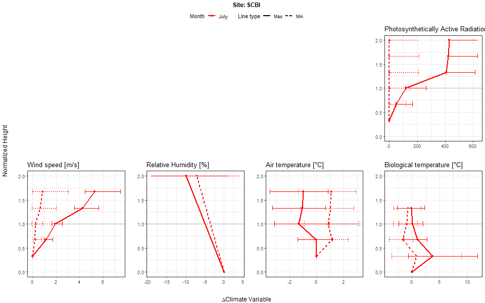
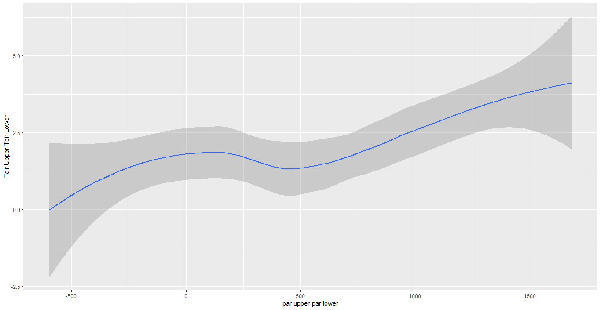
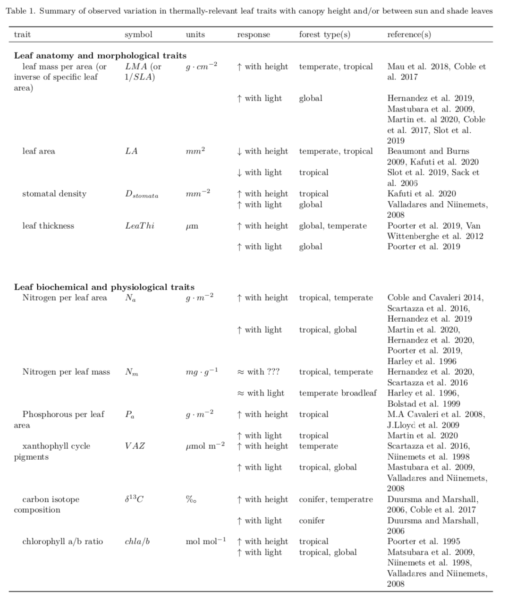
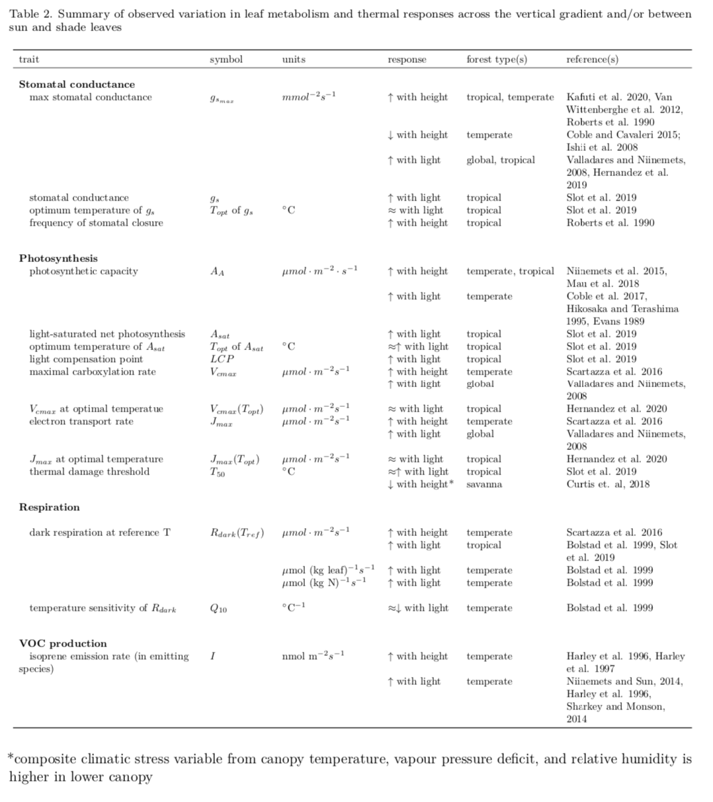

```{r setup, include=FALSE}
knitr::opts_chunk$set(echo = TRUE)
```

```{r eval = TRUE, echo=FALSE, warning=FALSE, results='hide'}

# This chunk is for auto numbering of tables/figures

#figures
fig_schematic = "1"
fig_NEON_vertical =  "2"
fig_NEON_differences  = "3"


# SUPPLEMENTARY INFO (this chunk must be repeated in MEE_manuscript_SI.Rmd)

#Appendices
appendix_NEON_methods <- "S1"
appendix_tealeaves_methods <- "S2"
appendix_lit_review_methods <- "S3"
appendix_SCBI_treering <- "S4"

appendix_NEON_methods_title<- "Methods for NEON vertical profiles"
appendix_tealeaves_methods_title <- "Methods for leaf energy balance modeling"
appendix_lit_review_methods_title<- "Methods for literature review"
appendix_SCBI_treering_title <- "Methods for SCBI tree-ring analysis"


#SI table numbers
SItable_example = "S1"

#SI table captions
SItable_example_legend <- "Table S1. ...."

#SI figure numbers
SIfig_example = "S1"

#SI figure captions
SIfig_example_legend <- "Figure S1. ...."

```


**Title:** Thermal sensitivity across forest vertical profiles: patterns, mechanisms, and ecological implications

**Authors (so far, not necessarily in final order):** 
Nidhi Vinod^1^,
Martijn Slot^2^,
Ian McGregor^3^,
Elsa M. Ordway^4^,
Marielle N. Smith^5^,
Tyeen Taylor,
Lawren Sack,
Kristina J. Anderson-Teixeira^1,2^* 


**Author Affiliations:**

1. Conservation Ecology Center; Smithsonian Conservation Biology Institute; Front Royal, VA 22630, USA

2. Smithsonian Tropical Research Institute; Panama, Republic of Panama

3. Center for Geospatial Analytics; North Carolina State University; Raleigh, NC 27607, USA

4. Department of Organismic and Evolutionary Biology, Harvard University, Cambridge, MA 02138, USA

5. Department of Forestry, Michigan State University, East Lansing, MI 48824, USA

*corresponding author: teixeirak@si.edu; +1 540 635 6546

\newpage

```{r eval=FALSE, echo=FALSE}
# based on Helene's Tansley review, and regular NewPhyt guidelines, I think the limit for New Phyt is 200 words. 
```

## Summary

*(currently too long for NewPhyt)*

Rising temperatures are expected to have profound effects on forests; however, it is not well understood how responses will vary across forest strata.
Here, we synthesize evidence as to how environmental conditions and foliar traits vary across vertical gradients, shaping leaf temperatures, metabolism, and ultimately whole-tree growth and mortality.
Strong vertical microclimatic gradients imply that canopy leaves are exposed to more solar radiation and higher evaporative demand than understory leaves, particularly in forests with dense canopies.
However, foliar traits relevant to shaping leaf temperature ($T_{leaf}$) and metabolism also vary strongly across height or light gradients.
Resulting $T_{leaf}$'s exceed air temperature ($T_{air}$) under conditions of high solar radiation, low wind, and low stomatal conductance.
Differences are most pronounced when hydraulic limitations impede evaporative cooling such that $T_{leaf}$'s of sun-exposed canopy leaves become dramatically elevated above both $T_{air}$ and understory $T_{leaf}$.
While leaf metabolism generally increases with height across the vertical gradient, differences in thermal sensitivity, optimal temperatures, and thermal damage thresholds are modest.
The implications for tree performance are mixed: whereas thermal buffering may contribute to the disproportionate stress of larger trees during drought, emerging tree-ring evidence suggests that understory trees experience relatively greater stress from high $T_{air}$.
Additional research will be important for improving our spotty understanding of the thermal sensitivity of metabolism and tree growth across vertical forest gradients.
In the meantime, our findings imply that while large canopy trees are the most vulnerable to warming when combined with drought, understory trees may be more vulnerable under more mesic conditions.


\newpage

## Introduction

Globally, temperatures have risen # $^\circ$C since YEAR and are expected to rise an additional #-#$^\circ$C by YEAR (IPCC REF). 
There is also increasing severity and frequency of heat waves [@perkinsIncreasingFrequencyIntensity2012] that will potentially reduce [forest] biomass  accumulation, and disrupt photosynthesis and metabolic processes across plant species [@sullivanLongtermThermalSensitivity2020].
These changes are expected to have profound effects on forest biodiversity and ecosystem function (REFS), and the resulting feedbacks to the climate system (e.g., decreased C storage, altered albedo and hydrology) will in turn have a critical influence on the future of trajectory of climate change [@bonan_ecological_2016, Bonan 2008].
 
**Rising temperatures are likely to have differential impacts on trees of different size and canopy position, in large part because small understory trees exist in a microenvironment that is substantially buffered by the more exposed canopy trees [@zellweger_seasonal_2019; @davis_microclimatic_2019].**

Forests are vertically and horizontally stratified, with trees of different sizes through various successional stages. Overstory trees form canopies that play a crucial role in moderating macro-microclimate [@ozanneBiodiversityMeetsAtmosphere2003; @nakamuraForestsTheirCanopies2017] by buffering extreme temperatures along with other macroclimatic conditions in the understory. This creates a vertical stratification of biophysical environmental conditions such as temperature, light, wind, humidity and Co2 which influences leaf traits, thermoregulation and metabolism along the gradient, with implications for whole plant performance [@fauset_differences_2018; @michaletzEnergeticCarbonEconomic2016].

The capacity of buffering largely depends on canopy cover and water availability [@davis_microclimatic_2019], each of which is subjected to change through climate-driven disturbances such as drought, deforestation, fire and related disruptions [@senfCanopyMortalityHas2018a].
Increasing global temperatures can increase canopy leaf temperatures sometimes above ambient temperature when transpiration is low, leading to temperate and tropical forest canopies functioning beyond or close to their optimal photosynthetic threshold [@mau_temperate_2018; @huangAirTemperatureOptima2019]. In wetter conditions, available water facilitates leaf transpiration through open stomata; however increased relative humidity in tropical regions indirectly caused by increased temperature reduces transpiration, leading to high leaf temperatures in the canopy [@tibbittsHumidityPlants1979; @perezIncreasingHumidityThreatens2018]

Frequent drought-related hydraulic limitation in forests alters species thermoregulation [@sastry_leaf_2018], and also decreases tree canopy circumference [@aussenacInteractionsForestStands2000a] due to sensitivity of overstory to variability in water availability and precipitation [@rollinsonClimateSensitivityUnderstory 2020]. Larger trees suffer hydraulic stress during drought [resulting in heat stressed canopy-leaves], which may contribute to increasing larger tree mortality in forests around the world should frequencies of drought continue to increase [@mcdowellMechanismsPlantSurvival2008; Brienen et al. 2015; @bennettLargerTreesSuffer2015; @stovallTreeHeightExplains2019a]. Increases in loss of canopy cover [@senfCanopyMortalityHas2018a; @senfMappingForestDisturbance2020] are also associated with reduced canopy structural complexity, altering microclimates with local heating effects and surface energy balance components [@zellweger_forest_2020; @starkReframingTropicalSavannization2020]. However, in mesic forest conditions, availability of soil water enables canopies with suitable foliar traits to remain cool through continuous evapotranspiration even during increasing air temperature, thereby buffering understory microclimates, unless relative humidity is so high as to reduce rate of evapotranspiration [@perezIncreasingHumidityThreatens2018].

While forest microclimates are insulated from macroclimatic extremes, they are still subjected to warming trends [@bertrandCommentForestMicroclimate2020]. Understories experience a distinct set of pressures as microclimatic warming combines with conditions of limited light and related foliar traits, inter-species resource competition, and herbivory [@niinemetsResponsesForestTrees2010a; @bartholomewSmallTropicalForest2020]. Since temperature sensitivity is directly linked with plant metabolic processes and performance, even around 1 degree of warming can lead to changes in plant species composition and growth [@bertrandChangesPlantCommunity2011; @bertrandCommentForestMicroclimate2020]. Plant communities in forest microclimates are already undergoing thermophilization [@duqueThermophilizationAdultJuvenile2015a; @zellweger_forest_2020; @zellweger_seasonal_2019; @defrenneMicroclimateModeratesPlant2013]. Tree-ring analysis in mesic temperate forests shows reduced growth of understory trees relative to overstory with warming temperatures [@rollinsonClimateSensitivityUnderstory, 2020]. In addition, understory growth phenology is more sensitive to warming than canopy-- showing earlier spring onset and later autumn senescense [@zohnerOngoingSeasonallyUneven2019]. 

Microclimate warming has implications for forest regeneration [@vonarxSpatiotemporalEffectsForest2012a]. Temperature driven photosynthesis limitation is reducing tree growth rates, accompanying a global trend towards disturbed forests with younger trees [@mcdowellPervasiveShiftsForest2020]. Reductions in canopy cover can lead to non-linear threshold responses, causing dramatic shifts from one forest state to another (e.g., transition from forest to savanna-like vegetation in tropical forest regions through "savannization"), with energy balance impacts and implications for forest-atmosphere interactions [@starkReframingTropicalSavannization2020]. Each of these changes have potential feedbacks to climate change.

While there is evidence for temperature driven shifts in forest dynamics, leaf-level metabolic and performance changes influenced by biophysical conditions and warming in the overstory and understory is still unclear. Thus, it is becoming important to understand foliage thermal sensitivity in forests along the vertical canopy profile, from the understory to the top of the canopy. This will provide a pathway for understanding how rising temperature affects forest ecology and biodiversity, energy balance, ecosystem function, and biosphere-atmosphere interactions with additional feedbacks to forest structure and microclimates.


(@niinemetsWithincanopyVariationRate2004a highlights how biophysical and photosynthetic gradient varies along the vertical canopy profile, however our current knowledge of this topic is lacking.)

**We lack a systematic, up to date understanding of biophysical and biological patterns across the vertical canopy gradient in forests, how this gradient affects leaf-level processes, and in turn how it affects ecosystems (Fig. ` r fig_schematic`).** 

**This review addresses the following questions:**

i.	How does the biophysical environment vary with height in forests?

ii.	How do leaf traits vary with height (or between sun and shade leaves) in forests?(What types of leaf traits?-E.O)

iii. How do vertical changes in biophysical environment conditions and leaf traits interact to affect leaf temperature [and in turn photosynthetic capacity]??

iv.	How does leaf metabolism respond to [air or leaf?] temperature in canopy and understory settings?

v. What are the implications of vertical canopy gradient patterns for the ecological and climate change responses of canopy versus understory trees?

vi.	What are the implications for modeling/ scaling / What are the implications of these leaf-scale responses at the ecosystem scale [in the context of climate change] / How do these leaf-level responses scale to entire ecosystems(*nerge these better*)

*Our primary interest is the gradient in height and exposure from the top of the canopy to the understory in forests. However, because a lot of the relevant research has focused on exposure gradients near ground level (e.g., comparisons of sun and shade leaves), and the implications [or utility] for ecosystem models we also review studies focused on exposure gradients.*


![rough figure 1., needs some suggestions and info to include.] (https://github.com/EcoClimLab/vertical-thermal-review/blob/master/schematic/vertical%20thermal%20sensitivity%20image.png)

Martijn : in this illustration it would also be nice to show that you can have shade leaves of canopy trees in the understory, and shaded plants of understory species.

## The biophysical environment

The biophysical environment, here defined to include the physical structure of the forest canopy (from understory to the top of the canopy) and associated microclimates, is in large part determined by the structure of the forest itself. 
We supplement a review of the existing literature with a new analysis of data on vegetation structure and vertical microclimate profiles from the U.S. National Ecological Observatory Network [NEON; Appendix `r appendix_NEON_methods`; Schimel et al. 2007].

Canopy foliage, which varies across forest types and seasonality, strongly shapes understory light, wind, etc.
Forest canopies have a buffering effect on multiple aspects of the understory climate (Fig. `r fig_NEON_vertical`).


- (*@bonan_ecological_2016 reviews this and points to appropriate references*)

*(paragraph on leaf area distribution, including figure ([separate from or combined with current Fig. 2- see GitHub issue #15](https://github.com/EcoClimLab/vertical-thermal-review/issues/15))*
The vertical structure and corresponding microenvironments of forest canopies vary seasonally (Parker & Tibbs 2004; @smithSeasonalDroughtrelatedChanges2019 ; @parkerConsequencesEnvironmentalHeterogeneity2019) and following disturbance [e.g., @parkerCanopyLightTransmittance2002 ; @almeidaContrastingFireDamage2016 ; @starkReframingTropicalSavannization2020].
In this review, we focus primarily on growing season conditions, including leaf phenology at the edges of the growing season, but excluding periods when no leaves are present in deciduous forests.


Light conditions, specifically changes in photosynthetically active radiation (PAR), vary along the vertical gradient with leaf area index (LAI), canopy height, canopy structure, and across species and forest types [@koike_leaf_2001]. Generally, upper canopies in dense forests are exposed to greater PAR values and limit light penetration to canopy interiors, lower canopy layers, and the understory. Shaded regions experience lower values and quality of PAR [in ranges of blue, orange and red]. The light gradient is more pronounced under broadleaf forests than needleleaf forests [@lowmanForestCanopies1995; @aussenacInteractionsForestStands2000a; @niinemetsPackingPhotosyntheticMachinery2009; @poorterMetaanalysisPlantResponses2019b]
(Fig. `r fig_NEON_vertical`).

In heterogeneous canopies [with high gap fractions], the distance from the outer canopy [to X?] is a better proxy for light environment than height (Parker 1995) and lower canopy light environments are highly variable, ranging from high light gaps to deeply shaded understory regions [@chazdonPhotosyntheticLightEnvironments1984; @tymenQuantifyingMicroenvironmentalVariation2017; @smithSeasonalDroughtrelatedChanges2019]

Tropical forests with densely packed overstory trees limit light to subsequent canopy layers and forest understories. Tropical forest floors receive approximately 1-2%  of the incident light that hits the top of the canopy [@robertsStomatalBoundaryLayerConductances1990a; @chazdonPhotosyntheticLightEnvironments1984; @parkerConsequencesEnvironmentalHeterogeneity2019], whereas mixed-wood boreal and northern temperate forest floors receive around 4-5% of full sunlight [@bartemucciOverstoryInfluencesLight2006]. However, vertical canopy layers and forest floors also receive light permeating through canopy gaps, as well as intermittent light penetration from tree, branch, and leaf movement caused by wind, defined collectively as sunflecks. Sunflecks can provide 10-80% of photon flux density for photosynthesis in canopy layers and understory, depending on canopy attributes such as foliage density, height and architecture [@waySunflecksTreesForests2012]

This difference in light regimes along a vertical profile is an important driver of plasticity in leaf traits, leaf physiology, adaptation, and thermal sensitivity. Leaves thus exhibit variation in leaf trait adaptations from sun to shade both along a vertical intra-canopy gradient, as well as inter-canopy [@michaletzEnergeticCarbonEconomic2016; @fauset_differences_2018; @niinemetsResponsesForestTrees2010; @sackHowStrongIntracanopy2006; @niinemetsControversyTraitsConferring2006].

-	Sunflecks: Leaky et al. 2003--from Marielle, "This is another, higher resolution axis of the variability of microenvironments that is probably quite important to address. (Also see the papers by Robin Chazdon on temporal variability of light environments). Maybe we will want to add these sentences (above) and something about sunflecks to a separate section that specifically addresses sources of variation in forest structure & microenvironments (e.g., vertical, horizontal, seasonal, diurnal, and with disturbance)?"

**Wind speeds are also higher at the top of the canopy (Fig. `r fig_NEON_vertical`).**
*(fill in some specifics from the NEON analysis)*
Consistent with the results from NEON sites, higher wind speeds at greater heights within a forest canopy have been observed in both closed canopy forests [@barnardSeasonalVariationCanopy2016a; @mcgregor_tree_nodate] and open savannas [@curtis_intracanopy_2019] 

Wind speed in the upper canopy of a semi-deciduous tropical forest has been observed to be higher in the dry season than the wet season [@rey-sanchez_spatial_2016] [*double check*]. 
Greater upper canopy wind speeds result in higher boundary layer conductance ($g_{a}$) for canopy leaves, which increases linearly with wind velocity [@daudetWindSpeedLeaf1999a]. Large $g_{a}$ to heat transfer, in turn, results in a smaller difference between $T_{air}$ and $T_{leaf}$, which is more typical of small leaves in the upper canopy, allowing them to dissipate heat more efficiently than larger leaves [@bauerleSeparatingFoliarPhysiology2011]. In low wind conditions, because $g_{a}$ to heat transfer is comparatively small, $T_{leaf}$ in the upper canopy can become substantially elevated in relation to $T_{air}$ under high radiation [@martin_boundary_1999; @leighInfluenceLeafSize2017]. Additionally, the thickness of the air layer is proportional to boundary layer resistance at the surface of the leaf through which water vapor diffuses after leaving the stomata [@martin_boundary_1999; @robertsStomatalBoundaryLayerConductances1990a; @stokesBoundaryLayerConductance2006] this tends to be greater in the understory than canopy? [ref] 

**Air temperature, $T_{air}$, is sometimes significantly buffered by forest canopies (Fig. `r fig_NEON_vertical`).**
Studies comparing $T_{air}$ under forest canopies with nearby clearings have found lower maximum temperatures under forest canopies globally [@defrenneGlobalBufferingTemperatures2019], and recent evidence shows a similar trend across Europe [@zellweger_seasonal_2019; @vonarxSpatiotemporalEffectsForest2012a] and in the northwestern United States [@davis_microclimatic_2019]. Intact tropical forests have also been show to exhibit lower peak daytime $T_{air}$ than neighboring tree crop agricultural plantations (S. R. Hardwick et al., The relationship between leaf area index and microclimate in tropical forest and oil palm plantation: Forest disturbance drives changes in microclimate. Agric. Meteorol. 201, 187–195 (2015)). Even though canopy cover buffers maximum air temperatures in the understory, inevitable increases in understory temperatures continue to be observed as a result of global temperature increases. However, the buffering by canopy cover smooths this warming in the understory [@bertrandCommentForestMicroclimate2020; @zellwegerResponseCommentForest2020;@rollinsonClimateSensitivityUnderstory]

Diurnal moderating capacity differs between forests with varying canopy structure, crown density, and seasonality. Tropical, temperate broadleaved and non-pine conifer forests maintain lower daytime maximum temperatures than pine and boreal forests. Increases in crown density and leaf area index decrease light and higher maximum temperature permeability into the forest understory, thus maintaining lower maximum daytime temperatures. Comparatively open forests such as pine forests with sparse stands (stems?) resulting in decreased buffering capacity in the understory and air temperatures more similar to nearby clearings [@defrenneGlobalBufferingTemperatures2019; @vonarxSpatiotemporalEffectsForest2012a]. This relationship is reversed during the night, however, with open-canopy pine forests maintaining warmer understory temperatures than above canopy [@vonarxSpatiotemporalEffectsForest2012a] 

During the wet season, maximum air temperatures have been shown to be higher above forest canopies than below in tropical forests in Panama [@rey-sanchez_spatial_2016], temperate forests in Switzerland [@vonarxSpatiotemporalEffectsForest2012a] and coastal forests in Brazil [@fauset_differences_2018, Tymen et al. 2017]. Similarly, in these studies, maximum temperatures were higher while humidity was lower in gaps compared to understory regions (both at 1.5 m above the ground, see Fig. 4 - again illustrating buffering effect of the canopy). However, similar maximum temperatures have been observed during the dry season of a semi-deciduous tropical forest in Panama, partially because in the dry season some canopy trees were leafless, resulting in more light reaching the sub-canopy, and more boundary layer turbulence [@rey-sanchez_spatial_2016]. Similar results were observed in a temperate deciduous forest in the eastern United States [@mcgregor_tree_nodate].

Minimum $T_{air}$ is also buffered by forest canopies under some conditions.
Higher (Elsa: or lower?) minimum temperatures under forest canopies relative to nearby clearings have been observed across Europe [@zellweger_seasonal_2019] and in the northwestern United States [@davis_microclimatic_2019].(Martijn: should we refer to mechanisms at this point? (e.g., greater radiative heat loss in exposed areas resulting in lower Tmin))
However, similar minimum temperatures under forest canopies have been observed in tropical forests in Panama [@rey-sanchez_spatial_2016] and coastal Brazil [@fauset_differences_2018], as well as in a temperate deciduous forest in the eastern United States [@mcgregor_tree_nodate; @nakamuraForestsTheirCanopies2017].


*(Add something about risk of freeze.)* 


**Humidity also varies across the forest vertical profile, and is generally higher in the understory (Fig. `r fig_NEON_vertical`).**
- DETAILS - REFS
- @mcgregor_tree_nodate

Along with temperature, forest canopies moderate relative humidity (RH) in below-canopy microclimates. In three European forest types (Broadleaved, Non-Pine Conifer, Pine), canopy buffering decreased daily maximum $T_{air}$ and increased daily minimum RH in below-canopy microclimate compared to a nearby open area. Moderating capacity was stronger under broadleaved and non-pine conifer forests than pine, and greater in wetter conditions, and in summer and autumn months than winter [@vonarxSpatiotemporalEffectsForest2012a]. 

RH, in combination with temperature, determines vapor pressure deficit, $VPD$. Atlantic forests in Brazil during the wet season tend to have higher $T_{air}$, and $VPD$ in the upper canopy and canopy gaps than lower in the understory where $T_{air}$ and $VPD$ tend to be lower [@fauset_differences_2018; @tymenQuantifyingMicroenvironmentalVariation2017].  
This means that canopy leaves tend to be exposed to higher *evaporative demand*, higher stomatal constraints and lower osmotic potential [@niinemetsPhotosyntheticAcclimationSimultaneous2004b]. In northeastern US temperate forests, the upper canopy was observed to be more sensitive to $VPD$, whereas the understory was insensitive [@rollinsonClimateSensitivityUnderstory, 2020]

**Finally, carbon dioxide (CO~2~) concentrations tend to be higher in the understory.** 
	Higher in the understory, particularly at dusk [@koike_leaf_2001]. Higher in the understory overnight; difference persists during the day but is very small [@yang_spatial_1999]. Differences in concentration are by far most pronounced near ground level, as well, concentrations of (CO~2~) mole fraction values have been observed to be higher in lower canopy leaves compared with upper canopy leaves [@niinemetsPhotosyntheticAcclimationSimultaneous2004b]

Given that differences are small during the day when photosynthesis is occuring, and that even nighttime differences are modest at the height of understory tree crowns, CO~2~ concentrations are unlikely to have much of an effect on the energy balance and metabolism of leaves across the forest vertical gradient.

If soil and stem respiration do not acclimate fully to rising temperatures, the greater amount of CO~2~ emitted at the forest floor (i.e. from soils and decaying organic matter and leaf litter) could increase the vertical CO~2~ gradient in the future, but this would still only be a short-term effect in the early morning, as the CO~2~ would quickly diffuse through the canopy. Furthermore, increases in mortality of big trees (e.g. @senfCanopyMortalityHas2018a) would increase canopy roughness and prevent build-up of CO~2~ concentration gradients.
(Elsa: see these papers on the long-term Harvard Forest soil warming experiments. CO2 emissions increased, then decreased, then increased again. It's thought that the changes in soil CO2 emissions over time were linked to turnover in microbial community composition.
- DeAngelis, K.M., Pold, G., Topçuoğlu, B.D., van Diepen, L.T., Varney, R.M., Blanchard, J.L., Melillo, J. and Frey, S.D., 2015. Long-term forest soil warming alters microbial communities in temperate forest soils. Frontiers in microbiology, 6, p.104.
- Melillo, J.M., Steudler, P.A., Aber, J.D., Newkirk, K., Lux, H., Bowles, F.P., Catricala, C., Magill, A., Ahrens, T. and Morrisseau, S., 2002. Soil warming and carbon-cycle feedbacks to the climate system. Science, 298(5601), pp.2173-2176.
- Melillo, J.M., Frey, S.D., DeAngelis, K.M., Werner, W.J., Bernard, M.J., Bowles, F.P., Pold, G., Knorr, M.A. and Grandy, A.S., 2017. Long-term pattern and magnitude of soil carbon feedback to the climate system in a warming world. Science, 358(6359), pp.101-105.) 
- Nottingham, A.T., Meir, P., Velasquez, E. and Turner, B.L., 2020. Soil carbon loss by experimental warming in a tropical forest. Nature, 584(7820), pp.234-237.





**The strength of this buffering varies across forests, influenced by both forest characteristics (Fig. `r fig_NEON_differences`) and the biophysical environment.**
First, buffering increases with canopy cover and water availabity.
* greater cover --> lower max T and VPD, higher minT  [@davis_microclimatic_2019]
* greater cover -->  lower max T and light availability [@zellweger_seasonal_2019]
* [@thom_effects_2020; Tymen et al. 2017 ; Jucker et al. 2018 ; Hardwick et al. 2015] 
The omega factor (McNaughton and Jarvis, 1983; Jarvis & McNaughton 1986) describes the degree of aerodynamic coupling between the vegetation and the atmospheric boundary layer; the lower the value of omega, the greater the coupling.
"I wonder whether it would be useful to introduce such 'formal' terms used to describe what is essentially the same as buffering effect of canopies.
I'd have to read up some more to see if there are papers showing what sort of canopy characteristics influence omega.

https://doi.org/10.1016/S0065-2504(08)60119-1"-M.Slot

*Presumably, buffering would also be affected by canopy roughness, which affects turbulent air flow and the canopy boundary layer.*
Taller trees don't necessarily increase buffering [@zellweger_seasonal_2019]. "They found that taller forests (which coincided with forests of higher LAI) had lower mean and max values of VPD and temperature" [Jucker, T., Hardwick, S.R., Both, S., Elias, D.M., Ewers, R.M., Milodowski, D.T., Swinfield, T. and Coomes, D.A., 2018. Canopy structure and topography jointly constrain the microclimate of human-modified tropical landscapes. Global change biology, 24(11), pp.5243-5258]
.See Jucker et al. 2018 - max height was highly correlated to both LAI and surface roughness

Species that have higher shade casting ability such as broadleaved trees increase T buffering [@zellweger_seasonal_2019,@vonarxSpatiotemporalEffectsForest2012]
The strength of buffering also varies with respect to geographic and climatic factors.
* Distance to coast, topographic position, elevation [@zellweger_seasonal_2019]
* [@davis_microclimatic_2019]--Proximity to riparian areas tends to sustain buffering, protecting understory temperatures even during increasing temperatures [@davis_microclimatic_2019]
However vertical climate gradients within forests are known to be steeper than those driven by elevation and latitude [@nakamuraForestsTheirCanopies2017; @martinCovarianceSunShade2020a]




## Trait variation 


Leaf traits co-vary with their environment [@michaletzEnergeticCarbonEconomic2016] and show different degrees of intraspecific foliar plasticity in accordance with the intensity and availability of light, optimizing water uptake, heat, C uptake and metabolism across forest vertical strata [@rozendaalPlasticityLeafTraits2006]. After the formation of leaves to integrated light, it takes 30-60 days for traits to stabilize in woody and herbaceous species [@keenanGlobalLeafTrait2016; @niinemetsLeafAgeDependent2016a]. A network of sensory photoreceptors in leaves, such as phytochromes, mediate leaf-level responses to PAR, and the ratio of red to far red radiation [R:FR] intercepting the leaf surface. This enables acclimation or avoidance responses through the development of necessary leaf traits [@casalPhotoreceptorSignalingNetworks2013]. Degrees of high irradiance give rise to variation in sun-leaf traits, while degrees of low irradiance-- characterized by shade-- result in variations of shade-leaf traits [@poorterMetaanalysisPlantResponses2019b; @sackHowStrongIntracanopy2006], ultimately influencing leaf structural, chemical and physiological traits as well [@keenanGlobalLeafTrait2016]. 

(Elsa: it may also be worth mentioning leaf turnover / leaf longevity briefly in the above paragraph in the context of leaf development and trait formation.)

An increasing number of studies point towards the importance of incorporating sun and shade in modelling leaf economic spectrum (LES) traits within-canopy gradient [@chenLeafEconomicsSpectrum2020a], because LES theory was developed using mainly sun exposed (upper canopy) leaves. Given the vastly different light environments at the bottom of the canopy and that most leaves in the canopy are likely to be shade leaves, there is a strong research need to better characterise trait relationships and leaf responses through the whole vertical canopy [Keenan and Niinemets 2016]. However, there is also concern for ambiguity in a simplified categorization of 'sun' and 'shade' leaves, due to variation based on within-canopy light, across functional groups, in canopy gaps, and with height and ontogeny [@ishiiVariationIntracrownLeaf2018; @niinemetsWorldwideAnalysisWithincanopy2015] as well as geographically [@ishiiVariationIntracrownLeaf2018]. 

Classification schemes for sun and shade tolerance rankings have been highlighted by multiple studies [Baker 1949; @niinemetsControversyTraitsConferring2006; Feng et al. 2018]. For example, classifications from @niinemetsControversyTraitsConferring2006 are as follows: "The five-level scale used for shade tolerance (1,very intolerant; 2, intolerant; 3, moderately tolerant; 4,tolerant; 5, very tolerant) corresponds approximately to the following light availabilities expressed as percentage of full sunlight: 1,>50%; 2, 25-50%; 3, 10-25%; 4, 5-10%; 5, 2-5%". 

Additionally, shade leaves in the understory can be broken into three categories; 1. shade leaves of canopy trees in which the--top of the tree is sun exposed, bottom is shaded. 2. seedlings/saplings of canopy trees that will eventually, if they survive, reach the canopy. 3 understory plants that complete their lifecycle in the shaded understory. These groups are likely to have different traits, and if we expect 'shade' plants to have a different sensitivity to climate change than sun leaves, the consequences of climate change for demography and species community composition of the forest will depend strongly on the category of shade plants being considered [refs, -Martijn Slot]


**Inter-species vertical gradient leaf trait variation**

Taller trees in dense forests tend to be exposed to greater irradiance but maintain shaded leaves in canopy interior and lower canopy, while shorter understory trees are shaded by overstory. As a result of different light regimes, a sun and shade leaf trait dichotomy has been established across species by various studies where typical sun leaves are often smaller in size and width, thicker, and hairier, with thicker cuticle and greater lobation than shade leaves
[Rozendaal et al. 2006, Mathur et al. 2018, more REFS]."Additionally, shorter understory trees that spend the bulk of their lifecycle in the shade experience different pressures than plant that get the bulk of their carbon from sun-exposed leaves, but can maintain a few layers of shade leaves as well" -Martijn 

The combination of stressors experienced by taller trees' foliage are different from that experienced by understory trees. For example, overstory sun leaves experience greater loads of PAR, $VPD$, elevated temperatures, higher wind speed, etc.. whereas understory leaves are subjected to shade or limitation of light, niche competition and herbivory. Overstory sun leaves are subjected to overheating pressures; thus, through developed traits of increased stomatal density, transpiration and water supply, along with increased convective heatloss via reduced boundary layer resistance, sun leaves are able to maintain optimum temperatures for photosynthesis and metabolic processes. Additionally, overstory sun leaves tend to have long-lived leaves with high LMA while shade leaves of canopy trees have large leaves with low LMA. Adaptive traits in understory enable light capture efficiency while maintaining larger width leaves with comparatively lower stomatal density due to available water, lesser $VPD$, and wind speed. Those differences in traits are likely to affect their thermal properties as well. Leaves act as windows to plant performance, enhancing plant adaptation to changing environment, thus leaf traits acclimated to prior stressors have been suggested to enable whole plants to respond differently to forthcoming stress [@rozendaalPlasticityLeafTraits2006; @niinemetsResponsesForestTrees2010a]

However, even with distinct features of sun and shade traits, trait adaptation to light maximizes light use efficiency for photosynthesis at both high and low light, while also adapting to other stressors as mentioned above. In light limited conditions, shade leaves increase light capture efficiency by increasing their specific leaf area [SLA] and by investing in chlorophyll on a mass basis, which "leads to a similar chlorophyll content on an area basis compared with sun leaves. This enables shade leaves to realize similar light capture to sun leaves at a lower biomass investment" [Chazdon et al. 1996, Poorter et al. 2000, @rozendaalPlasticityLeafTraits2006]

With increasing height and age, competition for light decreases as availability  of light increases in dense forests. However, depending on growth strategies of species occupying the understory, leaf traits might differ due to species inherent light requirements. Early successional species are considered more shade intolerant than late successional species that are more shade tolerant. Ontogenetic differences between the two in the understory suggests lower leaf dry mass per area ($M_A$), greater photosynthetic capacity in low light and greater carbon gain capacities in shade tolerators than in intolerators [@niinemetsControversyTraitsConferring2006]. Shade intolerant species experience greater heterogeneity in light during ontogeny [why?-nidhi],thus LMA responds to changes in light, with shade-intolerant species displaying higher plasticity in response to light [H. Poorter, U. Niinemets, L. Poorter, I. J. Wright, R. Villar, Causes and consequences of variation in leaf mass per area (LMA): A meta-analysis. New Phytol. 182, 565–588 (2009).].Rozendaal et al. 2006 found no significant trait differences with ontogeny and adult stature trees. Koike et al. 2001 has more info about this.   

**Intra-canopy on the same species leaf trait variation**

Several studies point towards common variations and differences in leaf trait plasticity within-species and at an intra-canopy gradient which influences leaf structural and biochemical traits [@sackHowStrongIntracanopy2006; @niinemetsWorldwideAnalysisWithincanopy2015; @chenLeafEconomicsSpectrum2020]. The differences among these traits contribute to leaf heat dissipation strategies and leaf temperature across the gradient [@fauset_differences_2018; @michaletzEnergeticCarbonEconomic2016] Table 1. summarizes relevant traits for thermal sensitivity.


[I think that this distinction should be addressed throughout the manuscript, so that it is always clear that the reader knows whether the cited references are about inter- or intra-specific variation, and that we address the different trait axes (Marielle made a comment on this earlier as well, that within species patterns may not follow leaf economics spectrum expectations). Ideally we would address the different categories, but if lack of information forces us to focus on just within species or just across species, this should still be made clear. photosynthesis, and canopy-level carbon uptake. They don't have to be treated separately, but it should always be clear which is being referred to. And in the consequences for scaling section this is of course also relevant.]
[Add something about how leaf traits along the vertical canopy profile are different than the expectation from leaf economic spectrum (LES)? Chen et al. 2020 is a good paper to help frame this . They make an important point in that paper that we may also want to make here: that the LES was 'built' using mainly sun (upper canopy) leaves; given the vastly different light environments at the bottom of the canopy (and that most leaves in the canopy are likely to be shade leaves) there is a strong research need to better characterise trait relationships and leaf responses through the whole vertical canopy - hence the importance of this review. Keenan & Niinemets 2016  will also be helpful in making this point.]--M N. Smith

**Many traits vary with height and/or between sun and shade leaves of the same species (Table 1).**
Here, we focus on intra-canopy traits that are important for shaping leaf temperature ($T_{leaf}$) and thermal sensitivity.



```{r eval=FALSE, echo=FALSE}
# refs in this table need to go in the nocite field below (easiest in alphabetical order)
```
---
nocite: | 
  @mau_temperate_2018; @hernandezSimilarTemperatureDependence2020; @cobleHowVerticalPatterns2016a; @slotPhotosyntheticHeatTolerance2019; @valladaresShadeToleranceKey2008b; @beaumontVerticalGradientsLeaf2009; @sackHowStrongIntracanopy2006,@cobleLightDrivesVertical2014; @scartazzaInvestigatingEuropeanBeech2016; @martinCovarianceSunShade2020; @bolstad_foliar_1999; @harleyEffectsLightTemperature1996; @kullDistributionLeafPhotosynthetic1998; @kafutiFoliarWoodTraits2020; @duursmaVerticalCanopyGradients2006; @cobleLightDrivesVertical2014a; @vanwittenbergheVariabilityStomatalConductance2012; @poorterLeafOpticalProperties1995; @poorterMetaanalysisPlantResponses2019b; @cavaleri_foliar_2008; @niinemetsAcclimationHighIrradiance1998; @panditharathnaChangeLeafStructure2008; @baltzerLeafOpticalResponses2005; @kusiPlasticLeafMorphology2020
---

Are traits shaped more by height or light?

Light based acclimation in leaf traits is well established, while research on solely height-based leaf trait variation is sparse due to the difficulty of isolating increased tree height from light. However, studies that have measured LMA in relation to height have found that in tropical forests LMA-height predicted stronger correlation between area- based respiration versus foliar nutrients, whereas Q10 and E10 remained constant with height [Cavaleri et al. 2008]. In temperate Acer saccharum forest, within-canopy Acer saccharum exhibited greater LMA and $N area$ with height early in the growing season as a result of hydrostatic constraints on leaf morphology; however, in later growing season LMA and $N area$ continued to increase in the upper canopy due to light driven changes [@cobleLightDrivesVertical2014a; @cobleLightAcclimationOptimizes2015; @cobleHowVerticalPatterns2016].In addition, carbon isotope composition also increased with height, independent of light [@cobleLightAcclimationOptimizes2015]

Height-based leaf trait variation in Quercus alba and Quercus velutina showed decrease in lobation with increased height in two tall species, suggesting an adaptation to hydraulic constraints in order to lower evapotranspiration with increasing height by decreasing lobation [@kusiPlasticLeafMorphology2020]. However, @sackHowStrongIntracanopy2006 did not observe trait variation based on height in Quercus spp.

Height is more important than light in determining leaf morphology in a tropical forests (Cavaleri et al. 2010)
- (Cavaleri et al. 2008) 
- from Martijn: "If I remember correctly, height and light exposure are closely correlated and things like LMA scale with both, but above a certain level of light exposure, the effect of additional light disappears, while the relationship of the morphological traits with height continues. I have often been a bit skeptical about assuming height drives morphology, as most of the work that convincingly shows that (and relates it to turgor pressure for example) is from 100 m tall redwoods."
- Elsa: see also H. Poorter, U. Niinemets, L. Poorter, I. J. Wright, R. Villar, Causes and consequences of variation in leaf mass per area (LMA): A meta-analysis. New Phytol. 182, 565–588 (2009). -- LMA responds to changes in light, with shade-intolerant species displaying higher plasticity in response to light.

*Leaf area / characteristic dimension*:
- Recent paper on influence on leaf size/shape in PCE – certain aspects of leaf shape were not as relevant as expected (Leigh et al. 2017? https://onlinelibrary.wiley.com/doi/full/10.1111/pce.12857)

Leaf temperature is generally assumed to increase with leaf area ($LA$) [ Wright et al. 2019]. Yet, thermal imagery shows that though leaf area can be a predictor for leaf temperatures ranges [$Trange$] across the surface of the leaf, effective leaf width is a better predictor of leaf temperature changes and leaf thermal time constant [@leighInfluenceLeafSize2017]. With increase in effective leaf width, boundary layer thickness and resistance increases along with stomatal resistance [@leighInfluenceLeafSize2017; Wright et al. 2019; @fauset_differences_2018].This lowers evaporation from stomatal pores, and in turn transpirational cooling in large leaves [@fauset_differences_2018]. Because the rate of heat convection per unit area between leaf and air is lower for large leaves and greater for small leaves, small leaves are able to dissipate heat more efficiently than large leaves [@leighInfluenceLeafSize2017]. Using leaf energy balance to compare leaf temperatures of two species $Miconia$ and $Alchornea$, Fauset et al. 2016 found leaf width to be a dominant factor in determining changes in leaf temperature, which was evidently greater for large width leaves of $Miconia$ compared to $Alchornea$. Leaf width and characteristic dimension is generally greater in shaded leaves along the vertical gradient than exposed upper canopy [ref]. Additionally, leaf characteristics such as lobes, leaf elongation and serration, which break the entirety of leaf dimension by enhancing a smaller characteristic dimension, all facilitate more efficient heat dissipation. Leaf lobes are deeper in exposed canopy than in shaded understory, as well as leaf elongation and serration are more pronounced in sun exposed canopies [@vogelConvectiveCoolingLow1970; @schueppTansleyReviewNo1993; @sackHowStrongIntracanopy2006].However, Perez and Feeley et al. 2020 showed only a slight negative effect on leaf temperature with leaf width. 


*Thermal time constant (probably not a lot out there)*
-	Curtis et. al, 2018 – higher in more exposed leaves (heat up slower, cool slower)
-	Michaeletz has used this in theoretical calculations (Michaeletz et al. 2016 and 2015?

Thermal time constant, a leaf trait, quantifies heat flux in a leaf through incorporating heat stored versus heat exchanged with the environment, with relation to time. It comprises of several underlying traits -- leaf area, LMA, leaf width, leaf dry matter content and stomatal conductance [@michaletzEnergeticCarbonEconomic2016]. Typically, larger leaves with greater leaf width experience longer leaf cooling time and thus increased thermal time constant compared to leaves with smaller leaf width. Dissections in leaves, such as lobes, decrease leaf width and thus thermal time constant [@leighInfluenceLeafSize2017]. Additionally, a leaf with a smaller time constant experiences variable leaf temperatures in relation to the environment and exhibits instantaneous carbon assimilation rate and stable photosynthesis enabled by greater LMA [@michaletzEnergeticCarbonEconomic2016] Guessing, sun exposed leaves have lower thermal time constant than shaded?      
[I have Michaletz's code to calculate the thermal time constant, so if there are data, or general tendencies for changes in leaf area, LMA, leaf width and leaf dry matter content we can determine how these trends would translate into changes in thermal time constant. 
In practice, an important driver seems to be leaf water content per unit area (I think Lawren might have mentioned this as well in our meeting), so if we can conclude that that is something that scales with the vertical gradient, then we can make an informed guess about how the thermal time constant will change--Martijn Slot]

*Carotenoids/Xanthophyll cycle pigments* 

High light stimulates the need for photoprotection in leaves in order to protect internal photosystem 2 from photoinhibition through D1 protein replacement. Thus leaves exposed to greater irradiance have greater pools of xanthophyll pigments expressed on a mass or area basis--photoprotective pigments comprising of violaxanthin, antheraxanthin and zeaxanthin [$VAZ$] that convert excess light into heat energy dissipation through non photochemical quenching of excitation energy, enabling short-term acclimation to high temperature and light [@mathurPhotosyntheticEfficiencySun2018a; @niinemetsAcclimationHighIrradiance1998]. These are found to be proportional to within-canopy light gradient at an inter- and intra-species level. Therefore, $VAZ$ is lower in shaded leaves and greater in sun leaves, as observed among temperate tree species [@niinemetsAcclimationHighIrradiance1998]. In neotropical forest, foliage exposed to higher irradiance in the canopy showed greater b-carotene and vioxanthin-cycle pool on an area or chl basis compared to low light leaves that showed greater mass based chlorophyll, lutein and neoxanthin carotenoids [Mastubara et al. 2009]
  
-	antioxidant scavenging function- protect against cellular damage
- Koniger et. al. 1995, and  Matsubara et al. 2009

*Isoprene production*
-  Isoprene production *capability* as a trait (actual isoprene production is in section 4. I'm not sure whether Ty's content belongs here or in that section) 
- Elsa: I think Ty's section on isoprene would be better suited up here

*(Paragraph on intra- vs inter-specific variation)*

- *Are patterns (in traits, metabolism, ecology) driven by tree height or exposure?*

## Leaf temperature and hydraulics

**Many of the biophysical and trait variables reviewed above affect leaf temperature, $T_{leaf}$, which in turn has a strong influence on leaf metabolism (see following section).**
$T_{leaf}$ is determined by the energy balance of a leaf and can be estimated based on basic biophysical principles [@campbell_introduction_1998; @muir_tealeaves_2019; @michaletzEnergeticCarbonEconomic2016] (Fig. 3).
Leaf traits are influenced by biophysical environment in order to maintain metabolic optima so that the amount of carbon assimilated by a leaf throughout its life span is greater than the total carbon invested in the leaf, and thus leaf temperatures are decoupled from air temperature through adaptive physiological traits [@michaletzPlantThermoregulationEnergetics2015; @perezPhotosyntheticHeatTolerances2020] 
$T_{leaf}$  is largely a function of radiation input versus heat lost to the environment, and typically increases [with tree height] as light availability increases [@michaletzPlantThermoregulationEnergetics2015]. 

In addition, leaf size impacts leaf temperature. While small leaves remain within a few degrees of $T_{air}$, regardless of stomatal conductance, wider leaves can have temperatures deviating more from air temperature [@fauset_differences_2018]. Large leaves (with greater leaf width) can be significantly cooler than $T_{air}$ under low radiation with stomata open [@leighInfluenceLeafSize2017], and significantly hotter under high radiation with stomata closed.  

Leaves with open stomata and high radiation loads maintain $T_{leaf}$ similar to $T_{air}$, with coolest leaves at intermediate sizes (~10mm). Shaded understory leaves should tend to maintain cooler daytime leaf temperatures for any given level of stomatal conductance. However, counteracting this, lower wind speed in understory would reduce latent heat loss. Under hot conditions, canopy leaves exposed to higher wind speeds would be most effective at cooling when sufficient water is available to maintain high stomatal conductance. However, increase in air temperature typically also increases VPD, decrease in stomatal conductance during midday lead to a decrease in leaf CO2, and consequentially increasing leaf temperature in upper canopy [@fauset_differences_2018]. Thus, their $T_{leaf}$ can be highly elevated above $T_{air}$ when stomatal conductance is limiting.


**Aligning with biophysical expectations, field observations have shown that leaf temperatures are influenced by the biophysical environment and leaf traits.**
1.	Air T
2.	Solar radiation
3.	Leaf traits 


In a tropical forest of Puerto Rico and temperate forests in Michigan, greater light input in exposed upper canopy leaves has been observed to increase leaf temperatures, sometimes 1-7C above ambient air temperature, making upper canopy leaves susceptible to heat stress, more than scattered light in lower shaded leaves [@mauTemperateTropicalForest2018a] 

-  Michaletz et al have done some interesting work on leaf thermoregulation in relation to various leaf traits. I don’t think there is sun vs shade tests, but we could look at how this might translate, or how some of the traits he has calculated might differ between sun and shade leaves. For example, he has this thermal time constant parameter that is calculated from leaf mass per area, leaf dry matter content, and some environmental parameters. E.g.: DOI: 10.1038/nplants.2016.129, http://dx.doi.org/10.1016/j.tree.2015.09.006

**When vertical gradients in the biophysical environment and leaf traits combine to shape leaf energy budgets, under some conditions $T_{leaf}$ tracks  $T_{air}$ and therefore differs little between understory and canopy (Fig. **2?**).**
[Air temperature is not always a proxy for measuring leaf temperature [@michaletzPlantThermoregulationEnergetics2015].]
In a broadleaf deciduous forest, nighttime $T_{leaf}$'s were similar in the canopy and understory	(Bolstad et al. 1999). 
Similarly, during the dry season in a tropical moist forest in Panama... (Rey-Sánchez et al. 2016).


**However, canopy leaves can reach much higher maximum $T_{leaf}$, and higher $T_{leaf} - T_{air}$, than understory leaves.**
-Large leaf to air temperature differences and high leaf temperatures were found in upper canopy of Atlantic, Brazil Forests despite much lower air temperature due to high solar radiation loads. However, leaf temperatures themselves were moderated by air temperature. [@fauset_differences_2018].
-	(Slot et al. 2019) and refs therein
-	(Fauset et al. 2018)
Sun leaves can also be  cooled relative to $T_{air}$ more than shade leaves (Rey-Sánchez et al. 2016). There's some hint of this in Bolstad et al. 1999.

*(Because hydraulics are key to leaf T, we should include some of that here--e.g., water on leaves - evaporative cooling - and leaf water content)*

- Elsa: I came across these two studies that could be relevent in the evapotranspiration/temperature feedback section hinted at above: 
- Staudt, K., Serafimovich, A., Siebicke, L., Pyles, R.D. and Falge, E., 2011. Vertical structure of evapotranspiration at a forest site (a case study). Agricultural and Forest Meteorology, 151(6), pp.709-729.
- Sellin, A. and Lubenets, K., 2010. Variation of transpiration within a canopy of silver birch: effect of canopy position and daily versus nightly water loss. Ecohydrology, 3(4), pp.467-477.


## Leaf metabolism and thermal responses

Leaf metabolism is strongly shaped by leaf temperature, and by the traits and environmental drivers reviewed above, all of which vary across vertical forest gradients (Fig. 1). 
However, as we detail below, there are limited studies comparing thermal responses of sun and shade leaves (Table 2).


```{r eval=FALSE, echo=FALSE}
# refs in this table need to go in the nocite field below (easiest in alphabetical order)
```
---
nocite: | 
  @bolstad_foliar_1999; @roberts_stomatal_1990; @slot_photosynthetic_2019; @harleyEffectsLightTemperature1996; @niinemetsHowLightTemperature2015; @sharkeyFutureIsopreneEmission2014b; @ishiiExploringRelationshipsCanopy2004; @curtis_intracanopy_2019; @bolstad_foliar_1999; @kafutiFoliarWoodTraits2020; 
---


*Stomatal conductance*
Photosynthesis can be largely constrained by stomatal conductance. 
-"Sun exposed outer canopy leaves in tropical trees can experience temperatures up 48 C during diurnal cycle, midday stomtal closure reduces transpitrational cooling" thus elevating leaf temperature greater than air temperature (Slot et al. 2019)
- Max stomatal conductance - increases with canopy height (Kenzo et al. 2015)
Max transpiration rate - increases with canopy height (Kenzo et al. 2015).

*Photosynthesis*

**Photosynthesis is generally higher in sun leaves-- a fact that is well-established (Niinemets 2007 ; Kenzo et al. 2015 ; Slot et al. 2019; Chen et al. 2020) and observed in numerous field studies.**
This is primarily driven by the greater light available to sun leaves.
In response to the greater light availability, sun leaves have traits allowing greater photosynthetic rates at high light under sufficient nutrient and water conditions, including higher concentration of Rubsico, multiple layers of palisade parenchyma, and saturation level differs between leaves and canopies, with leaves saturating at lower light level than canopies (while a certain amount of light saturates the photosynthetic capacity of the leaf, increasing the amount of light in the canopy may increase photosynthesis in the shaded part of the canopy)
The vertical gradient in photosythetic rates is also influenced by available concentration of N and P. (and water availability)
.[thoughts: plasticity vs change in tree species composition through the canopy; differences in variability of microenvironments through the profile - highest lower down in canopy?; life history / investment strategies and hence, leaf life spans at leaves at the top vs bottom of the canopy]-- M N. Smith [agreed. Again the importance of differentiating between within-species and among species trait variation. Also; steepness of the vertical gradient in light and VPD. In very tall trees a gradient in water potential might cause a gradient in stomatal limitations of net photosynthesis]

Photosynthesis increases with increasing irradiance, and saturates at quantum flux density of 400 $m^{-2}$ $s^{-1}$ to 700nm $m^{-2}$ $s^{-1}$. Photosynthesis has a peaked response to temperature, where photosynthesis is commonly found to be maximized at the prevalent ambient growing season conditions (Tan et al. 2017; Slot & Winter 2017). Beyond the optimum, photosynthesis decreases as a result of stomatal closure (e.g. Slot & Winter 2017; Smith et al. 2020 [temperate/boreal refs needed) and eventually due to biochemical constraints (refs. e.g. Sage & Kubien 2007; Varhammer et al. 2015 ). Photosynthesis will also be affected by heat stress, when photoinhibition reduces photosynthesis either as a result of photoprotective; non-photochemical quenching or related to irreversible leaf damage leading to leaf necrosis. Leaves in upper canopy tend to experience more heat stress and greater photoinhibition than lower canopy leaves in conditions of water stress or drought. [@niinemetsWorldwideAnalysisWithincanopy2015] 

**While sun and shade leaves differ dramatically in $A_{max}$, the temperature sensitivity of photosynthesis does not appear to differ substantially between sun and shade leaves**
Biophysically, we might expect that sun leaves should tend to have a stronger temperature-dependence and higher temperature optima than shade leaves (Fig. 14.5; *revisit this!*) (Campbell and Norman 1998) as observed by earlier studies, suggesting that the interaction between light gradient and temperature response along vertical canopy profile implied a spectrum of temperature responses of $T_{opt}$,$V_{max}$ and $J_{max}$ along the gradient [@niinemetsWithincanopyVariationRate2004a; Harley and Baldocchi 1995, Friend, 2001].
However, this does not appear to be the case based on the limited number of field studies that have compared temperature sensitivity of photosnythesis in sun and shade leaves.
For 3 species in Panama, @hernandezSimilarTemperatureDependence2020 and @slotPhotosyntheticHeatTolerance2019 found that the optimum temperature for sun leaves tended to be slightly higher than that of shade leaves, but differences were not significant. Similar results were found for $V_{max}$ and $J_{max}$ [@slotPhotosyntheticHeatTolerance2019, Hernandez et al.2020]
Mau et al. found no trend in the optimum temperature for net photosynthesis along a height gradient in Puerto Rico, and no significant trend in temperate trees [@mau_temperate_2018].

**Leaf thermal tolerance (Tcrit/ T50)**
- define.
Typical values ~45-50$^\circ$C, varying somewhat 
across latitude/climate (O’sullivan et al. 2017),
with elevation [@feeley_thermal_2020;  Slot unpublished data],
with leaf traits [Sastry et al. 2018, @zhang_photosynthetic_2012].
Contrary to O'Sullivan et al. 2017's findings, Perez and Feeley et al. 2020 found that across inter-species sun leaves, higher photosynthetic heat tolerance in leaves lead to hotter leaf temperatures and narrower thermal safety margins and thus may be at a greater risk of thermal damage.  
[- Elsa: also see: 
- Perez, T.M. and Feeley, K.J., 2020. Weak phylogenetic and climatic signals in plant heat tolerance. Journal of Biogeography.]

Supporting the significant negative relationship between $T50$ and thermal safety margins, photosynthesis [PS2] temperature regulation has been associated with leaf thermal tolerance in order to maximize net carbon assimilation. However, randomly collected within-canopy leaves of individual mature plants in Florida showed that Tmax is not directly coordinated with high PS2 heat tolerance and does not necessarily increase leaf thermal tolerance [shows no direct correlation]; nor does it increase carbon assimilation at higher temperature. Rather, high PS2 heat tolerance reduces optimum temperature for C assimilation [$Topt$] because high PS2 heat tolerance requires a greater cost of PS2 metabolic activity maintenance, thus not contributing to increased C assimilation. Species exhibiting low carbon assimilation rates tended to have greater stress tolerance. In addition, species with low stomatal conductance exhibit greater PS2 heat tolerance because earlier closure of stomata ceases C assimilation before thermal limits are reached [@perezPSIIHeatTolerances2020]

**Thermal tolerance (e.g., $T_{50}$) varies with exposure, but there are no studies isolating effect of height.**
For two of three species studied in a tropical moist forest in Panama, $T_{50}$ was slightly lower for shade than sun-exposed leaves, both measured near ground level (Slot et al. 2019). 
Similarly, for *Acacia Papyrocarpa* (Benth.) trees in an arid region of southern Australia, higher $T_{50}$ was observed in more exposed (North-facing) canopy positions (Curtis et al. 2019). 
We're not aware of any other studies on this."we may want to argue that we have no *a priori* reasons to expect thermal tolerance to scale with height per se (or do we?). I think it makes sense to expect variation with light exposure because of the associated differences in temperature you can expect the leaves to be exposed to, but height itself should not affect heat tolerance other than through associated traits perhaps"--Martijn Slot

increased irradiance = increased VPD = increased air temp = midday stomatal closure =  decreased latent heat loss = increase leaf temperature = decreased C assimilation = greater PS2 heat tolerance = optimum rate of photosynthesis decreases = exhibiting lower t opt (optimum temp for c assimilation)

incr.humidity = decreased VPD = dec. latent heat loss = limited c assimilation [@perezPSIIHeatTolerances2020] 

*Respiration*

**Similar to photosynthesis, respiration tends to be higher in sun leaves (Chen et al. 2020), but its temperature sensitivity appears to be similar between between sun and shade leaves.**
At increasing temperatures, Photosynthetic System 2 [PS2] is particularly vulnerable. Damage to pS2  can lead to decreased electron transport rates and photosynthetic failure. Irreversible damage to PS2 is done at 40-60C [Baker 2008; @feeley_thermal_2020]
(Bolstad et al. 1999) did a study at Coweeta, including elev gradient. 
Found higher respiration (at reference T) in canopy leaves (@bolstad_foliar_1999). (*Martijn has some unpublished data on this that we might include: https://github.com/EcoClimLab/vertical-thermal-review/issues/8.*)
At Coweeta, Q10 showed a variable pattern, with a slight tendency to increase down the canopy [@bolstad_foliar_1999]. (*Martijn has some unpublished data on this that we might include.unpublished data showing higher Q10 in shade than in sun leaves for 10 species or so. May make sense to include here: https://github.com/EcoClimLab/vertical-thermal-review/issues/8.*)
Combining reference respiration and $Q_{10}$, @bolstad_foliar_1999 found  a modest net decrease in R for understory leaves relative to canopy leaves as T increases (*see their Fig. 1*)."Higher $Q_{10}$ values in the functional groups of upper canopy where temperatures are the highest may lead to exponential loses of C with increasing global temperatures depending upon the ability of canopy leaves to acclimate" [@cavaleri_foliar_2008]
Thus, @bolstad_foliar_1999 found evidence of acclimation, but there remained a declining trend of respiration with elevation.
- Elsa: and see Perez, T.M., Socha, A., Tserej, O. and Feeley, K.J., 2020. PSII heat tolerances characterize thermal generalists and the upper limit of carbon assimilation. Plant, Cell & Environment.


With increasing temperature experienced by foliage, photosynthesis and respiration are coupled at different rates upto photosynthetic thermal optimum. Beyond this inflection point, fluxnet global data analysis shows that photosynthesis declines whereas respiration increases exponentially, therefore, moving from carbon sink to carbon source with increasing temperature, independent of water and irradiance [Duffy et al.2021]

*VOC production*

**Isoprene production**
- high emission rates occur in the mid-canopy, and even from very small statured trees and shrubs, at a site in the Brazilian Amazon (Taylor et al., in prep).
- The high temperature carbon compensation point of sun leaves is higher in isoprene emitting species than in non-emitting species, so it is to be expected that other aspects of heat tolerance will be similarly affected by isoprenes (https://doi.org/10.1111/pce.13564).
-  Within species, isporene production scales with light/ T


## Ecosystem Scaling & implications

### Distribution of species and traits across the vertical profile

*(This section should address inter-specific vs intra-specific variation, as Tables 1 and 2 refer to intra-specific variation, but most models will focus on trait variation across strata, regardless of species). 

**Differences across forest vertical gradients in biophysical conditions, plant traits, and metabolism and its thermal responses scale up to affect whole-tree ecology in several ways.** First, vertical gradients in the biophysical environment shape which plant strategies, or sets of traits, are competitive in understory versus canopy conditions. 
-	*Spring and fall leaf phenology in temperate deciduous forests (Augsburger). 	Mechanism: more moderate conditions (T, wind) in understory (REF).*
*Among species that can be deciduous, greater proportion of deciduous individuals in larger size classes (Condit et al. 2000). One potential mechanism is lower temperature/hydraulic stress in understory*
- something on isoprene production?

**Appears to affect community change under warming (Zellweger et al. 2020).**

### Scaling to tree level: demography

**Vertical gradients also affect tree growth and survival, and how these respond to climatic variation.**
There are numerous demographic differences between understory and canopy trees, which have been linked to both the physical environment and plant traits (e.g., REFS), and we will not attempt to review those here.
More interesting in this context is how these shape differences in the climatic sensitivity of growth and mortality.
Many observations of larger trees suffering more during drought (Bennett et al. 2015).
One likely mechanism behind this pattern is that the crowns of larger trees exist higher in the vertical profile and therefore are exposed to higher evaporative demand and solar radiation [@mcgregor_tree_nodate].
Although drought is primarily a hydraulic problem, lack of water --> lower gs --> higher leaf T, so leaves face tradeoffs of water loss vs potentially damaging leafT.

**There is also recently emerging evidence that understory trees tend to exhibit greater growth declines with $T_{air}$ under mesic conditions.** 
In eight forests across the northeast United States, growth rates of understory trees declined sharply at higher $T_{air}$ (Rollinson et al., in review).
Similarly, our previously unpublished analysis shows that in a broadleaf deciduous forest in Virginia, understory trees in a Mid-Atlantic forest responded more negatively to warmer $T_{air}$ than did canopy trees (Fig. **4**; Appendix `r appendix_SCBI_treering`). 
This pattern is initially counter-intuitive in that sun-exposed leaves can experience greater elevation of $T_{leaf}$ over $T_{air}$ than shade leaves (Fig. **3?**). 
However, given adequate moisture to sustain high $g_s$, canopy leaves exposed to more wind and lower humidity should be more effective at cooling when $T_{air}$ exceeds physiological optima (Fig. **3**).
It is also possible that competition is accelerated under warmer temperatures.

Additionally, increased exposure to light increases non structural carbon reserve (NSC), plant height, foliage robustness,  while also increasing evapotranspiration, decreasing hydraulic conductivity, increasing chances of photoinhibition in leaves should water availbility become limited, however with available water overall sensitivity to stress decreases. Understory shaded/younger trees have comparitively less NSC reserve due to light limitation as a primary stressor [which differs among shade-tolerant/intolerant], decreased plant biomass, increased leaf biomass, and decreased evapotransition demands, as well as greater investment in light harvesting than in photosynthesis--with greater overall sensitivity to stress and reduced tolerance. Larger NSC reserves in trees with greater light and water availability allows them to tolerate greater number of stressors compared to understory/younger trees that are able to tolerate only a fewer stressors making them overall more sensitive to stress [such as temperature]. Thus, overall stress sensitivity decreases and tolerance increases with increasing height, light and age.[@niinemetsResponsesForestTrees2010a]

Interaction between degrees of shade x ontogeny x height with rising temperature needs more scietific attention because a huge part of understory vegetation lies within variations of light and shade spatio-temporal gradient. 


## Implications for Modeling / Scaling / Future Climate Projections 

*Ecosystem Scale Implications*
(Elsa: I included info on ecosystem function here -- e.g., transpiration, gpp)

Leaf-scale properties and processes aggregate non-linearly  in vertical and horizontal space, influencing stand-level ecosystem processes, and in turn biosphere-atmosphere exchanges of water, carbon, energy, and trace gases. As described above, variation in temperature across vertical gradients can interact with local light conditions and other vertically varying meteorological conditions to affect species composition (e.g., see @nakamuraForestsTheirCanopies2017), leaf traits, and photosynthesis . Linked to this local biophysical variation is the partitioning of evapotranspiration (ET) into soil evaporation, canopy evaporation, and transpiration, which occur across varying spatiotemporal scales depending on light availability, water stress, stomatal physiology, and turbulent transfer (Lawrence et al. 2007, Staudt et al. 2011). Vertical microclimate gradients interact with vertical variation in foliage density, influencing not only the location of evapotranspiration in the canopy, but also differences in rates and net gross primary productivity (GPP, Banerjee & Linn 2018). It has been demonstrated that net carbon assimilation and transpiration can vary substantially for forest canopies with the same LAI but different leaf area density distributions (e.g., Katul et al 2004 , Banerjee & Linn 2018). Further, although transpiration tends to be the dominant component of ET, partitioning is more complex in open canopies where soil evaporation can become more dominant (Baldocchi et al. 2004, Ma et al. 2020), likely affecting vertical thermal gradients. In other words, it matters whether foliage is dense or sparse, and whether it is concentrated higher in the canopy, lower in the canopy, or evenly distributed throughout. 

Still, partitioning ET into its constituent components, let alone vertically partitioning transpiration rates in the canopy, remains a challenge. Eddy covariance techniques, sap flow measurements, and stable isotope analysis offer useful tools, although errors can be large (Williams et al 2004, Herbst et al. 1996). To date, empirical analyses of ET vertical partitioning and interactions with temperature and vegetation structure have be concentrated in midlatitude ecosystems (e.g. Haverd et al 2009, 2011, Staudt et al. 2011, Ringgaard et al. 2014). With respect to changing temperatures, the net effect of leaf- and plant-level thermal responses remains an active area of research, including both how vertical variation in thermal sensitivity influences forest ecosystem dynamics and biosphere-atmosphere interactions. 

[Elsa: do we want a section about research opportunities using remote sensing or is that outside the scope of this review?] 
An increasing availability of airborne and spaceborne LiDAR remote sensing data offers a promising opportunity for mapping vertical thermal gradients and vegetation structure. [Drone based FLIR cams, tower thermal cams (Pau et al 2018), ECOSTRESS]. To evaluate large-scale ecosystem patterns, high resolution vertically resolved vegetation structure from LiDAR data can be analyzed in combination with collocated field measurements collected using towers (FluxNet REF), canopy cranes (@nakamuraForestsTheirCanopies2017), or by tree climbing (REF – e.g. Asner papers, Shenkin et al – Unding Jami’s work). Existing research efforts have already revealed incredibly heterogeneity in vegetation structure, diversity, traits, and properties both within and across ecosystems (REFS – Stovall, Schneider, …others). 

*Representing Vertical Gradients in Models* 
[How do models currently integrate or not integrate these concepts and dynamics]
(@Nidhi & @Krista, feel free to edit/remove any of the above text. I'm adding more text than we'll want in the end, but I want to air on the side of more rather than less so that you can make decisions about what content you think best fits the goal of this review. At some point, perhaps we should discuss this section further and I can revise based on that.) 

Models representing ecosystem dynamics related to carbon, energy, and water fluxes operate at a range of scales and have varying degrees of complexity , and include offline models and models that can be fully coupled with Earth System Models (ESMs). Dynamic global vegetation models (DGVMs) comprise the land surface models in ESMs used to predict the global distribution of vegetation types and biosphere-atmosphere feedbacks (Cao & Woodward, 1998; Foley et al., 1996; Sitch et al., 2003; Woodward & Lomas, 2004). Improved representation of vegetation demographic processes in ESMs, specifically including forest canopy architectural variation in both horizontal and vertical directions, has repeatedly been identified as a critical step toward reduced uncertainty  and more accurate characterization of biologically mediated feedbacks (Banerjee & Linn 2018, Evans, 2012; Moorcroft, 2006; Moorcroft, Hurtt, & Pacala, 2001; Purves & Pacala, 2008; Thomas, Brookshire, & Gerber, 2015). Still, as models increase in complexity, model developments and improvements have direct tradeoffs with increased computational cost and potentially decreased interpretability of model output. 

In general, DGVMs range from Individual Based Models (IBMs) on one end of the complexity and scale spectrum to big-leaf models on the other end. Most climate models incorporate vegetation dynamics using big-leaf models, which include many first generation DGVMs that reduce 3D vegetation structure across the entire biosphere into a single vegetation layer. This simplification results in greater computational efficiency and thus easier integration into ESMs (Arora & Boer, 2010; Bonan et al. 2003; Cox, 2001; Krinner et al., 2005), although it comes at a cost of a lack of representation of important demographic processes, canopy gap formation, vertical light competition, competitive exclusion, and successional recovery from disturbance (Feeley et al., 2007; Hurtt et al. 1998; Moorcroft et al., 2001; Smith et al. 2001; Stark et al., 2012). On the other end of the spectrum are IBMs, also referred to as forest gap models, representing vegetation at the level of individual plants (Christoffersen et al., 2016; Fischer et al., 2016; Fyllas et al., 2014; Sato et al. 2007; Shuman et al. 2014; Smith et al., 2001; Bugmann, 2001; Dietze & Latimer, 2011). These models are often stochastic and spatially explicit, capturing spatial variability in the light environment and microclimates at high vertical and horizontal resolution. As a result, however, IBMs are computationally expensive and tend to be run at very local scales. 

Cohort-based models (CBMs) sit in the middle of this continuum, between the oversimplified vegetation dynamics in big-leaf models and the computational expense of IBMs. CBMs represent vegetation as cohorts of individual plants, grouped together based on properties including size, age, and functional type (Haverd et al., 2013; Hurtt et al., 1998; Lischke et al. 2006; Medvigy et al. 2009; Moorcroft et al., 2001; Scherstjanoi et al. 2014; Smith et al., 2014; Weng et al., 2015). Although this cohort approach serves as a compromise that incurs lower computational costs than IBMs while capturing many of the same dynamics, CBMs do not incorporate the stochastic processes of IBMs that typically allow for greater representation of functional diversity (Fisher et al., 2010). 

To review the vertical light environment and thermodynamics of CBMs in more detail, we focus here on the Ecosystem Demography model version 2 (ED2), a model that is actively undergoing continued development and application across a range of ecosystems and landscapes (Moorcroft et al. 2001, Longo et al 2019 Pt 1 & pt 2). ED2 is also the progenitor of the Functionally Assembled Terrestrial Ecosystem Simulator (FATES), the DGVM coupled with the Energy Exascale Earth System Model (E3SM) (Xu & Christoffersen 2017 ) . In ED2, cohorts are tracked across multiple size-classes or individuals within the same plant functional type (PFT). Each cohort can encounter multiple light environments within a single climatic grid cell depending on patch-level disturbance history and vertical light competition that modulates interactions between plant traits and resource acquisition. Heterogeneity in the light environment and canopy structure across patches within a grid cell gives rise to varying horizontal and vertical micro-environments that differ in temperature, humidity, soil moisture, and soil nutrient conditions (Fisher et al 2018). The energy, water, and carbon dioxide cycles are solved separately for each patch in ED2, while fluxes and storage associated with individual plants are solved for each cohort within patches (Longo et al 2019). As a result, vegetation structure and functional distributions are emergent properties in the model that depend on plant functional traits and their interactions with abiotic environmental conditions. Each plant perceives a unique environment, including incident light, temperature, and vapor pressure deficit that varies across local scales in association with the horizontal and vertical position of each cohort relative to other cohorts, in addition to patch level differences in topographic and edaphic conditions. Coexistence of different vegetation types emerges from different environmental niches, either along a successional gradient of light availability or vertical position in the canopy (Moorcroft et al., 2001; Smith et al., 2001; Purves & Pacala, 2008).

Temperature is an atmospheric boundary condition driving the ED2 model (Longo et al 2019). Each patch in each grid cell is defined by a thermodynamic envelope, comprised of distinct thermodynamic systems for each soil layer, temporary surface water or snow layer, the aboveground component of each cohort, and the canopy air space (Longo et al 2019). The  atmosphere above and outside of the canopy air space is referred to as free air and is determined directly from boundary conditions in ED2. Patches exchange heat and mass with the free air  and lose water and associated energy through surface and sub-surface runoff. The net enthalpy flux of soil, temporary surface water, and vegetation thermodynamic systems in ED2 are exclusively due to associated water fluxes, whereas the eddy flux between the free air and the canopy air space includes both water transport and flux associated with the mixing of air with different temperatures between the canopy air space and free air (Longo et al 2019).

Because most CBMs are spatially implicit within grid cells, direct and diffuse photosynthetically active radiation (PAR) is distributed to cohorts of differing heights using radiative transfer models that depend on designated rules associated with how crown architecture is represented, rather than via direct spatial competition determined by spatially explicit crown locations (Fisher et al. 2010?). The flat-top crown method used in ED and ED2 stacks cohort-layers vertically, and a radiative transfer model is used to determine radiation absorbed by each layer at its midpoint, meaning that each cohort is shaded by all taller cohorts. This is distinct from other models that represent crown architecture using a perfect plasticity approximation (PPA) approach, which assumes that tree crowns completely fill canopy gaps through phototropism (stem leaning) and crown filling (Strigul et al. 2008). Discrete canopy layers are comprised of self-organizing crowns that all receive the same incoming radiation. Once the canopy layer is filled with tree crowns, successive shorter trees inhabit the subsequent understory layer and are shaded by the trees in the canopy (Fisher et al 2010/2018?). Models using the PPA approach differ in number of understory layers (e.g. some only have one) (Fisher et al 2018). Though an improvement over big-leaf models, models that separate the canopy into only two layers (e.g., sunlit and shaded portions) may not be able to capture important within-canopy variation in terms of leaf dynamics (e.g., seasonal shifts in vertical leaf area distributions, Smith et al. 2019) and functions (e.g. thermal responses, as we present in this paper). Hence, multi-layered ecosystem models may be necessary for accurately projecting future forest function. (E.g. see de Pury & Farquhar, 1997)


*Knowledge Gaps & Future Research*
-	What do [current model abilities or inabilities to integrate these concepts] mean for about ability to predict/understand how forest ecosystems will respond in the future?
-	What major gaps in knowledge and/or important questions emerge from this review (i.e. a lot of focus on droughts justifiably, but understanding heterogeneous impacts of temperature increases on forest ecosystems, particularly at vertically resolved scales is also important.)
- Not sure where this section should go

### Implications for climate change responses


- CO2 may lead to denser understory (Martijn)

- Influence of increasing temperatures on species compositions and feedbacks to future forest microclimates and function?

--Variation across horizontal biophysical gradients (climate, soils, etc.)(E.O)

## Conclusions

## SI files

Appendix `r appendix_NEON_methods`. `r appendix_NEON_methods_title`

Appendix `r appendix_tealeaves_methods`. `r appendix_tealeaves_methods_title`

Appendix `r appendix_lit_review_methods`. `r appendix_lit_review_methods_title`

Appendix `r appendix_SCBI_treering`. `r appendix_SCBI_treering_title`

\newpage
## References


